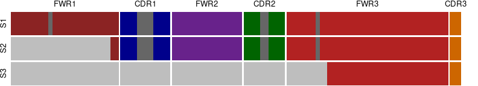
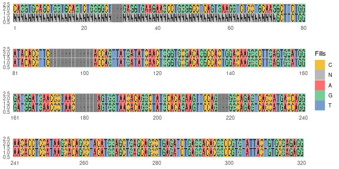
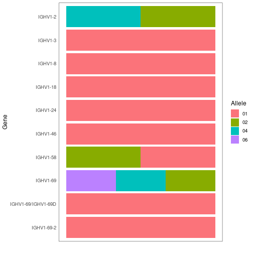

# PIgLET: Program for Ig clusters


<!--html_preserve--><img src="data:image/svg+xml;base64,PD94bWwgdmVyc2lvbj0iMS4wIiBlbmNvZGluZz0iVVRGLTgiIHN0YW5kYWxvbmU9Im5vIj8+CjwhLS0gQ3JlYXRlZCB3aXRoIElua3NjYXBlIChodHRwOi8vd3d3Lmlua3NjYXBlLm9yZy8pIC0tPgoKPHN2ZwogICB3aWR0aD0iNzQuOTY1MzQ3bW0iCiAgIGhlaWdodD0iNDYuMDE3NzY1bW0iCiAgIHZpZXdCb3g9IjAgMCA3NC45NjUzNDggNDYuMDE3NzY1IgogICB2ZXJzaW9uPSIxLjEiCiAgIGlkPSJzdmc1IgogICB4bWw6c3BhY2U9InByZXNlcnZlIgogICBpbmtzY2FwZTpleHBvcnQtZmlsZW5hbWU9Ii4uLzJiODUwZmNhL3JlZl9ib29rX3BpZ2xldF9sb2dvLnBuZyIKICAgaW5rc2NhcGU6ZXhwb3J0LXhkcGk9Ijk2IgogICBpbmtzY2FwZTpleHBvcnQteWRwaT0iOTYiCiAgIGlua3NjYXBlOnZlcnNpb249IjEuMi4yIChiMGE4NDg2NTQxLCAyMDIyLTEyLTAxLCBjdXN0b20pIgogICBzb2RpcG9kaTpkb2NuYW1lPSJyZWZfYm9va19waWdsZXRfbG9nby5zdmciCiAgIHhtbG5zOmlua3NjYXBlPSJodHRwOi8vd3d3Lmlua3NjYXBlLm9yZy9uYW1lc3BhY2VzL2lua3NjYXBlIgogICB4bWxuczpzb2RpcG9kaT0iaHR0cDovL3NvZGlwb2RpLnNvdXJjZWZvcmdlLm5ldC9EVEQvc29kaXBvZGktMC5kdGQiCiAgIHhtbG5zPSJodHRwOi8vd3d3LnczLm9yZy8yMDAwL3N2ZyIKICAgeG1sbnM6c3ZnPSJodHRwOi8vd3d3LnczLm9yZy8yMDAwL3N2ZyI+PHNvZGlwb2RpOm5hbWVkdmlldwogICAgIGlkPSJuYW1lZHZpZXc3IgogICAgIHBhZ2Vjb2xvcj0iI2ZmZmZmZiIKICAgICBib3JkZXJjb2xvcj0iIzAwMDAwMCIKICAgICBib3JkZXJvcGFjaXR5PSIwLjI1IgogICAgIGlua3NjYXBlOnNob3dwYWdlc2hhZG93PSIyIgogICAgIGlua3NjYXBlOnBhZ2VvcGFjaXR5PSIwLjAiCiAgICAgaW5rc2NhcGU6cGFnZWNoZWNrZXJib2FyZD0iMCIKICAgICBpbmtzY2FwZTpkZXNrY29sb3I9IiNkMWQxZDEiCiAgICAgaW5rc2NhcGU6ZG9jdW1lbnQtdW5pdHM9Im1tIgogICAgIHNob3dncmlkPSJmYWxzZSIKICAgICBpbmtzY2FwZTp6b29tPSIxLjkxNjg5MzUiCiAgICAgaW5rc2NhcGU6Y3g9IjMzNC4xMzQzNyIKICAgICBpbmtzY2FwZTpjeT0iLTI1LjMwMTM1NCIKICAgICBpbmtzY2FwZTp3aW5kb3ctd2lkdGg9IjMzNjYiCiAgICAgaW5rc2NhcGU6d2luZG93LWhlaWdodD0iMTM3NiIKICAgICBpbmtzY2FwZTp3aW5kb3cteD0iNzQiCiAgICAgaW5rc2NhcGU6d2luZG93LXk9IjI3IgogICAgIGlua3NjYXBlOndpbmRvdy1tYXhpbWl6ZWQ9IjEiCiAgICAgaW5rc2NhcGU6Y3VycmVudC1sYXllcj0iZzE0NzgxIiAvPjxkZWZzCiAgICAgaWQ9ImRlZnMyIiAvPjxnCiAgICAgaW5rc2NhcGU6bGFiZWw9IkxheWVyIDEiCiAgICAgaW5rc2NhcGU6Z3JvdXBtb2RlPSJsYXllciIKICAgICBpZD0ibGF5ZXIxIgogICAgIHRyYW5zZm9ybT0idHJhbnNsYXRlKC0xMTUuNTAzMTIsLTI0Ny4xMzk4MSkiPjxnCiAgICAgICBpZD0iZzE0NzgxIgogICAgICAgdHJhbnNmb3JtPSJtYXRyaXgoMS44OTg4NjE4LDAsMCwxLjg5ODg2MTgsLTMwLjk0NzYxLC0yMDMuODM1MzcpIj48cGF0aAogICAgICAgICBpZD0icGF0aDYzMTUiCiAgICAgICAgIHN0eWxlPSJmaWxsOm5vbmU7ZmlsbC1vcGFjaXR5OjE7c3Ryb2tlOiNmZmFhYWE7c3Ryb2tlLXdpZHRoOjAuMDM0MzQ3NztzdHJva2UtZGFzaGFycmF5Om5vbmU7c3Ryb2tlLW9wYWNpdHk6MSIKICAgICAgICAgZD0ibSAxMDguNzQ4MjUsMjQzLjI1NjA2IC0wLjA0ODEsMC4wMzc5IDAuMDEzMywtMC4wNTg1IGMgMC4wNjg3LC0wLjMxMjcyIDAuMjgxNzgsLTAuNDc3NjUgMC42MTUxMSwtMC40NzA3OCBoIDAuMDg2IGwgLTAuMDc4OSwwLjAzNzcgYyAtMC4xNTgsMC4wNzkxIC0wLjI4ODY4LDAuMTkyMzUgLTAuNDI2MTEsMC4zMTI3MiAtMC4wNTE2LDAuMDQ0NSAtMC4xMDMwNSwwLjA5MjggLTAuMTYxNTUsMC4xNDA5MyBsIDIuNWUtNCw3ZS01IHYgMCIgLz48cGF0aAogICAgICAgICBpZD0icGF0aDEzNDQ1IgogICAgICAgICBzdHlsZT0iZmlsbDpub25lO2ZpbGwtb3BhY2l0eToxO3N0cm9rZTojZmZhYWFhO3N0cm9rZS13aWR0aDowLjAzNDM0Nzc7c3Ryb2tlLWRhc2hhcnJheTpub25lO3N0cm9rZS1vcGFjaXR5OjEiCiAgICAgICAgIGQ9Im0gMTEwLjQwNDU4LDI0My4wODc2NSAtMC4wNjE4LC0wLjAyNzUgMC4wNjU0LC0wLjAxMzMgYyAwLjE1NDY3LC0wLjAzMDggMC4zMDkyNiwwLjAzNzkgMC40MzI5NiwwLjE4NTcgMC4xNTExMywwLjE4MjE2IDAuMjIzMzcsMC40NDY3MiAwLjE2NDg3LDAuNjA0NzkgbCAtMC4wMTExLDAuMDI0MiAtMC4wMjQyLC0wLjAxNzcgYyAtMC4wNjIsLTAuMDQ0NSAtMC4wODI0LC0wLjExMDEzIC0wLjA5NjIsLTAuMTcxNzMgLTAuMDY1MiwtMC4yODUyMiAtMC4yMTY1LC0wLjQ3MDc5IC0wLjQ3MDc5LC0wLjU4NDE4IGwgOC4yZS00LC0yLjJlLTQgdiAwIiAvPjxwYXRoCiAgICAgICAgIGlkPSJwYXRoMTM0NDMiCiAgICAgICAgIHN0eWxlPSJmaWxsOm5vbmU7ZmlsbC1vcGFjaXR5OjE7c3Ryb2tlOiNmZmFhYWE7c3Ryb2tlLXdpZHRoOjAuMDM0MzQ3NztzdHJva2UtZGFzaGFycmF5Om5vbmU7c3Ryb2tlLW9wYWNpdHk6MSIKICAgICAgICAgZD0ibSAxMDkuNTI4MjksMjQ0Ljk3NzY2IGMgMC4wMDksLTAuMDA0IDAuMDIsLTAuMDA5IDAuMDI3NSwtMC4wMTExIDAuMDIzOSwtMC4wMTMzIDAuMDI3NSwtMC4wMjc1IDAuMDI3NSwtMC4wNjUxIHYgLTAuMDAyIGMgMC4wMDksLTAuMTc4NjEgMC4wOTYyLC0wLjI3NDkxIDAuMjc0OTIsLTAuMjc4MzUgMC4wNzU2LDAgMC4xMzczOSwwLjAyNzUgMC4xNjg0MSwwLjA4MjQgMC4wMzA4LDAuMDUxNiAwLjAyNzUsMC4xMTM0NiAtMC4wMDksMC4xNzUyOCAtMC4wMjQyLDAuMDQxMiAtMC4wMzEsMC4wNzIyIC0wLjAyNDIsMC4wOTI2IDAuMDA5LDAuMDE3NyAwLjAzNDQsMC4wMzQzIDAuMDg2LDAuMDQ4MyAwLjA3ODksMC4wMTk5IDAuMTQ3ODEsMC4wNjUxIDAuMjMwMjQsMC4xMjM2NSBsIDAuMDcyMiwwLjA1MTQgLTAuMDg2LC0wLjAxMzMgYyAtMC4wNjUyLC0wLjAxMTEgLTAuMTI3MTksLTAuMDI0MiAtMC4xODkwMiwtMC4wMzc3IC0wLjE2MTU0LC0wLjAzNDMgLTAuMzEyNywtMC4wNjU0IC0wLjQ2NzMzLC0wLjA1MTYgaCAtMC4wMTExIGMgLTAuMDA5LDAgLTAuMDIzOSwwLjAwMiAtMC4wMzc3LDAgLTAuMDExMSwtMC4wMDIgLTAuMDIzOSwwLjAwMiAtMC4wMzc3LDAuMDA5IC0wLjAxOTksMC4wMDkgLTAuMDQ0OCwwLjAxMzMgLTAuMDY1MiwwLjAwMiAtMC4wMTMzLC0wLjAwOSAtMC4wMTk5LC0wLjAxOTkgLTAuMDI3NSwtMC4wMzc3IC0wLjAxOTksLTAuMDU4NSAwLjAzNDQsLTAuMDc1OCAwLjA2NTIsLTAuMDg1OCBsIDAuMDAyLC0wLjAwMiB2IDAiIC8+PHBhdGgKICAgICAgICAgaWQ9InBhdGgxMzQ0MSIKICAgICAgICAgc3R5bGU9ImZpbGw6bm9uZTtmaWxsLW9wYWNpdHk6MTtzdHJva2U6I2ZmYWFhYTtzdHJva2Utd2lkdGg6MC4wMzQzNDc3O3N0cm9rZS1kYXNoYXJyYXk6bm9uZTtzdHJva2Utb3BhY2l0eToxIgogICAgICAgICBkPSJtIDEwOC41NTkyNSwyNDcuOTQzMjQgMC4wMjQxLDAuMDM0MyBoIC0wLjA0MTIgLTAuMDAyIGMgLTAuMDc1NiwwIC0wLjEzMDUzLC0wLjAyNzUgLTAuMTc1MjksLTAuMDg1OCAtMC4yODUyMiwtMC4zNzggLTAuNDg3OTYsLTAuNzExMzMgLTAuNTcwNDQsLTEuMTEzMzggLTAuMDAyLC0wLjAxMzMgLTAuMDA5LC0wLjAyNzUgLTAuMDA5LC0wLjA0MTIgLTAuMDI0MiwtMC4xMDMwNSAtMC4wNDgzLC0wLjIyMzM3IDAuMDMwOCwtMC4zNjA4MyBsIDAuMDI0MiwtMC4wNDQ1IDAuMDEzMywwLjA0ODMgYyAwLjE4NTQ4LDAuNjM5MTcgMC40MDg5NCwxLjEzNzQ0IDAuNzA3OSwxLjU2MzU3IGwgLTAuMDAyLC01LjFlLTQgdiAwIiAvPjxwYXRoCiAgICAgICAgIGlkPSJwYXRoMTM0MzkiCiAgICAgICAgIHN0eWxlPSJmaWxsOm5vbmU7ZmlsbC1vcGFjaXR5OjE7c3Ryb2tlOiNmZmFhYWE7c3Ryb2tlLXdpZHRoOjAuMDM0MzQ3NztzdHJva2UtZGFzaGFycmF5Om5vbmU7c3Ryb2tlLW9wYWNpdHk6MSIKICAgICAgICAgZD0ibSAxMDcuNTA3NzIsMjQ0LjgxNjE0IGMgMC4xNzUyOCwtMC4yNTQyOSAwLjQwODkzLC0wLjQzOTg1IDAuNjg3MjgsLTAuNTQ2MzggMC4wNDEyLC0wLjAxNzcgMC4wNzU2LC0wLjAyMzkgMC4xMDY1OSwtMC4wMjM5IDAuMDc5MSwwIDAuMTM0MDcsMC4wNDgxIDAuMTcxNzQsMC4xNDQyNiAwLjA1MTQsMC4xMjcyIDAuMDcyMiwwLjI2MTE1IDAuMDY4NywwLjQ3NDIyIDAsMC4wMTMzIDAsMC4wMjc1IC0wLjAwMiwwLjA0NDggLTAuMDA5LDAuMTA5OTIgLTAuMDEzMywwLjI0NzQyIC0wLjEwNjU5LDAuMzY0MjcgLTAuMDM0NCwwLjA0NDUgLTAuMDcyMiwwLjA2MTggLTAuMTE2NzgsMC4wNjE4IC0wLjMxOTU3LC0wLjAxMTEgLTAuNTYwMTEsLTAuMDc5MSAtMC43NTU5OCwtMC4yMTI5NSAtMC4wNTUsLTAuMDM3OSAtMC4wODU4LC0wLjA4MjQgLTAuMDk2MiwtMC4xMzQwNyAtMC4wMTExLC0wLjA1NSAwLjAwOSwtMC4xMTM0NiAwLjA0NDgsLTAuMTcxNzQgbCAtMC4wMDEsLTIuNmUtNCB2IDAiIC8+PHBhdGgKICAgICAgICAgaWQ9InBhdGgxMzQzNyIKICAgICAgICAgc3R5bGU9ImZpbGw6bm9uZTtmaWxsLW9wYWNpdHk6MTtzdHJva2U6I2ZmYWFhYTtzdHJva2Utd2lkdGg6MC4wMzQzNDc3O3N0cm9rZS1kYXNoYXJyYXk6bm9uZTtzdHJva2Utb3BhY2l0eToxIgogICAgICAgICBkPSJtIDEwNy4zMTUzNywyNDUuNTM0MzQgYyAwLjAzNDQsMC4wMTc3IDAuMDY1MiwwLjA2NTIgMC4xMjAzMywwLjE1OCBsIDAuMDAyLDAuMDA5IGMgMC4wMDQsMC4wMDkgMC4wMDksMC4wMTMzIDAuMDEzMywwLjAxOTkgMC4yNzE0NiwwLjQ0MzI5IDAuNjM1NzIsMC42NjMyMiAxLjA3OTAzLDAuNjYzMjIgMC4xMTY3OCwwIDAuMjQwNTQsLTAuMDE3NyAwLjM2NzY3LC0wLjA0ODEgMC4yNzE0OCwtMC4wNjUxIDAuNTEyMDMsLTAuMTk1OSAwLjcxNDc3LC0wLjMxMjcyIDAuMDYyLC0wLjAzNDMgMC4wOTYyLC0wLjAzNDMgMC4xNDQyNiwwLjAwOSAwLjA0NDgsMC4wMzc3IDAuMTA5OTEsMC4wODI0IDAuMjA5NjMsMC4wOTYyIGwgMC4wNDgzLDAuMDA5IC0wLjAyNzUsLTAuMDQxMiBjIC0wLjEzMDUyLC0wLjE4NTQ4IC0wLjI3MTQ4LC0wLjI4NTE5IC0wLjQzOTg1LC0wLjMxOTU2IC0wLjAwOSwwIC0wLjAxMzMsLTAuMDAyIC0wLjAxOTksLTAuMDAyIC0wLjAzNzcsLTAuMDExMSAtMC4xMTM0NiwtMC4wMjc1IC0wLjEzMDUyLDAuMDQ0NSAtMC4wMTMzLDAuMDUxNCAwLjAzNzcsMC4wNjUyIDAuMDYyLDAuMDcyMiAwLjAxMzMsMC4wMDIgMC4wMjc1LDAuMDA5IDAuMDM0NCwwLjAxMzMgMCwwIDAuMDAyLDAgMC4wMDIsMC4wMDIgLTAuMjQwNTMsMC4xMjcyIC0wLjUwODU3LDAuMjEyOTYgLTAuODEwOTksMC4yNjQ1OSAtMC4xMzczOSwwLjAyMzkgLTAuMjgxNzYsMC4wMiAtMC40MjI2NywtMC4wMTMzIC0wLjM1NzM3LC0wLjA3OTEgLTAuNTYzNTUsLTAuMzM2NzcgLTAuNzMxOTQsLTAuNTk3OTQgLTAuMDc4OSwtMC4xMjAzMyAtMC4xMDMwNCwtMC4yMzM2OCAtMC4wODI0LC0wLjM0NzA3IDAuMTk5NDQsMC4xMTY3OCAwLjQzMzAxLDAuMjQwNTUgMC42OTQxNiwwLjI1MDg1IDAuMjg1MjIsMC4wMTMzIDAuNDUwMTgsMC4wMDIgMC41MDg1OSwtMC4zNjQyNiAwLjAzMSwtMC4xOTIzNSAwLjAzNDQsLTAuMzc0NTUgMC4wMTExLC0wLjU0OTgxIC0wLjAwOSwtMC4wNTE0IDAsLTAuMDc1NiAwLjA0NDgsLTAuMDkyNiAwLjE5NTksLTAuMDc1NiAwLjM1MDUxLC0wLjIxNjUgMC40NjczMywtMC40Mjk1MiAwLjA4OTMsLTAuMTYxNTUgMC4xNjE1NSwtMC4zMzY3OSAwLjIzMDI0LC0wLjUwMTcyIDAuMDIsLTAuMDUxNCAwLjA0MTIsLTAuMDk5NyAwLjA2MiwtMC4xNTExMyAwLjAwNCwtMC4wMDIgMC4wMDQsLTAuMDExMSAwLjAwOSwtMC4wMTMzIDAuMDA5LC0wLjAxNzcgMC4wMiwtMC4wMzc5IDAuMDEzMywtMC4wNjIgLTAuMDA5LC0wLjAxMzMgLTAuMDE3NywtMC4wMjQyIC0wLjAzNzcsLTAuMDMwOCAtMC4wNTE2LC0wLjAxNzcgLTAuMDc1NiwwLjAzMDggLTAuMDg1OCwwLjA1NSAwLDAuMDAyIC0wLjAwNCwwLjAwOSAtMC4wMDQsMC4wMTExIC0wLjAxNzcsMC4wMzc3IC0wLjAzNDQsMC4wNzIgLTAuMDUxNiwwLjEwOTkxIC0wLjAzNDMsMC4wNzU4IC0wLjA3MjIsMC4xNTQ2NyAtMC4xMTM0NiwwLjIzMDI0IGwgLTAuMDA3LDAuMDEzMyBjIC0wLjEwOTkxLDAuMjAyNzYgLTAuMjIzMzcsMC40MTU3OCAtMC4zODgzMSwwLjU4NzYxIC0wLjA1MTQsMC4wNTE0IC0wLjA5OTcsMC4wNzIgLTAuMTU4LDAuMDYxOCB2IC0wLjAwMiBjIDAuMDAyLC0wLjAxNzcgMC4wMDksLTAuMDMxIDAuMDEzMywtMC4wNDQ4IDAuMDM3NywtMC4wODkzIDAuMDI0MSwtMC4xNjQ4NyAtMC4wNDQ4LC0wLjIxMjk2IC0wLjA2MTgsLTAuMDQ0NSAtMC4xMzA1MywtMC4wNDgxIC0wLjIwOTY0LC0wLjAwOSBsIC0wLjAxNzcsMC4wMDkgYyAtMC4wMzQ0LDAuMDE3NyAtMC4wNjg3LDAuMDM3OSAtMC4xMDMwNSwwLjA0MTIgLTAuMjk1NTIsMC4wNTE2IC0wLjU0OTgzLDAuMjEyOTUgLTAuODA3NTUsMC41MDg1OSAtMC4xMTY3OCwwLjEzNzM5IC0wLjIwOTYzLDAuMjY0NTkgLTAuMTY4NDEsMC40NjA0NiAwLjAxNzcsMC4wNzU4IDAuMDI0MiwwLjIwOTYzIC0wLjEwNjU5LDAuMjc0OTEgLTAuMDU4MywwLjAzMDggLTAuMDk2MiwwLjA4OTMgLTAuMTA2NTksMC4xNTQ2OCBsIC0wLjAwNCwwLjAyNzUgMC4wMjc1LC0wLjAwMiBjIDAuMTA5OTEsLTAuMDExMSAwLjE2MTU0LC0wLjAxOTkgMC4xOTkyMiwwIGwgMC4wMDIsLTAuMDA4IHYgMCIgLz48cGF0aAogICAgICAgICBpZD0icGF0aDEzNDM1IgogICAgICAgICBzdHlsZT0iZmlsbDpub25lO2ZpbGwtb3BhY2l0eToxO3N0cm9rZTojZmZhYWFhO3N0cm9rZS13aWR0aDowLjAzNDM0Nzc7c3Ryb2tlLWRhc2hhcnJheTpub25lO3N0cm9rZS1vcGFjaXR5OjEiCiAgICAgICAgIGQ9Im0gMTE2LjQ0NTgsMjYwLjQwNjkzIGMgLTAuMDA0LC0wLjAxMzMgLTAuMDExMSwtMC4wMjc1IC0wLjAyLC0wLjA0MTIgLTAuMDAyLC0wLjAwMiAtMC4wMDcsLTAuMDExMSAtMC4wMDcsLTAuMDEzMyAtMC4wMTMzLC0wLjAxOTkgLTAuMDMxLC0wLjA1NSAtMC4wNzU2LC0wLjA0NDggLTAuMDE3NywwLjAwMiAtMC4wMzA4LDAuMDEzMyAtMC4wMzQzLDAuMDI0MSAtMC4wMTExLDAuMDE5OSAtMC4wMDIsMC4wNDEyIDAuMDA0LDAuMDU1IDAuMDAyLDAuMDA5IDAuMDAyLDAuMDExMSAwLjAwMiwwLjAxMzMgMC4wMzQ0LDAuMjMzNjUgMC4wMTMzLDAuNDE1NzggLTAuMDcyMiwwLjU3MDQxIC0wLjA2MTgsMC4xMjAzMyAtMC4xNDc4MSwwLjIxNjUgLTAuMjU0MzEsMC4yOTIwOSAwLjAwMiwtMC4wMDcgMC4wMDksLTAuMDEzMyAwLjAwOSwtMC4wMTk5IDAuMDI0MSwtMC4wNDEyIDAuMDQ4MywtMC4wODI3IDAuMDM3OSwtMC4xMzczOSBsIC0wLjAwNCwtMC4wMjQyIC0wLjAyNDIsMC4wMTExIGMgLTAuMDcyMiwwLjAyNDIgLTAuMTE2NzgsMC4wNzU2IC0wLjE0NzgsMC4xMTM0NiAtMC4xODIxNiwwLjIyNjgxIC0wLjQzNjQyLDAuMjc4MzUgLTAuNjg3MjcsMC4zMDI0MiAtMC4yOTU1MiwwLjAyNzUgLTAuNTk0NSwwLjAwOSAtMC44OTM0NiwtMC4wNjE4IC0wLjIwOTYzLC0wLjA0ODEgLTAuMzE5NTksLTAuMTQ3ODEgLTAuMzY3NywtMC4zMzY3OCAtMC4xMjcyLC0wLjUwMTcgLTAuMTc1MjgsLTAuODkwMDEgLTAuMTU4LC0xLjI2NDU4IDAuMDA0LC0wLjA0ODEgLTAuMDA5LC0wLjA5NjIgLTAuMDI0MiwtMC4xNDQyNiAtMC4wMDcsLTAuMDE3NyAtMC4wMTk5LC0wLjA0ODEgLTAuMDU1LC0wLjA0ODEgaCAtMC4wMTMzIGMgLTAuMDA5LDAuMDAyIC0wLjAxOTksMC4wMDkgLTAuMDMwOCwwLjAxMzMgLTAuMDM0MywtMC41OTQ0OCAtMC4wMTk5LC0xLjE5NTg1IC0wLjAwOSwtMS43NzY2IDAuMDAyLC0wLjA4MjQgMC4wMDIsLTAuMTYxNTQgMC4wMDksLTAuMjQzOTggMCwtMC4wNDEyIDAuMDA3LC0wLjA2MiAwLjAzNzcsLTAuMDc5MSAwLjEwNjU5LC0wLjA1MTYgMC4yMDk2NCwtMC4xMDY1OSAwLjMxOTU5LC0wLjE2MTU0IDAuMDM0NCwtMC4wMTc3IDAuMDY1NCwtMC4wMzQ0IDAuMDk5NywtMC4wNTE2IDAsMC4wMTc3IC0wLjAwMiwwLjAzNDMgLTAuMDAyLDAuMDUxNiAtMC4wMDQsMC4wNTgzIC0wLjAwOSwwLjExMzQ2IC0wLjAxMzMsMC4xNjg0MSAtMC4wNTE0LDAuMzc0NTcgLTAuMDAyLDAuNzQ1NyAwLjA1NSwxLjEyNzEyIDAuMDA5LDAuMDc1NiAwLjAyMzksMC4xNTExMyAwLjAzNzcsMC4yMjY4IDAuMDE3NywwLjExMzQ2IDAuMDM3NywwLjIzMDI0IDAuMDUxNCwwLjM0NzA3IDAuMDMxLDAuMjMzNjggMC4xMzA1MiwwLjQzOTg1IDAuMjI2NzgsMC42NDI2MSBsIDAuMDIsMC4wNDQ4IGMgMC4wMjc1LDAuMDYyIDAuMDIzOSwwLjA4OTMgLTAuMDI0MiwwLjEzNDA2IC0wLjAwOSwwLjAwOSAtMC4wMTk5LDAuMDE3NyAtMC4wMzQzLDAuMDI0MiAtMC4wMzA4LDAuMDE5OSAtMC4wNjg3LDAuMDQ0OCAtMC4wNzIyLDAuMDc5MSAtMC4wMDIsMC4wMTc3IDAsMC4wMzQ0IDAuMDEzMywwLjA1MTQgMC4wNDEyLDAuMDU4NSAwLjA5OTcsMC4wMTc3IDAuMTM3MzksLTAuMDEzMyAwLjAxMzMsLTAuMDA5IDAuMDI3NSwtMC4wMTk5IDAuMDQxMiwtMC4wMjc1IDAuMDk5NywtMC4wNDQ4IDAuMTk5MjIsLTAuMDk2MiAwLjI5NTUyLC0wLjE0NDI3IDAuMTQwOTQsLTAuMDcyIDAuMjg1MjIsLTAuMTQ0MjYgMC40MzY0MiwtMC4yMDYwOCAwLjE3ODYxLC0wLjA3MjIgMC4zNjQyNCwtMC4xMDk5MSAwLjU4NDE4LC0wLjE0NzgxIDAuMDcyMiwtMC4wMTMzIDAuMTQwOTMsMC4wMDkgMC4yMTk4MiwwLjA0ODEgLTAuMDEzMywwLjAxMTEgLTAuMDIzOSwwLjAxOTkgLTAuMDI3NSwwLjAzNzkgLTAuMDAyLDAuMDI3NSAwLjAxOTksMC4wNTE0IDAuMDQxMiwwLjA2ODcgMC4wOTI2LDAuMDcyMiAwLjE2NDg3LDAuMTM0MDYgMC4yMzM2OCwwLjE5NTg5IDAuMDk2MiwwLjA4OTMgMC4xNDA5MywwLjIwNjA5IDAuMTQwOTMsMC4zNTA1IDAsMC4wMDIgLTAuMDAyLDAgLTAuMDAyLC0wLjAwNCBsIDJlLTQsLTguNmUtNCB2IDAiIC8+PHBhdGgKICAgICAgICAgaWQ9InBhdGgxMzQzMyIKICAgICAgICAgc3R5bGU9ImZpbGw6bm9uZTtmaWxsLW9wYWNpdHk6MTtzdHJva2U6I2ZmYWFhYTtzdHJva2Utd2lkdGg6MC4wMzQzNDc3O3N0cm9rZS1kYXNoYXJyYXk6bm9uZTtzdHJva2Utb3BhY2l0eToxIgogICAgICAgICBkPSJtIDExMS45MzcyOSwyNTcuNTMwNjkgYyAtMC4xNzE3NCwtMC4wMzc5IC0wLjM1NzM5LC0wLjExMDEzIC0wLjU0OTgzLC0wLjIxOTgyIC0wLjI3MTQ4LC0wLjE1NDY4IC0wLjUzNjA3LC0wLjM0NzA5IC0wLjgyODE2LC0wLjYxMTY4IDAuNTkxMDUsMC4xMDMwNCAxLjI0NzQsMC4xNTExMyAxLjg2NTk1LC0wLjA5OTcgbCAtMC4wMDksMC4wNzIyIDAuMDE5OSwwLjAwOSBjIDAuMDQ0OCwwLjAxOTkgMC4wNzg5LDAuMDA0IDAuMTEzNDYsLTAuMDA5IGwgMC4wMDksLTAuMDA0IGMgMC42MjU0MiwtMC4yNjQ2MSAxLjE1MTE4LC0wLjYwMTM4IDEuNjA4MjEsLTEuMDIwNTkgMC4wMzc3LC0wLjAzNDQgMC4wNzIyLC0wLjA3NTYgMC4xMDMwNCwtMC4xMTM0NiAwLjAxMTEsLTAuMDEzMyAwLjAxOTksLTAuMDIzOSAwLjAzMSwtMC4wMzc3IDAuMzgxNDYsLTAuNDM2NDIgMC42MDQ4MywtMC45NzU5MiAwLjcyNTEsLTEuNzUyNTQgbCAwLjAwNCwtMC4wMTMzIGMgMC4yMDk2MywwLjI4ODY3IDAuMzA1ODIsMC42MDQ4MSAwLjM3NDU2LDAuOTgyODEgLTAuMDAyLC0wLjAwMiAtMC4wMDIsLTAuMDAyIC0wLjAwNywtMC4wMDkgLTAuMDE5OSwtMC4wMjc1IC0wLjA0MTIsLTAuMDU0OSAtMC4wODI0LC0wLjA2NTEgbCAtMC4wMTk5LC0wLjAwOSAtMC4wMDksMC4wMTk5IGMgLTAuMDE5OSwwLjA3MjIgLTAuMDAyLDAuMTQwOTQgMC4wMTExLDAuMjAyNzcgMC4wMDIsMC4wMTc3IDAuMDA5LDAuMDM0MyAwLjAwOSwwLjA0ODEgMC4wOTI4LDAuNTE1NDYgLTAuMDQ0OCwwLjk5NjU1IC0wLjQyMjY4LDEuNDc0MjEgLTAuMzY3NywwLjQ2NzM1IC0wLjgxNDQyLDAuNzk3MjIgLTEuMzE5NTcsMC45ODYyNCAtMC41NzA0NCwwLjIxOTgzIC0xLjEyMDI3LDAuMjcxNDYgLTEuNjI4ODQsMC4xNjQ4NyBsIDEwZS00LDAuMDA1IHYgMCIgLz48cGF0aAogICAgICAgICBpZD0icGF0aDEzNDMxIgogICAgICAgICBzdHlsZT0iZmlsbDpub25lO2ZpbGwtb3BhY2l0eToxO3N0cm9rZTojZmZhYWFhO3N0cm9rZS13aWR0aDowLjAzNDM0Nzc7c3Ryb2tlLWRhc2hhcnJheTpub25lO3N0cm9rZS1vcGFjaXR5OjEiCiAgICAgICAgIGQ9Im0gMTEzLjAzMDA2LDI1Ny43OTUyOCBjIC0wLjA3NTgsMC4zMjMwMiAtMC4xNDc4MSwwLjY1MjkyIC0wLjIyMDA1LDAuOTcyNDggLTAuMDQ0OCwwLjIwMjc3IC0wLjA4OTMsMC40MDU1MSAtMC4xMzczOSwwLjYwODI1IC0wLjAwOSwwLjAyNzUgLTAuMDExMSwwLjA1NSAtMC4wMTc3LDAuMDg1OCAtMC4wMTMzLDAuMDcyMiAtMC4wMzA4LDAuMTQ3OCAtMC4wNTgzLDAuMjIzMzcgLTAuMDA0LC0wLjAxOTkgLTAuMDE3NywtMC4wNDEyIC0wLjA1NSwtMC4wMzc3IC0wLjA1NSwwLjAwMiAtMC4wNzIyLDAuMDQ4MSAtMC4wODYsMC4wODI0IGwgLTAuMDAyLDAuMDExMSBjIC0wLjAzMSwwLjA3MiAtMC4wNjIxLDAuMTQ0MjYgLTAuMDkyOSwwLjIxNjUgLTAuMDkyNiwwLjIxOTgzIC0wLjE4OTAyLDAuNDUwMTggLTAuMjg1MjIsMC42NzAwOSAtMC4wOTI2LDAuMjEyOTYgLTAuMjI2NzgsMC40MTkyNCAtMC4zOTUxOCwwLjYxMTY4IC0wLjA2NTIsMC4wNzU2IC0wLjEzNzM5LDAuMTIzNjUgLTAuMjE5ODIsMC4xNDc4MSAwLjAwNCwtMC4wMDIgMC4wMDksLTAuMDAyIDAuMDExMSwtMC4wMDkgMC4wMjc1LC0wLjAxOTkgMC4wNTUsLTAuMDM3NyAwLjA3MjIsLTAuMDc1NiBsIDAuMDAyLC0wLjAxMzMgLTAuMDA5LC0wLjAxMTEgYyAtMC4wMTMzLC0wLjAxNzcgLTAuMDMxLC0wLjAxOTkgLTAuMDQ4MSwtMC4wMTk5IC0wLjAxMTEsMCAtMC4wMTk5LDAuMDAyIC0wLjAyNzUsMC4wMDIgLTAuMDA3LDAgLTAuMDA5LDAuMDA0IC0wLjAxNzcsMC4wMDQgLTAuNzA3OSwwLjA3MiAtMS4yNDM5NywtMC4xMzc0IC0xLjYzOTE0LC0wLjYzOTE4IC0wLjE0MDk0LC0wLjE3ODYxIC0wLjIwMjc2LC0wLjQwODkyIC0wLjE5MjM1LC0wLjcwMTAxIDAuMDA0LC0wLjA0NDggMC4wMjc1LC0wLjA4MjcgMC4wNTUsLTAuMTIzNjUgMC4wMDksLTAuMDA5IDAuMDExMSwtMC4wMTc3IDAuMDE3NywtMC4wMjc1IDAuMDA0LC0wLjAwMiAwLjAwOSwtMC4wMTExIDAuMDEzMywtMC4wMTc3IDAuMDE3NywtMC4wMTc3IDAuMDQ4MywtMC4wNTUgMC4wMTExLC0wLjA4OTMgLTAuMDQxMiwtMC4wMzc5IC0wLjA3NTYsLTAuMDA5IC0wLjA5MjYsMC4wMTMzIDAuMDM0NCwtMC4wNzU2IDAuMDkyNiwtMC4xMjcyIDAuMTU0NjgsLTAuMTc4NjEgbCAwLjAxMzMsLTAuMDEzMyBjIDAuMDk2MiwtMC4wODI0IDAuMjA5NjQsLTAuMTQwOTMgMC4zMTYxNiwtMC4xOTU4OSAwLjA0MTIsLTAuMDE5OSAwLjA4NTgsLTAuMDQxMiAwLjEyNzIsLTAuMDY1MSAwLjAxMzMsLTAuMDA5IDAuMDM0MywtMC4wMDIgMC4wNTUsMC4wMDIgMC4wMDksMC4wMDIgMC4wMTMzLDAuMDAyIDAuMDI0MiwwLjAwOSAwLjIwMjc2LDAuMDQxMiAwLjM5MTc0LDAuMTM0MDcgMC41ODA3NCwwLjI4NTIyIDAuMTA2NTksMC4wODU4IDAuMjE2NSwwLjE3MTc0IDAuMzE5NTcsMC4yNTQyOCAwLjA3NTYsMC4wNTg1IDAuMTQ3OCwwLjEyMDMzIDAuMjIzMzcsMC4xNzg2MSBsIDAuMDExMSwwLjAwNyBjIDAuMDcyMiwwLjA1ODUgMC4xNDQyNiwwLjExNjc4IDAuMjUwODUsMC4xMzA1MiBsIDAuMDQxMiwwLjAwOSAtMC4wMTk5LC0wLjAzNzcgYyAtMC4wMzEsLTAuMDU0OSAtMC4wNDQ4LC0wLjA4MjQgLTAuMDQxMiwtMC4xMDMwNCAwLjAwNCwtMC4wMTk5IDAuMDMxLC0wLjA0NDggMC4wNzU2LC0wLjA4OTMgMC4yMTI5NSwtMC4yMDI3NyAwLjM4MTQzLC0wLjQ1MzYyIDAuNTA4NTksLTAuNzY2MzEgMC4xODIxNSwtMC40NDY3MiAwLjMwMjM5LC0wLjg1NTY2IDAuMzYwOCwtMS4yNDM5NyAwLjAwNywtMC4wNTUgMC4wMjM5LC0wLjA3MjIgMC4wNzg5LC0wLjA3MjIgMC4wODkzLC0wLjAwMiAwLjE4MjE2LC0wLjAxNzcgMC4yNjgwNSwtMC4wMjc1IGwgMC4wMjc1LC0wLjAwMiBjIDAuMDMwOCwtMC4wMDQgMC4wMzc3LDAgMC4wMzc3LDAgMC4wMDksLTAuMDA0IDAuMDA5LDAuMDAyIDAuMDAyLDAuMDM3NyBsIC0wLjAwMiwtMC4wMDIgdiAwIiAvPjxwYXRoCiAgICAgICAgIGlkPSJwYXRoMTM0MjkiCiAgICAgICAgIHN0eWxlPSJmaWxsOm5vbmU7ZmlsbC1vcGFjaXR5OjE7c3Ryb2tlOiNmZmFhYWE7c3Ryb2tlLXdpZHRoOjAuMDM0MzQ3NztzdHJva2UtZGFzaGFycmF5Om5vbmU7c3Ryb2tlLW9wYWNpdHk6MSIKICAgICAgICAgZD0ibSAxMTAuMzE1MzIsMjU2LjQ4MjYgLTAuMDE3NywtMC4wMTc3IGMgLTAuMzM2NzcsLTAuMzQwMiAtMC42ODM4MywtMC42OTA3IC0wLjg3NjI5LC0xLjE1NDYyIDAuMDE3NywwLjAwOSAwLjAzNDMsMC4wMTc3IDAuMDU0OSwwLjAyNzUgMC4wMDksMC4wMDkgMC4wMTc3LDAuMDA5IDAuMDI3NSwwLjAxMzMgMC41NjAxNCwwLjI4ODY1IDEuMTc4NjgsMC4zOTE3NCAxLjg0MTksMC4zMDkyOCAwLjI4ODY2LC0wLjAzNDMgMC41MzYwNywtMC4xMDk5MSAwLjc1OTQ0LC0wLjIyNjggMC4wNDEyLC0wLjAyIDAuMDg2LC0wLjAyNzUgMC4xMzQwNywtMC4wMzQ0IDAuMDQxMiwtMC4wMDkgMC4wODI0LC0wLjAwOSAwLjEyMzY1LC0wLjAzMDggMC40MjYxMSwtMC4xNzg2MSAwLjgwNzU1LC0wLjQ3MDc5IDEuMTY4MzgsLTAuODkzNDYgMC4yMTI5NiwtMC4yNTA4NSAwLjM4ODMxLC0wLjUyNTc3IDAuNTEyLC0wLjgyNDczIDAuMDA0LC0wLjAwOSAwLjAwOSwtMC4wMDkgMC4wMDksLTAuMDE3NyAwLjAwOSwtMC4wMTMzIDAuMDE3NywtMC4wMzEgMC4wMTc3LC0wLjA1MTYgLTAuMDA0LC0wLjE5OTIxIDAuMTM0MDcsLTAuMjc4MzIgMC4yNzQ5MiwtMC4zNjQyNCAwLjAyNDIsLTAuMDEzMyAwLjA1MTYsLTAuMDMwOCAwLjA3ODksLTAuMDQ4MSAwLjA0NDgsLTAuMDI3NSAwLjA3NTYsLTAuMDI3NSAwLjExMzQ2LDAuMDA5IDAuMDE5OSwwLjAxNzcgMC4wNDEyLDAuMDM0NCAwLjA1ODMsMC4wNTE0IDAuMjk1NTQsMC4yNTQyOCAwLjI5NTU0LDAuMjU0MjggMC4yMzAyNCwwLjY5NDEzIC0wLjAwOSwwLjA0MTIgLTAuMDEzMywwLjA4OTMgLTAuMDE5OSwwLjE0MDk0IC0wLjAzMDgsMC4yMzM2OCAtMC4xMDY1OSwwLjQ1MzYxIC0wLjE5OTIxLDAuNzExMzMgLTAuMDA5LC0wLjAxMTEgLTAuMDE5OSwtMC4wMTk5IC0wLjAzNDMsLTAuMDE5OSAtMC4wMzA4LC0wLjAwNCAtMC4wNDgxLDAuMDI3NSAtMC4wNjUyLDAuMDU0OSAtMC4wMzc3LDAuMDcyIC0wLjA3ODksMC4xNDA5NCAtMC4xMjAzMywwLjIxMjk2IC0wLjAzNzcsMC4wNjg3IC0wLjA3ODksMC4xNDA5NCAtMC4xMTY3OCwwLjIwOTYzIC0wLjE3NTI5LDAuMzEyNzIgLTAuNDU3MDMsMC41MTg4NyAtMC43MzE5NCwwLjcxODIgLTAuMDY1MiwwLjA0ODEgLTAuMTY4NDEsMC4xMDY1OSAtMC4yODg2NSwwLjE2NDg3IGwgLTAuMjU0MzEsMC4wODkzIGMgLTAuMDY1MiwwLjAyNzUgLTAuMTI3MiwwLjA1NSAtMC4xODkwMiwwLjA4MjQgLTAuMTA2NTksMC4wNDgxIC0wLjIxNjUxLDAuMDk2MiAtMC4zMjk5LDAuMTM0MDcgLTAuNjk0MTUsMC4yMzM2NyAtMS4zOTg2MSwwLjI2NDU4IC0yLjA5NjE4LDAuMDg5MyAtMC4wMTk5LDAgLTAuMDQ0OCwtMC4wMTMzIC0wLjA2MTgsLTAuMDI3NSBsIC0wLjAwMywtOC42ZS00IHYgMCIgLz48cGF0aAogICAgICAgICBpZD0icGF0aDEzNDI3IgogICAgICAgICBzdHlsZT0iZmlsbDpub25lO2ZpbGwtb3BhY2l0eToxO3N0cm9rZTojZmZhYWFhO3N0cm9rZS13aWR0aDowLjAzNDM0Nzc7c3Ryb2tlLWRhc2hhcnJheTpub25lO3N0cm9rZS1vcGFjaXR5OjEiCiAgICAgICAgIGQ9Im0gMTA5LjMwNTAxLDI1NS4wMjkgYyAtMC4wMDksLTAuMDM3NyAtMC4wMjc1LC0wLjA4MjQgLTAuMDY1MiwtMC4xMTY3OCBsIC0wLjAwOSwtMC4wMDkgLTAuMDA5LDAuMDA0IGMgLTAuMDMxLDAuMDA3IC0wLjA0MTIsMC4wMjc1IC0wLjA0MTIsMC4wNDQ4IC0wLjA3OTEsLTAuMjM3MDkgLTAuMTQ0MjYsLTAuNDc0MjIgLTAuMjA2MDksLTAuNzA3ODkgMC4wMTk5LDAuMDA5IDAuMDQxMiwwLjAwOSAwLjA1ODUsMC4wMTc3IDAuMDYxOCwwLjAxNzcgMC4xMjAzMywwLjAzMSAwLjE3ODYxLDAuMDQ4MSAwLjQxOTI2LDAuMTI3MiAwLjg4MzE2LDAuMTU0NjggMS40MTU4MSwwLjA4OTMgMC4zNDcwNywtMC4wNDQ4IDAuODA0MSwtMC4yNzE0NSAwLjc4NjkyLC0wLjI0MDU0IGwgLTAuMDIzOSwwLjA0NDggMC4wNDgxLC0wLjAxMzMgYyAwLjQyOTU0LC0wLjEyMDMzIDAuNzQ1NywtMC4zODgzMSAxLjAzMDg5LC0wLjY0OTQ2IDAuMzEyNzIsLTAuMjg1MjIgMC41Mzk1MywtMC42MDQ4MSAwLjY4NzI5LC0wLjk2NTY0IDAuMDA0LDAuMDA0IDAuMDA0LDAuMDA5IDAuMDA0LDAuMDA5IDAuMTE2NzksMC4zNjc3IDAuNDIyNjYsMC41NTMyNyAwLjcwMTAxLDAuNjk3NTkgMC4wODYsMC4wNDQ4IDAuMDg2LDAuMDkyOCAwLjA1NSwwLjE1NDY4IC0wLjI3MTQ4LDAuNTcwNDQgLTAuNjE1MTEsMS4yMTMwMyAtMS4yMzM2MywxLjYzNTcxIC0wLjAzNzcsMC4wMjM5IC0wLjA3NTYsMC4wNDgxIC0wLjExMzQ2LDAuMDY4NyAtMC4wMzc3LDAuMDE5OSAtMC4wNzU2LDAuMDQxMiAtMC4xMDk5MiwwLjA2NTEgLTAuMDEzMywwLjAxMTEgLTAuMDE3NywwLjAwOSAtMC4wMzEsLTAuMDA5IC0wLjAwOSwtMC4wMTExIC0wLjAxOTksLTAuMDE5OSAtMC4wNDEyLC0wLjAxNzcgLTAuMDUxNiwwLjAwOSAtMC4wOTYyLDAuMDM0NCAtMC4xNDQyNiwwLjA1ODMgbCAtMC4wMDksMC4wMDQgYyAtMC4zODgzMSwwLjE5NTg5IC0wLjgyODE2LDAuMjc4MzMgLTEuNDIyNjYsMC4yNjExNSAtMC40ODQ1MywtMC4wMTMzIC0wLjkyNzgxLC0wLjE5NTg5IC0xLjM2MDc5LC0wLjM3MTEzIGwgLTAuMDkyOSwtMC4wMzc5IGMgLTAuMDMwOCwtMC4wMTc3IC0wLjA0NDgsLTAuMDM0MyAtMC4wNTUsLTAuMDY1MSBsIDEwZS00LC0zLjhlLTQgdiAwIiAvPjxwYXRoCiAgICAgICAgIGlkPSJwYXRoMTM0MjUiCiAgICAgICAgIHN0eWxlPSJmaWxsOm5vbmU7ZmlsbC1vcGFjaXR5OjE7c3Ryb2tlOiNmZmFhYWE7c3Ryb2tlLXdpZHRoOjAuMDM0MzQ3NztzdHJva2UtZGFzaGFycmF5Om5vbmU7c3Ryb2tlLW9wYWNpdHk6MSIKICAgICAgICAgZD0ibSAxMDguOTA5ODQsMjUzLjk3NzUgYyAtMC4wMjM5LC0wLjA4OTMgLTAuMDQ4MSwtMC4xNzg2MSAtMC4wNzU2LC0wLjI3MTQ4IC0wLjAwOSwtMC4wMzc5IC0wLjAxOTksLTAuMDc5MSAtMC4wMzQ0LC0wLjExNjc5IGwgLTAuMDA5LC0wLjAyNDEgLTAuMDIzOSwwLjAxMTEgYyAtMC4wNDEyLDAuMDE5OSAtMC4wNTUsMC4wNTE0IC0wLjA1ODUsMC4wNzg5IC0wLjA1NDksLTAuMjE2NSAtMC4wNzU2LC0wLjQyOTU1IC0wLjA4OTMsLTAuNjczNTMgMC4xNTQ2OCwwLjA2NTIgMC4yOTg5OCwwLjEzMDUyIDAuNDU3MDUsMC4xNDc4MSBsIDAuMDU4MywwLjAwOSBjIDAuMzUzOTMsMC4wNDQ4IDAuNzE4MiwwLjA4OTMgMS4wNzU1OSwtMC4wMjc1IDAuMDA3LC0wLjAwMiAwLjAwOSwtMC4wMDIgMC4wMTc3LC0wLjAwOSAwLjAwOSwtMC4wMDIgMC4wMTMzLC0wLjAwOSAwLjAxOTksLTAuMDA5IDAsMC4wMDkgLTAuMDA0LDAuMDEzMyAtMC4wMTExLDAuMDMxIC0wLjAwMiwwLjAwOSAtMC4wMDIsMC4wMTk5IDAuMDA0LDAuMDI3NSAwLjAxMzMsMC4wMTc3IDAuMDQxMiwwLjAxMzMgMC4wNzU2LDAuMDExMSBoIDAuMDA0IGMgMC4xNTExMywtMC4wMTc3IDAuMjk1NTMsLTAuMDc1NiAwLjQyOTUzLC0wLjEzNDA3IGwgMC4wMTMzLC0wLjAwOSBjIDAuNDk0ODMsLTAuMjA2MDkgMC44Nzk3MiwtMC40ODc5NiAxLjE3MTgxLC0wLjg2MjUxIHYgMC4wMTMzIDAuMDExMSBsIDAuMDA5LDAuMDA5IGMgMC4wMzc3LDAuMDI3NSAwLjA2NTIsLTAuMDAyIDAuMDc1NiwtMC4wMTMzIDAuMDM0NCwtMC4wMzc5IDAuMDY4OSwtMC4wNzU2IDAuMTA2NTksLTAuMTEzNDYgMC4xODkwMiwtMC4xOTkyMiAwLjM4MTQyLC0wLjQwMjA1IDAuNDgxMDcsLTAuNjczNTMgMC4wMTMzLC0wLjAzNDMgMC4wMTk5LC0wLjAzNzkgMC4wMjQyLC0wLjA0MTIgMCwwIDAuMDA5LDAgMC4wMzQ0LDAuMDIzOSAwLjA1MTQsMC4wNTUgMC4xMDk5MSwwLjExMzQ2IDAuMTc4NjEsMC4xNTQ2NyAwLjE1MTEzLDAuMDg5MyAwLjE3ODYxLDAuMjMwMjQgMC4yMDk2MywwLjM5MTc0IGwgMC4wMDksMC4wMjc1IGMgMC4wNTQ5LDAuMjc0OTIgLTAuMDM0NCwwLjUwMTcgLTAuMTgyMTYsMC43NjI4OCAtMC4yNTc3MiwwLjQ1MDE1IC0wLjYxNTExLDAuODQxOTIgLTEuMDY4NywxLjE2ODM1IC0wLjA1MTYsMC4wMzc5IC0wLjEwOTkxLDAuMDY4OSAtMC4xNjg0MiwwLjA5OTcgLTAuMDMwOCwwLjAxNzcgLTAuMDkyNiwwLjAzNzcgLTAuMDcyMiwtMC4wMTc3IGwgMC4wMTc3LC0wLjA0NDggLTAuMDQ0OCwwLjAxNzcgYyAtMC4wNTUsMC4wMTk5IC0wLjEwNjU5LDAuMDQ0OCAtMC4xNTgsMC4wNjUyIC0wLjExMzQ2LDAuMDQ4MyAtMC4yMTY1LDAuMDkyOCAtMC4zMjY0OCwwLjEzNDA3IC0wLjM4MTQ0LDAuMTQ0MjYgLTAuODA0MTIsMC4xODkwMiAtMS4yOTU1MSwwLjEzNzM5IC0wLjIxMjk2LC0wLjAyMzkgLTAuNDQzMjgsLTAuMDcyIC0wLjcyNTA3LC0wLjE2MTU1IC0wLjA2ODcsLTAuMDE3NyAtMC4xMDY1OSwtMC4wNTUgLTAuMTI3MiwtMC4xMzA1MiBsIC0wLjAwMyw3ZS01IHYgMCIgLz48cGF0aAogICAgICAgICBpZD0icGF0aDEzNDIzIgogICAgICAgICBzdHlsZT0iZmlsbDpub25lO2ZpbGwtb3BhY2l0eToxO3N0cm9rZTojZmZhYWFhO3N0cm9rZS13aWR0aDowLjAzNDM0Nzc7c3Ryb2tlLWRhc2hhcnJheTpub25lO3N0cm9rZS1vcGFjaXR5OjEiCiAgICAgICAgIGQ9Im0gMTA4LjYwNzQ0LDI1Mi43ODg1MSBjIC0wLjAxNzcsLTAuMjU0MjggLTAuMDM3NywtMC41MTIwMiAtMC4wNTgzLC0wLjc2Mjg3IC0wLjAxMTEsLTAuMTEzNDYgLTAuMDE3NywtMC4yMjY4MSAtMC4wMjc1LC0wLjM0MDIgdiAtMC4wNDEyIDAgYyAwLjg5MDAxLDAuMzY3NjggMS42MTUxLDAuMzc3OTggMi4yODUxOSwwLjAzMDggbCAwLjA0MTIsLTAuMDE5OSAtMC4wNDQ4LC0wLjAxNzcgYyAtMC4wMjQyLC0wLjAxMTEgLTAuMDQxMiwtMC4wMjQxIC0wLjA2MiwtMC4wMzA4IDAuNDE1ODEsLTAuMTQ0MjYgMC43NTI1NSwtMC4zODgzMyAwLjk5NjUzLC0wLjcyNTA3IDAuMDM3NywtMC4wNTE0IDAuMDY4NywtMC4wNjUyIDAuMTIwMzIsLTAuMDU4NSAwLjEwNjU5LDAuMDE3NyAwLjIxMjk2LDAuMDI3NSAwLjMxNjE0LDAuMDM3OSBsIDAuMDQxMiwwLjAwMiBjIDAuMDIzOSwwLjAwMiAwLjA0MTIsMC4wMTc3IDAuMDYxOCwwLjA0NDggMC4wMTMzLDAuMDE3NyAwLjAyNzUsMC4wMzc5IDAuMDQxMiwwLjA1NSAwLjAzMSwwLjA0MTIgMC4wNjIsMC4wODU4IDAuMDk5NywwLjEyMDMyIDAuMDk2MiwwLjA4NTggMC4wNzg5LDAuMTYxNTUgMC4wMTk5LDAuMjY4MDUgLTAuMDE5OSwwLjAzNzkgLTAuMDQxMiwwLjA3NTggLTAuMDYxOCwwLjExMzQ2IC0wLjA4MjQsMC4xNTExMyAtMC4xNjQ4NiwwLjMwMjM5IC0wLjI2NDYxLDAuNDQ2NzIgbCAwLjA2NTIsLTAuMjE2NSAtMC4xMDk5MSwwLjE2MTU0IGMgLTAuNDIyNjgsMC40NTAxOCAtMC44NTU2NiwwLjkxNDA3IC0xLjQ5MTM4LDEuMDk5NjQgMC4wMDksLTAuMDA0IDAuMDExMSwtMC4wMTExIDAuMDE3NywtMC4wMTMzIDAuMDM3NywtMC4wMjc1IDAuMDc1NiwtMC4wNTgzIDAuMTAzMDQsLTAuMTAzMDQgbCAwLjAzMSwtMC4wNTE0IC0wLjA1NSwwLjAxOTkgYyAtMC4wMTk5LDAuMDA5IC0wLjA0MTIsMC4wMTMzIC0wLjA1ODUsMC4wMTk5IC0wLjAzNzcsMC4wMTMzIC0wLjA3MjIsMC4wMjc1IC0wLjEwNjU5LDAuMDQxMiAtMC40Nzc2NSwwLjIxMjk2IC0wLjk2OTA1LDAuMTc4NjEgLTEuMzg0ODYsMC4xMjAzMyAtMC4xNjg0MSwtMC4wMjQxIC0wLjMyMzAyLC0wLjA3NTggLTAuNDM5ODcsLTAuMTIwMzMgLTAuMDQ4MSwtMC4wMTk5IC0wLjA3MjIsLTAuMDM3OSAtMC4wNzU2LC0wLjA4MjcgbCAzLjdlLTQsMC4wMDIgdiAwIiAvPjxwYXRoCiAgICAgICAgIGlkPSJwYXRoMTM0MjEiCiAgICAgICAgIHN0eWxlPSJmaWxsOm5vbmU7ZmlsbC1vcGFjaXR5OjE7c3Ryb2tlOiNmZmFhYWE7c3Ryb2tlLXdpZHRoOjAuMDM0MzQ3NztzdHJva2UtZGFzaGFycmF5Om5vbmU7c3Ryb2tlLW9wYWNpdHk6MSIKICAgICAgICAgZD0ibSAxMDguMzg3NjIsMjUwLjcxNjM3IGMgLTAuMDEzMywtMC4wNTg1IC0wLjAyMzksLTAuMTIwMzMgLTAuMDM0NCwtMC4xODIxNiAtMC4wMDcsLTAuMDQ0OCAtMC4wMDIsLTAuMDU0OSAwLC0wLjA1NDkgMCwwIDAuMDA5LC0wLjAwOSAwLjA0ODEsMC4wMTExIDAuMzUzOTYsMC4xMzczOSAwLjY5NDE1LDAuMTk1ODkgMS4wMzc3OSwwLjE4MjE1IGggMC4wMTMzIGMgMC4wMjM5LC0wLjAwMiAwLjAzNzcsLTAuMDAyIDAuMDQ4MSwwLjAxNzcgMC4wMzc3LDAuMDYyIDAuMTEzNDYsMC4wNDQ4IDAuMTM3MzksMC4wMzc3IGwgMC4wNjIsLTAuMDEzMyBjIDAuMjg1MjIsLTAuMDYyIDAuNTgwNzQsLTAuMTI3MTkgMC44MjgxNSwtMC4zMDkyNiAwLjAzNzcsLTAuMDI3NSAwLjA1ODMsLTAuMDMxIDAuMDc4OSwtMC4wMTExIDAuMjMzNjgsMC4yMDk2MyAwLjUyNTc3LDAuMjc4MzUgMC44MDc1NSwwLjM0NzA5IDAuMDI0MiwwLjAwOSAwLjA1MTYsMC4wMTMzIDAuMDc1NiwwLjAxNzcgMC4wMTMzLDAuMDAyIDAuMDI0MiwwLjAwMiAwLjAzNzcsMC4wMDkgMC4wMjc1LDAuMDAyIDAuMDU1LDAuMDExMSAwLjA3NTYsMC4wMjQyIC0wLjE3NTI4LDAuMjE2NSAtMC40MDIwNCwwLjQwMjA0IC0wLjY3MDA5LDAuNTU2NjcgLTAuMjA2MDgsMC4xMTY3OSAtMC40MzI5OCwwLjE5OTQ0IC0wLjY1Mjg5LDAuMjc0OTQgLTAuMDU1LDAuMDE5OSAtMC4xMDk5MiwwLjAzNzcgLTAuMTY0ODcsMC4wNTgzIGwgLTAuMTM0MDcsMC4wNDgzIGMgLTAuMzY0MjQsMC4wMzA4IC0wLjcyNTA3LDAuMDAyIC0xLjA2ODcsLTAuMTA2NTkgLTAuMDEzMywtMC4wMDQgLTAuMDMwOCwtMC4wMTExIC0wLjA0NDgsLTAuMDEzMyAtMC4wMTc3LC0wLjAwOSAtMC4wMzc3LC0wLjAxMzMgLTAuMDU1LC0wLjAxOTkgLTAuMjY0NjEsLTAuMDc5MSAtMC4zNzQ1NywtMC4yMDYwOCAtMC4zNzgsLTAuNDQzMzEgMC4wMTExLC0wLjE0NDI2IC0wLjAxOTksLTAuMjg4NjUgLTAuMDQ4MSwtMC40MjYwOCBsIDYuOWUtNCwtMC4wMDUgdiAwIiAvPjxwYXRoCiAgICAgICAgIGlkPSJwYXRoMTM0MTkiCiAgICAgICAgIHN0eWxlPSJmaWxsOm5vbmU7ZmlsbC1vcGFjaXR5OjE7c3Ryb2tlOiNmZmFhYWE7c3Ryb2tlLXdpZHRoOjAuMDM0MzQ3NztzdHJva2UtZGFzaGFycmF5Om5vbmU7c3Ryb2tlLW9wYWNpdHk6MSIKICAgICAgICAgZD0ibSAxMDguMjkxNDQsMjUwLjIyNDk3IGMgLTAuMDE5OSwtMC4wOTI5IC0wLjA0NDgsLTAuMTgyMTUgLTAuMDY1NCwtMC4yNzE0NSAtMC4wMTc3LC0wLjA3NTYgLTAuMDM3NywtMC4xNTExMyAtMC4wNTUsLTAuMjI2ODEgMCwtMC4wMDQgLTAuMDAyLC0wLjAxMTEgLTAuMDAyLC0wLjAxMzMgLTAuMDA0LC0wLjAwNyAtMC4wMDksLTAuMDI3NSAtMC4wMDksLTAuMDM0MyAwLjAwMiwwIDAuMDA5LDAgMC4wMTk5LDAuMDA5IDAuMjUwODcsMC4wOTYyIDAuNTA4NTksMC4wNjg3IDAuNzU2MDMsMC4wNDEyIDAuMDE5OSwtMC4wMDIgMC4wNDQ4LC0wLjAwMiAwLjA2NTIsLTAuMDA5IDAuNDc3NjUsLTAuMDQ4MSAwLjg1OTA3LC0wLjE1MTEzIDEuMTk5MjksLTAuMzI2NDYgMC4zMDU4MiwtMC4xNTggMC41NjcsLTAuMzMzMyAwLjc5Mzc4LC0wLjU0MjkzIDAuMDM0NCwtMC4wMzA4IDAuMDY4NywtMC4wNjE4IDAuMTA5OTIsLTAuMDk2MiAwLjAwOSwtMC4wMTExIDAuMDI0MSwtMC4wMTk5IDAuMDM0MywtMC4wMzA4IDAuMDAyLDAuMDE3NyAwLjAwOSwwLjAzNDQgMC4wMDksMC4wNTE0IDAuMDExMSwwLjA1ODUgMC4wMTk5LDAuMTEwMTQgMC4wMzEsMC4xNjE1NSAwLjAwNywwLjAzMDggMC4wMDcsMC4wNTE2IDAsMC4wNjE4IC0wLjAwOSwwLjAxMzMgLTAuMDI3NSwwLjAxOTkgLTAuMDU1LDAuMDI3NSAtMC4xODU0OCwwLjAzNzkgLTAuMzc0NTcsMC4wODkzIC0wLjUwODU3LDAuMjQwNTIgLTAuMjE2NSwwLjI1MDg3IC0wLjI2ODA1LDAuNTQyOTYgLTAuMTU0NjgsMC44NzYyOSAwLjAyNzUsMC4wNzg5IDAuMDE3NywwLjEwMzA0IC0wLjA1NDksMC4xNTggLTAuMzE5NTksMC4yNDc0MiAtMC42ODM4MywwLjI1NDI5IC0xLjA5NjIxLDAuMjMzNjggLTAuMzY0MjYsLTAuMDE3NyAtMC42NzAwOSwtMC4wODkzIC0wLjkzNDcsLTAuMjIzMzcgLTAuMDQ4MSwtMC4wMiAtMC4wNzU2LC0wLjA0MTIgLTAuMDg2LC0wLjA4NTggbCAwLjAwMywtNS42ZS00IHYgMCIgLz48cGF0aAogICAgICAgICBpZD0icGF0aDEzNDE3IgogICAgICAgICBzdHlsZT0iZmlsbDpub25lO2ZpbGwtb3BhY2l0eToxO3N0cm9rZTojZmZhYWFhO3N0cm9rZS13aWR0aDowLjAzNDM0Nzc7c3Ryb2tlLWRhc2hhcnJheTpub25lO3N0cm9rZS1vcGFjaXR5OjEiCiAgICAgICAgIGQ9Im0gMTA0LjY4MzI4LDI0OS4yNTcxMiBjIDAuMDc4OSwtMC4wMzA1IDAuMTI3MTgsMC4wNzkgMC4xMjk4OCwwLjIwNzM4IDAsMC4xNzg2MSAtMC4wNjE4LDAuMzQzNjQgLTAuMTIwMzMsMC41MDg1OSAtMC4wMDksMC4wMjc1IC0wLjAxOTksMC4wNTUgLTAuMDMwOCwwLjA4MjQgLTAuMDcyMiwwLjE5NTg5IC0wLjE3NTI4LDAuMzgxNDMgLTAuMjcxNDgsMC41NjM1NyAtMC4wNDgxLDAuMDg5MyAtMC4wOTk3LDAuMTc4NiAtMC4xNDQyNiwwLjI3MTQ4IC0wLjEzNDA3LDAuMjY4MDIgLTAuMjc0OTIsMC41OTEwMiAtMC4yNzQ5MiwwLjk1MTg1IDAsMC4wMTMzIDAsMC4wMjc1IDAuMDA0LDAuMDQ0OCAwLDAuMDExMSAwLDAuMDE5OSAwLjAwMiwwLjAzMSBsIDAuMDA0LDAuMDQxMiAwLjAzMDgsLTAuMDI3NSBjIDAuMDU4MywtMC4wNTE0IDAuMDY1MiwtMC4xMDk5MiAwLjA3MjIsLTAuMTYxNTUgMC4wMDIsLTAuMDIzOSAwLjAwOSwtMC4wNDQ4IDAuMDEzMywtMC4wNjUxIDAuMDA0LC0wLjAwOSAwLjAwNCwtMC4wMTMzIDAuMDA5LC0wLjAxOTkgMC4wMDksLTAuMDI3NSAwLjAxMTEsLTAuMDM3NyAwLjAzNDMsLTAuMDM3NyAwLjM3NDU3LC0wLjAyNDIgMC42NzM1MywtMC4yMjY3OSAwLjkxNDA4LC0wLjQyNjA5IDAuMDE2NCwtMC4wMTIxIDAuMDI1NSwtMC4wMjE0IDAuMDM5OCwtMC4wMjkxIGwgMi43MzEzNiwtMS40ODEzMiBjIDAuMjM1MjIsLTAuMTI3NTkgMC4xMjc5MywwLjcyNzU3IDAuMTY5MTQsMS4wNzQ2NCAwLjAwMiwwLjAxOTkgMC4wMDIsMC4wNDQ4IDAuMDA5LDAuMDY4NyAwLjAwMiwwLjA0ODEgMC4wMDcsMC4wOTk3IDAuMDIzOSwwLjE0NDI2IDAuMDI3NSwwLjA4OTMgLTIuNzQ0MTQsMS40NzM2OCAtMi44MjM0NywxLjUxODIyIGwgLTAuMDA0LC0zLjFlLTQgdiAwIgogICAgICAgICBzb2RpcG9kaTpub2RldHlwZXM9ImNjY2NjY3NjY2NjY2NjY2NjY2NjY2NjYyIgLz48cGF0aAogICAgICAgICBpZD0icGF0aDE0MzI3IgogICAgICAgICBzdHlsZT0iZmlsbDpub25lO2ZpbGwtb3BhY2l0eToxO3N0cm9rZTojZmZhYWFhO3N0cm9rZS13aWR0aDowLjAzNDM0Nzc7c3Ryb2tlLWRhc2hhcnJheTpub25lO3N0cm9rZS1vcGFjaXR5OjEiCiAgICAgICAgIGQ9Im0gMTA1LjIwMTE5LDI1Mi41MTcxMSBjIC0wLjM2MDgxLDAuMjE2NSAtMC42NzAwOSwwLjM1MzkzIC0wLjk3MjQ4LDAuNDMyOTYgLTAuMTIzNjYsMC4wMzQzIC0wLjI0NzQyLDAuMDUxNCAtMC4zNzQ1NywwLjA1MTQgMC4wMTMzLC0wLjAxMTEgMC4wMzA4LC0wLjAyNzUgMC4wMjc1LC0wLjA1NSAtMC4wMDQsLTAuMDQ0OCAtMC4wMzc3LC0wLjA0ODEgLTAuMDU4MywtMC4wNDgxIGggLTAuMDEzMyAtMC4wMDkgYyAtMC4xNDc4MSwwLjAwNCAtMC4yNjExNiwtMC4wMTMzIC0wLjM2MDgxLC0wLjA2MTggLTAuMTIzNjUsLTAuMDU4NSAtMC4yMzM2OCwtMC4xNDA5NCAtMC4zNDcwNywtMC4yNjExMyAwLjAwOSwwLjAwMiAwLjAxNzcsMC4wMDkgMC4wMjQyLDAuMDA5IDAuMDMwOCwwLjAxNzcgMC4wNjUyLDAuMDMxIDAuMTA5OTEsMC4wMjc1IGwgMC4wMjc1LC0wLjAwMiAtMC4wMDksLTAuMDI0MSBjIC0wLjAxNzcsLTAuMDQ4MSAtMC4wNDgxLC0wLjA4NTggLTAuMDc1NiwtMC4xMjAzMyAtMC4wMjc1LC0wLjAzNDQgLTAuMDU1LC0wLjA2ODcgLTAuMDY4NywtMC4xMTAxMyAtMC4xMDMyNiwtMC4yNzQ5IC0wLjExMzQ2LC0wLjU3MDQ0IC0wLjAzMSwtMC44Nzk3IDAuMTAzMDQsLTAuMzc4MDEgMC4yMTY1LC0wLjgwNzU1IDAuNDI2MDksLTEuMTg4OTkgMC4xMzExNCwtMC4yMzYxNSAwLjMxMzY2LC0wLjU1Mjk1IDAuNTc5MTMsLTAuODA5MjciCiAgICAgICAgIHNvZGlwb2RpOm5vZGV0eXBlcz0iY2NjY3NjY2NjY3Njc2NjY2NjIiAvPjxwYXRoCiAgICAgICAgIGlkPSJwYXRoMTM0MTUiCiAgICAgICAgIHN0eWxlPSJmaWxsOm5vbmU7ZmlsbC1vcGFjaXR5OjE7c3Ryb2tlOiNmZmFhYWE7c3Ryb2tlLXdpZHRoOjAuMDM0MzQ3NztzdHJva2UtZGFzaGFycmF5Om5vbmU7c3Ryb2tlLW9wYWNpdHk6MSIKICAgICAgICAgZD0ibSAxMDcuNzM0MDcsMjQ5LjQ4ODE5IGMgLTAuMDAzLDAuMDAzIC0wLjEzNSwwLjA3MiAtMC45NTc2OSwwLjU5NzUyIGwgLTAuMDg2NSwwLjA1MjkgMC4wMDYsLTAuMDAyIGMgMC4yNzYwOSwtMC4xMzM3OSAtMi4xOTkwMSwxLjE3ODQ5IC0yLjQ5NDUzLDEuMzEyNTEgbCAtMC4wMTc3LDAuMDA5IGMgMC4wOTk3LC0wLjI2ODA0IDAuMjIzMzcsLTAuNTAxNzIgMC4zNTA1MywtMC43MzE5NiAwLjAxNzcsLTAuMDI3NSAwLjAzNDMsLTAuMDU4NSAwLjA1MTQsLTAuMDg2IDAuMDI0MiwtMC4wNDEyIDAuMDQ4MywtMC4wODI0IDAuMDY4NywtMC4xMjM2NSAwLjAyMDgsLTAuMDM5MiAwLjAyNjIsLTAuMDQyNyAwLjAyNjIsLTAuMDQyNyBsIDAuMDM2NiwtMC4wNDk1IDAuMDIyOCwtMC4wNDciCiAgICAgICAgIHNvZGlwb2RpOm5vZGV0eXBlcz0iY2Njc2NjY2NjY2NjIiAvPjxwYXRoCiAgICAgICAgIGlkPSJwYXRoMTM1OTIiCiAgICAgICAgIHN0eWxlPSJmaWxsOm5vbmU7ZmlsbC1vcGFjaXR5OjE7c3Ryb2tlOiNmZmFhYWE7c3Ryb2tlLXdpZHRoOjAuMDM0MzQ3NztzdHJva2UtZGFzaGFycmF5Om5vbmU7c3Ryb2tlLW9wYWNpdHk6MSIKICAgICAgICAgZD0ibSAxMDYuODM0MjgsMjQ3LjgyMDQxIGMgLTAuMDA0LDAuMDA3IDAuNzU5MDMsMS4yMTM2MSAwLjc2NTUzLDEuMjI0MiAwLjA4NiwwLjEzMDUyIDAuMTM0ODIsMC4xOTA0MSAwLjIyNzY3LDAuMzE0MSBsIDAuMDI0NCwwLjAyODYgYyAwLjAyMTMsMC4wMjM2IC0wLjEwMTcxLDAuMDY4IC0wLjEwOTgsMC4wODMzIgogICAgICAgICBzb2RpcG9kaTpub2RldHlwZXM9ImNjY2NjIiAvPjxwYXRoCiAgICAgICAgIGlkPSJwYXRoMTM0MTMiCiAgICAgICAgIHN0eWxlPSJmaWxsOm5vbmU7ZmlsbC1vcGFjaXR5OjE7c3Ryb2tlOiNmZmFhYWE7c3Ryb2tlLXdpZHRoOjAuMDM0MzQ3NztzdHJva2UtZGFzaGFycmF5Om5vbmU7c3Ryb2tlLW9wYWNpdHk6MSIKICAgICAgICAgZD0ibSAxMDQuNTE5MzIsMjQ5LjA3NDQxIGMgLTAuMDEsLTUuNWUtNCAtMC4wMTM1LDAuMDAzIC0wLjAyMzksMC4wMDMgLTAuMTIzNjUsMCAtMC4yMTI0NSwwLjAzOTQgLTAuMzM2MTcsMC4xMTg1NiAtMC4wMTMzLDAuMDExMSAtMC4wNzc2LDAuMDUyMSAtMC4wODI1LDAuMDYwOSAwLjAwMywwLjAwNiAwLjAxMTksLTAuMDExNiAwLjAxMTksLTAuMDExNiIKICAgICAgICAgc29kaXBvZGk6bm9kZXR5cGVzPSJjc2NjYyIgLz48cGF0aAogICAgICAgICBpZD0icGF0aDE0MzM0IgogICAgICAgICBzdHlsZT0iZmlsbDpub25lO2ZpbGwtb3BhY2l0eToxO3N0cm9rZTojZmZhYWFhO3N0cm9rZS13aWR0aDowLjAzNDM0Nzc7c3Ryb2tlLWRhc2hhcnJheTpub25lO3N0cm9rZS1vcGFjaXR5OjEiCiAgICAgICAgIGQ9Im0gMTA0LjcxMzI5LDI1MC40Mjk3IGMgMC4wMDksLTAuMDE4OSAwLjA4NzMsLTAuMTcyNjUgMC4xMDI0OCwtMC4yMTkxMyAwLjA4NTgsLTAuMjIzMzcgMC4xMzQwNywtMC4zOTg2MSAwLjE1OCwtMC41NzA0NCAwLjAxOTksLTAuMTM0MDcgMC4wMDcsLTAuMjU0MjggLTAuMDM0MywtMC4zNjQyNiAtMC4wNjE4LC0wLjE2NDg3IC0wLjI3ODUzLC0wLjIyNTYxIC0wLjM0NzA3LC0wLjE5NTkgdiAwIgogICAgICAgICBzb2RpcG9kaTpub2RldHlwZXM9ImNjY2NzYyIgLz48cGF0aAogICAgICAgICBpZD0icGF0aDEzNTgyIgogICAgICAgICBzdHlsZT0iZmlsbDpub25lO2ZpbGwtb3BhY2l0eToxO3N0cm9rZTojZmZhYWFhO3N0cm9rZS13aWR0aDowLjAzNDM0Nzc7c3Ryb2tlLWRhc2hhcnJheTpub25lO3N0cm9rZS1vcGFjaXR5OjEiCiAgICAgICAgIGQ9Im0gMTA3LjcwNzAzLDI0OC44NTA5OSBjIC0wLjAwMiwtMC4wMDQgLTAuNzEzMzMsLTEuMTQ0NjkgLTAuNzMxOSwtMS4xNTE5NiAwLjAwMiwtMC4wMTgyIC0wLjAwMywtMC4wMzA2IC0wLjAxNjUsLTAuMDQ2OCAtMC4wMDQsLTAuMDA2IC0wLjAxOTcsLTAuMDI1MyAtMC4wMjY4LC0wLjAzOTEgLTAuMjAyMTUsLTAuNDAwMjQgLTAuNDE4NTMsLTAuODUzMjQgLTAuNTMxMjIsLTEuMzY1MTggbCA3LjVlLTQsLTAuMDAyIGMgLTAuMTQwOTMsLTAuNjQ5NDkgLTAuMDEzMywtMS4yMDk2IDAuMzgxNDQsLTEuNjU5NzUgMC4xMjcyLC0wLjE0NDI2IDAuMjk1NTIsLTAuMjMwMjcgMC40NjA0OCwtMC4zMTI3MiAwLjA3ODksLTAuMDM3OSAwLjE1OCwtMC4wNzU2IDAuMjM3MTEsLTAuMTEzNDYgMC4xNzE3NCwtMC4wNzkxIDAuMzUzOTQsLTAuMTYxNTUgMC41MTU0NCwtMC4yNzQ5MiAwLjEzNDA3LC0wLjA5MjggMC4yMzcxMywtMC4xOTU4OSAwLjMwOTI4LC0wLjMwOTI2IDAuMDMwOCwtMC4wNDgxIDAuMDYyLC0wLjA5NjIgMC4wOTI2LC0wLjE0MDkzIDAuMTAzMDUsLTAuMTU4IDAuMjEyOTYsLTAuMzIzMDMgMC4yOTg5NiwtMC40OTgyNyAwLjA0ODEsLTAuMDk5NyAwLjE0NDI2LC0wLjE2ODQxIDAuMjMzNjgsLTAuMjMzNyAwLjAxMzMsLTAuMDExMSAwLjAyNDIsLTAuMDE3NyAwLjAzNzksLTAuMDI3NSAwLjI2MTE4LC0wLjE5NTkgMC41NjcsLTAuMjcxNDggMC44MDc1NSwtMC4zMTYxNCAwLjQ2MDQ2LC0wLjA4OTMgMC44MzUwNSwtMC4wODI0IDEuMTc4NjYsMC4wMTc3IDAuMDU4MywwLjAxNzcgMC4wNzg5LDAuMDM0MyAwLjA4MjQsMC4wODkzIDAsMC4wOTI4IDAuMDI3NSwwLjE4MjE1IDAuMDU1LDAuMjY4MDIgMC4wMTMzLDAuMDQxMiAwLjAyMzksMC4wODI0IDAuMDM0NCwwLjEyNzIgMC4wMDksMC4wNDgxIDAuMDQ0OCwwLjA2ODcgMC4wNzIyLDAuMDc5MSAwLjE3MTc0LDAuMDc5MSAwLjMyMzAyLDAuMjAyNzYgMC40NTcwNywwLjM4MTQzIDAuMTcxNzMsMC4yMjY4MSAwLjM1MDUsMC40NjM5IDAuNDU3MDIsMC43MzUzOCAwLjAxMzMsMC4wMzc3IDAuMDM3NywwLjA2ODcgMC4wOTYyLDAuMDY1MSAwLjAxMzMsMCAwLjAyMzksMCAwLjAzNDQsLTAuMDA0IDAuMDU1LC0wLjAwMiAwLjA4OTMsLTAuMDA3IDAuMDk5NywwLjAwOSAwLjAxMzMsMC4wMTMzIDAuMDE3NywwLjA1ODUgMC4wMTk5LDAuMTI3MiB2IDAuMDE3NyAwLjA1NSAwLjAyNzUgYyAtMC4wMjQyLDAuNDIyNjggLTAuMTE2NzgsMC44NDUzNSAtMC4yNzE0OCwxLjI2MTE0IC0wLjA5NjIsMC4yNTQzIC0wLjE5OTIxLDAuNTA4NTkgLTAuMjk4OTUsMC43NTYgLTAuMTQwOTQsMC4zNDcwNyAtMC4yODg2NiwwLjcwNzkgLTAuNDEyMzgsMS4wNjg3MyAtMC4xMjM2NSwwLjM2NzY3IC0wLjE5OTIxLDAuNjU2MzUgLTAuMjM3MTEsMC45Mjc4MSAtMC4wMTExLDAuMDY1MSAtMC4wMzQzLDAuMTEzNDUgLTAuMDg2LDAuMTU4IC0wLjM1MzkzLDAuMzEyNzIgLTAuNzE0NzYsMC41NDk4MyAtMS4wOTk2MywwLjcyODUgLTAuMzUzOTQsMC4xNjQ4NyAtMC43NDU3LDAuMjE2NSAtMS4wODI0NSwwLjI1Nzc0IC0wLjIwOTYzLDAuMDI0MiAtMC40MTkyNCwwLjAwMiAtMC42MTUxMSwtMC4wMTk5IC0wLjA0MTIsLTAuMDAyIC0wLjA2ODcsLTAuMDIgLTAuMDkyOCwtMC4wNDgxIC0wLjE2MTU0LC0wLjIxMjk2IC0wLjMwOTI4LC0wLjQwODkyIC0wLjQ1NzA0LC0wLjU5NDUgLTAuMDAxLC0wLjAwMSAtMC4wMDIsLTAuMDAzIC0wLjAwMywtMC4wMDQiCiAgICAgICAgIHNvZGlwb2RpOm5vZGV0eXBlcz0iY2NjY2NjY2NjY2NjY2NjY2NjY2NjY2NjY2NjY2NjY2NjY2NjY2Njc2MiIC8+PHBhdGgKICAgICAgICAgaWQ9InBhdGgxMzQwOSIKICAgICAgICAgc3R5bGU9ImZpbGw6bm9uZTtmaWxsLW9wYWNpdHk6MTtzdHJva2U6I2ZmYWFhYTtzdHJva2Utd2lkdGg6MC4wMzQzNDc3O3N0cm9rZS1kYXNoYXJyYXk6bm9uZTtzdHJva2Utb3BhY2l0eToxIgogICAgICAgICBkPSJtIDEwOC4yODExLDI0Mi4yNDIyOSBjIC0wLjE5MjM1LC0wLjMyMyAtMC4yODUyMiwtMC42ODcyNiAtMC4zNzExMiwtMS4wNDQ2MyBsIC0wLjAxOTksLTAuMDg5MyBjIC0wLjAzNDQsLTAuMTQwOTMgLTAuMDcyMiwtMC4yODE3OCAtMC4xMDk5MSwtMC40MTkyNCAtMC4wMTc3LC0wLjA2MiAtMC4wMzQ0LC0wLjEyNzIgLTAuMDUxNiwtMC4xODkwMiAwLC0wLjAwMiAtMC4wMDIsLTAuMDA3IC0wLjAwMiwtMC4wMDkgdiAtMC4wMDQgYyAwLjAwMiwwIDAuMDAyLDAuMDA0IDAuMDA3LDAuMDA0IDAuMDA5LDAuMDAyIDAuMDEzMywwLjAwOSAwLjAxNzcsMC4wMDkgbCAwLjA0NDgsMC4wMTk5IC0wLjAxNzcsLTAuMDQ4MyBjIC0wLjIwNjA5LC0wLjU2NyAtMC41NzA0NCwtMC43OTM4MSAtMS4xNDc3NSwtMC43MTQ3NiAtMC4xNzE3MywwLjAyNDIgLTAuMzQzNjMsMC4wNDgxIC0wLjUxNTQ2LDAuMDcyMiAtMC4wNjg3LDAuMDA5IC0wLjEzNzM5LDAuMDE5OSAtMC4yMDk2MywwLjAyNzUgMC4wMjc1LC0wLjEwOTkyIDAuMDk2MiwtMC4xOTkyMiAwLjIwOTYzLC0wLjI3NDkgMC42MDQ4MSwtMC40MDg5MyAxLjI3MTQ3LC0wLjU4NDIgMS45NzkzNiwtMC41MTU0NiAwLjA2ODcsMC4wMDkgMC4xMzc0LDAuMDExMSAwLjIwNjA5LDAuMDE3NyAwLjAzMSwwLjAwMiAwLjA2NTQsMC4wMDIgMC4wOTYyLDAuMDA5IGwgMC4wMjQyLDAuMDAyIHYgLTAuMDI0MiBjIC0wLjAwNCwtMC4wMzQzIC0wLjAxNzcsLTAuMDU1IC0wLjAzNDQsLTAuMDY4NyBoIDAuMDM0NCBjIDAuNjI4ODcsMCAxLjYyMTk3LDAuMjk4OTYgMi4wMjA1OCwxLjAwMzQgbCAwLjAzMSwwLjA1MTQgMC4wMTMzLC0wLjEwMzA0IGMgMC4xNjQ4NywwLjI5MjA5IDAuMjM3MTEsMC42Mjg4NyAwLjIyNjgsMS4wNjE4NSAtMC4wMDksMC4zNTczNyAtMC4wNzg5LDAuNjkwNyAtMC4yMDk2MywwLjk5NjU1IC0wLjAyNDIsMC4wNTg1IC0wLjA1MTYsMC4wNzU2IC0wLjExMzQ2LDAuMDc5MSAtMC40Mzk4NywwLjAyNzUgLTAuNzg2OTQsMC4wOTI5IC0xLjA5OTY2LDAuMjA2MDkgLTAuMTg5MDIsMC4wNjg3IC0wLjM1MDUsMC4xNzUyOCAtMC40ODEwOSwwLjI2ODAyIC0wLjA3NTYsMC4wNTUgLTAuMTQ0MjYsMC4wNTUgLTAuMjI2NzgsMCAtMC4xMTY3OCwtMC4wNzU2IC0wLjIxNjUsLTAuMTg1NDggLTAuMjk4OTgsLTAuMzIzIGwgLTAuMDAxLC0zLjhlLTQgdiAwIiAvPjxwYXRoCiAgICAgICAgIGlkPSJwYXRoMTM0MDciCiAgICAgICAgIHN0eWxlPSJmaWxsOm5vbmU7ZmlsbC1vcGFjaXR5OjE7c3Ryb2tlOiNmZmFhYWE7c3Ryb2tlLXdpZHRoOjAuMDM0MzQ3NztzdHJva2UtZGFzaGFycmF5Om5vbmU7c3Ryb2tlLW9wYWNpdHk6MSIKICAgICAgICAgZD0ibSAxMTEuNDU2MzEsMjQxLjQyNzg4IGMgMC4xOTU4OSwtMC40MjYwOSAwLjQ3MDc5LC0wLjgxMDk5IDAuODM4NDYsLTEuMTgyMTIgMC4wMDIsLTAuMDAyIDAuMDA3LC0wLjAwOSAwLjAwOSwtMC4wMDkgdiAwLjAwOSBjIDAsMC4wMTc3IC0wLjAwMiwwLjA0ODEgMC4wMzA4LDAuMDU4NSAwLjAzNzksMC4wMTExIDAuMDU4NSwtMC4wMTk5IDAuMDc1NiwtMC4wNDEyIDAuMDAyLC0wLjAwMiAwLjAwOSwtMC4wMTExIDAuMDA5LC0wLjAxMzMgMC40NDMzLC0wLjUyOTIgMC43NTI1NywtMS4xNDc3NSAwLjk0NSwtMS44OTY4NiAwLjAyNzUsLTAuMTAzMDQgMC4wMzQzLC0wLjIwOTYzIDAuMDQ0OCwtMC4zMTI3MiAwLjAwMiwtMC4wMzQzIDAuMDA5LC0wLjA2NTEgMC4wMDksLTAuMDk2MiAwLjAwOSwtMC4wNTg1IDAuMDI0MSwtMC4xMTAxNCAwLjA0NDgsLTAuMTY4NDIgMC4wMTk5LC0wLjA1ODUgMC4wNDgxLC0wLjA5MjggMC4wODI0LC0wLjA5NjIgMC4wMzEsLTAuMDA5IDAuMDcyMiwwLjAxNzcgMC4xMDk5MSwwLjA2MiAwLjA4NiwwLjEwNjU4IDAuMTc1MjgsMC4yMTY1IDAuMjU0MzEsMC4zMzMzMiAwLjIzMDIxLDAuMzQ3MDcgMC40Mjk1MiwwLjcyODUxIDAuNjExNjUsMS4xNTgwNSAwLjEzNDA3LDAuMzEyNzIgMC4yMTY1LDAuNjU2MzYgMC4yNTA4NywxLjA1NDk5IHYgMC4wMjc1IGMgMCwwLjAyNzUgLTAuMDAyLDAuMDYxOCAwLjAxNzcsMC4wODI0IDAuMDExMSwwLjAxMTEgMC4wMjQyLDAuMDEzMyAwLjA0MTIsMC4wMTMzIDAuMDU4MywwIDAuMDY4NywtMC4wNjUyIDAuMDcyMiwtMC4xMDk5MiAwLC0wLjAwMiAwLC0wLjAxMTEgMC4wMDIsLTAuMDEzMyAwLjEwMzA0LDAuODQ1MzUgMC4xMDMwNCwxLjczNTM2IC0wLjU0OTgzLDIuNTAxNjcgbCAtMC4wNDQ4LDAuMDUxNCAwLjA2NTIsLTAuMDE3NyBjIDAuMDk2MiwtMC4wMjQyIDAuMTYxNTUsLTAuMDg1OCAwLjIyMzM1LC0wLjE0MDk0IDAuMDExMSwtMC4wMDkgMC4wMiwtMC4wMTk5IDAuMDMxLC0wLjAzMDggLTAuMDE5OSwwLjAzNDMgLTAuMDQ0OCwwLjA2NTQgLTAuMDY1NCwwLjA5OTcgLTAuMjg1MjIsMC4zODgzMSAtMC42NzAwNywwLjY0MjU5IC0xLjE2NDkyLDAuOTAzNzcgLTAuMjk1NTIsMC4xNTQ2NyAtMC41NzczLDAuMjQzOTggLTAuODU5MDksMC4yNjgwMiAtMC4wNTUsMC4wMDIgLTAuMTA2NTksMCAtMC4xNjE1NCwtMC4wMDIgLTAuMDM3NywtMC4wMDIgLTAuMDc1NiwtMC4wMDkgLTAuMTEzNDYsLTAuMDA5IGggLTAuMDE3NyBjIC0wLjAzNzksMCAtMC4wNDQ4LC0wLjAxNzcgLTAuMDU4NSwtMC4wNTUgbCAtMC4wMDIsLTAuMDExMSBjIC0wLjAwOSwtMC4wMTk5IC0wLjAxNzcsLTAuMDQ0OCAtMC4wMjQyLC0wLjA2NTQgLTAuMDM0NCwtMC4wOTk3IC0wLjA3MjIsLTAuMTk5MjIgLTAuMTI3MiwtMC4yOTU1MiAtMC4xODIxNSwtMC4zMDU4MyAtMC40MDIwNywtMC41MTg5IC0wLjY3MzUzLC0wLjY0OTQ4IC0wLjEyMDMyLC0wLjA1ODUgLTAuMTIzNjUsLTAuMTkyMzUgLTAuMTMwNTIsLTAuMzA5MjcgdiAtMC4wMTMzIGMgLTAuMDE5OSwtMC4zNzExMSAwLjA1NSwtMC43MzUzOCAwLjIxOTgzLC0xLjA4NTg4IGwgMC4wMDUsOC43ZS00IHYgMCIgLz48cGF0aAogICAgICAgICBpZD0icGF0aDEzNDA1IgogICAgICAgICBzdHlsZT0iZmlsbDpub25lO2ZpbGwtb3BhY2l0eToxO3N0cm9rZTojZmZhYWFhO3N0cm9rZS13aWR0aDowLjAzNDM0Nzc7c3Ryb2tlLWRhc2hhcnJheTpub25lO3N0cm9rZS1vcGFjaXR5OjEiCiAgICAgICAgIGQ9Im0gMTEzLjA3NDg0LDI1MC45NjcyNCBjIC0wLjAxMTEsMC4xMTY3OCAtMC4wMTk5LDAuMjM3MTEgLTAuMDI3NSwwLjM1MDUgLTAuMDA0LDAuMDQxMiAtMC4wMDksMC4wODYgLTAuMDExMSwwLjEyNzIgdiAwIGwgLTAuNTE1NDYsLTAuNTYzNTcgYyAwLjAyNzUsLTAuMDA0IDAuMDUxNiwwLjAwMiAwLjA3NTYsMC4wMDkgMC4wMTc3LDAuMDAyIDAuMDM0NCwwLjAwOSAwLjA1MTYsMC4wMDkgMC4wNjIsMC4wMDQgMC4xMjAzMywwLjAwOSAwLjE4MjE2LDAuMDEzMyAwLjA2NTIsMC4wMDIgMC4xMzA1MiwwLjAwOSAwLjE5NTg5LDAuMDEzMyAwLjAxNzcsMCAwLjAzNzcsMC4wMDIgMC4wNDQ4LDAuMDExMSAwLjAwMiwwLjAwNyAwLjAwMiwwLjAxOTkgMC4wMDIsMC4wMzA4IGwgMC4wMDIsLTMuM2UtNCB2IDAiIC8+PHBhdGgKICAgICAgICAgaWQ9InBhdGgxMzQwMyIKICAgICAgICAgc3R5bGU9ImZpbGw6bm9uZTtmaWxsLW9wYWNpdHk6MTtzdHJva2U6I2ZmYWFhYTtzdHJva2Utd2lkdGg6MC4wMzQzNDc3O3N0cm9rZS1kYXNoYXJyYXk6bm9uZTtzdHJva2Utb3BhY2l0eToxIgogICAgICAgICBkPSJtIDExMS43OTY1MSwyNDkuMjM4NzUgYyAwLjA0MTIsMC4wMDkgMC4wODI0LDAuMDEzMyAwLjEyNzIsMC4wMTc3IGwgMC4xNTgsMC4wMTk5IGMgMC4zNTczOSwwLjA1MTQgMC43Mjg1LDAuMTAzMDQgMS4wOTI3NiwwLjE2ODQyIGwgMC4wMjc1LDAuMDA0IGMgMC4zMjMsMC4wNTgzIDAuNjU2MzMsMC4xMTY3OCAwLjk2NTYyLDAuMjQ3MzkgMC4wMjM5LDAuMDA5IDAuMDQ4MSwwLjAxOTkgMC4wNzIyLDAuMDM0MyAwLjAwMiwwLjAwMiAwLjAxMTEsMC4wMDIgMC4wMTMzLDAuMDA5IC0wLjAwNCwwLjAwMiAtMC4wMDksMC4wMDIgLTAuMDExMSwwLjAwNyAtMC4wMTc3LDAuMDA5IC0wLjAzNzcsMC4wMTc3IC0wLjA0NDgsMC4wNTE2IGwgLTAuMDA0LDAuMDEzMyAwLjAxMzMsMC4wMDkgYyAwLjE2MTU1LDAuMDkyOCAwLjMwMjQsMC4xODIxNiAwLjM3NDU1LDAuMzUzOTYgLTAuMDE3NywtMC4wMTc3IC0wLjAzNDQsLTAuMDMwOCAtMC4wNjg3LC0wLjAyNzUgaCAtMC4wMDkgbCAtMC4wMDQsMC4wMDIgYyAtMC4wMzQzLDAuMDI3NSAtMC4wMzA4LDAuMDc1NiAtMC4wMDksMC4xMDk5MSAwLjA5MjYsMC4xNTggMC4wNjUxLDAuMzI2NDYgMC4wMzQzLDAuNDkxNCAtMC4wMDksMC4wMzQzIC0wLjAxMTEsMC4wNjg3IC0wLjAxNzcsMC4xMDMwNCAtMC4wNTE2LDAuMzc4IC0wLjE3ODYsMC43MzUzNyAtMC4zMDIzOSwxLjA2NTI5IC0wLjAxOTksMC4wNTUgLTAuMDQ0OCwwLjExNjc4IC0wLjA1NSwwLjE4NTQ4IGwgLTAuMDA5LDAuMDQ4MSAwLjA0MTIsLTAuMDI3NSBjIDAuMDcyMiwtMC4wNDgzIDAuMTEzNDYsLTAuMTIwMzMgMC4xNTQ2NywtMC4xODU0OCAwLjAwOSwtMC4wMTExIDAuMDExMSwtMC4wMTc3IDAuMDE3NywtMC4wMjQyIDAuMDYyLC0wLjA5OTcgMC4xMjcyLC0wLjIwNjA4IDAuMjcxNDgsLTAuMTk5MjEgMC4xNDA5NCwwLjAwNCAwLjIwNjA5LDAuMDU4NSAwLjIwOTYzLDAuMTcxNzMgMC4wMTExLDAuMzIzMDEgLTAuMDA0LDAuNjk0MTQgLTAuMjc4MzUsMC45NzkzNiAtMC4xMTM0NSwwLjExNjc4IC0wLjI0MDU0LDAuMjE2NSAtMC40MjYwOSwwLjE3ODYxIC0wLjAxNzcsLTAuMDAyIC0wLjA1NSwtMC4wMTExIC0wLjA3OTEsMC4wMjc1IGwgLTAuMDA3LDAuMDA5IDAuMDAyLDAuMDExMSBjIDAuMDEzMywwLjA0NDggMC4wNTUsMC4wNjIgMC4wODkzLDAuMDc1NiAwLjAwOSwwLjAwNCAwLjAxNzcsMC4wMDkgMC4wMjQyLDAuMDExMSAtMC4wODkzLDAuMDE5OSAtMC4xNjg0MSwtMC4wMDkgLTAuMjM3MTMsLTAuMDM0MyAtMC4xMzQwNywtMC4wNDgxIC0wLjIxOTgzLC0wLjE1MTEzIC0wLjMxMjcsLTAuMjU3NzQgbCAtMC4wMTMzLC0wLjAxNzcgYyAtMC4wMDIsLTAuMDA5IC0wLjAwOSwtMC4wMiAtMC4wMTMzLC0wLjAzMSAtMC4wMTExLC0wLjAzMDggLTAuMDI3NSwtMC4wNjU0IC0wLjA2MiwtMC4wNzU2IC0wLjAwOSwtMC4wMDIgLTAuMDEzMywtMC4wMDIgLTAuMDE3NywtMC4wMDIgLTAuMDE3NywwIC0wLjAzNzcsMC4wMDkgLTAuMDU4MywwLjAxOTkgLTAuMDA0LC0wLjAwOSAtMC4wMDksLTAuMDE3NyAtMC4wMTExLC0wLjAyNDIgLTAuMDAyLC0wLjAwMiAtMC4wMDIsLTAuMDA5IC0wLjAwOSwtMC4wMTMzIC0wLjA4OTMsLTAuMTk1OSAtMC4xMDMwNCwtMC40MTIzOCAtMC4xMjAzMywtMC42MjE5OSB2IC0wLjAxNzcgYyAtMC4wMTMzLC0wLjE3ODYxIC0wLjAyMzksLTAuMzU3NCAtMC4wMzc3LC0wLjUzMjY2IC0wLjAxMzMsLTAuMTg1NDggLTAuMDIzOSwtMC4zNzQ1NSAtMC4wMzc3LC0wLjU2MzU3IC0wLjAwMiwtMC4wNTQ5IDAsLTAuMDY4NyAwLjA1MTYsLTAuMDc1NiAwLjA4NTgsLTAuMDEzMyAwLjE2MTU1LC0wLjA0ODEgMC4yMzcxMSwtMC4xMTM0NiBsIDAuMDM3NywtMC4wMzA4IC0wLjA0ODEsLTAuMDAyIGMgLTAuMDM3NywtMC4wMDIgLTAuMDcyMiwtMC4wMDkgLTAuMTAzMDUsLTAuMDExMSAtMC4wNjU0LC0wLjAwOSAtMC4xMjcyLC0wLjAxMzMgLTAuMTg1NDgsLTAuMDE3NyAtMC4zMzMzMiwtMC4wMTc3IC0wLjY3MzUyLC0wLjA0ODEgLTEuMDAzNDEsLTAuMDc1NiAtMC4xMjM2NiwtMC4wMTExIC0wLjI1MDg1LC0wLjAyNDIgLTAuMzc0NTcsLTAuMDM0NCAtMC4yODUyMiwtMC4wMjQxIC0wLjU1MzI3LC0wLjA4NTggLTAuODIxMjksLTAuMTkyMzUgLTAuMTc4NjEsLTAuMDY4NyAtMC4zMDkyOCwtMC4yMTY1IC0wLjM3MTEzLC0wLjQwODkxIC0wLjA1ODMsLTAuMTk1OSAtMC4wMzc3LC0wLjQxNTgxIDAuMDU1LC0wLjU0OTgxIDAuMTI3MiwtMC4xODU3IDAuMzI5OSwtMC4yNzgzNSAwLjYxODU3LC0wLjI4NTI0IDAuMTQ0MjYsLTAuMDE5OSAwLjMwNTgzLDAuMDA5IDAuNDYzOSwwLjAzMSBsIDAuMDA5LC0wLjAwMyB2IDAiIC8+PHBhdGgKICAgICAgICAgaWQ9InBhdGgxMzQwMSIKICAgICAgICAgc3R5bGU9ImZpbGw6bm9uZTtmaWxsLW9wYWNpdHk6MTtzdHJva2U6I2ZmYWFhYTtzdHJva2Utd2lkdGg6MC4wMzQzNDc3O3N0cm9rZS1kYXNoYXJyYXk6bm9uZTtzdHJva2Utb3BhY2l0eToxIgogICAgICAgICBkPSJtIDEwOC4yMTEwNCwyNTEuMjI4MTYgYyAwLjAwMywtMC4wMDIgLTAuMDk5LC0wLjA3MiAtMC4wOTc4LC0wLjA3MiAwLDAgMC4xMTM4MSwwLjA3OCAwLjExMzgxLDAuMTAzNDkgMC4wMTc3LDAuMTYxNTQgMC4wMzQzLDAuMzIzMDIgMC4wNTE2LDAuNDg0NTIgMC4wMjQyLDAuMjMzNyAwLjA1MTYsMC40NzQyMiAwLjA3NTYsMC43MTEzMyAwLjA1NSwwLjU0OTgxIDAuMTEzNDYsMS4wODI0NiAwLjI3MTQ4LDEuNjAxMzYgMC4wMDQsMC4wMTc3IDAuMDExMSwwLjAzMDggMC4wMTMzLDAuMDQ4MSAwLjAxNzcsMC4wNTg1IDAuMDM0MywwLjEyMDMyIDAuMDY4NywwLjE3MTczIDAuMDU4MywwLjA4OTMgMC4xMDY1OSwwLjE4OTAzIDAuMTM3MzksMC4yOTg5NiAwLjE4NTQ4LDAuNjMyMjkgMC40OTgyOSwxLjE4ODk3IDAuOTMxMjcsMS42NTYzMiAwLjI4NTIyLDAuMzA5MjggMC41ODQxOCwwLjYwNDgxIDAuODg2NTksMC44NzYyOSAwLjMwMjQsMC4yNzQ4OSAwLjY1MjksMC40NjczNSAxLjA0MTIxLDAuNTczODcgMC4yMDI3NiwwLjA1NSAwLjQxMjM3LDAuMDkyNiAwLjYyMTk4LDAuMTE2NzggaCAwLjAzNDMgYyAwLjAyNDIsMCAwLjA1NSwtMC4wMDIgMC4wNjU0LDAuMDExMSAwLjAwNywwLjAwOSAwLjAwNywwLjAyNzUgMCwwLjA1MTQgLTAuMDM0MywwLjExMzQ2IC0wLjA2NTQsMC4yMzAyNCAtMC4wOTYyLDAuMzQwMjIgLTAuMDc1NiwwLjI3NDkyIC0wLjE1NDY3LDAuNTYzNTUgLTAuMjcxNDgsMC44MjgxNiAtMC4xMTY3OCwwLjI2ODAyIC0wLjI1MDg1LDAuNTQ5ODEgLTAuNDY3MzMsMC43NzMxOCAtMC4wMjQyLDAuMDI3NSAtMC4wNDQ4LDAuMDM3OSAtMC4wNTg1LDAuMDM3OSB2IDAgYyAtMC4wMTMzLDAgLTAuMDMwOCwtMC4wMTExIC0wLjA1ODMsLTAuMDM3OSAtMC4wNDEyLC0wLjA0MTIgLTAuMDc4OSwtMC4wNzkxIC0wLjEyMDMzLC0wLjEyMDMzIC0wLjE1OCwtMC4xNjE1NSAtMC4zMTk1NiwtMC4zMjY0NCAtMC41MDUxMywtMC40NjM4OSAtMC4yMDk2MywtMC4xNTQ2OCAtMC40NTM2MSwtMC4yMTY1MSAtMC42ODcyNiwtMC4xNzE3NCAtMC4yNDc0NCwwLjA0NDggLTAuNDY3MzYsMC4yMDI3NiAtMC42MTg1NSwwLjQzOTg1IC0wLjIwNjA5LDAuMzI2NDYgLTAuMTI3MiwwLjY5NDE1IC0wLjAxOTksMC45NDg0NCAwLjIwMjc3LDAuNDg3OTYgMC41ODQxOCwwLjgzMTYxIDEuMTA2NTEsMC45OTMxMSAwLjAzMSwwLjAxMTEgMC4wNjUxLDAuMDE3NyAwLjA5NjIsMC4wMjQyIDAuMDU1LDAuMDEzMyAwLjEwNjU5LDAuMDI0MSAwLjE1MTEzLDAuMDQ4MSAwLjE4NTQ4LDAuMDgyNyAwLjM4ODI5LDAuMDk2MiAwLjYzMjI5LDAuMDM3OSAwLjIwOTYzLC0wLjA0ODEgMC4zMzY3NiwtMC4yMDk2MyAwLjQ1MDE2LC0wLjM1MDUgMC4yOTIwOCwtMC4zNjc3IDAuNDg3OTYsLTAuODAwNjggMC42NzY5NiwtMS4yMTY0NyAwLjAzNDMsLTAuMDc1NiAwLjA2ODcsLTAuMTQ3OCAwLjA5OTcsLTAuMjIzMzcgMC4yNzE0OCwtMC41OTEwNyAwLjM2NDI2LC0xLjIzMzY2IDAuNDM2NDMsLTEuODQxOSAwLjAyMzksLTAuMTkyMzUgMC4wNzU2LC0wLjI0MDU1IDAuMjY4MDMsLTAuMjQzOTggMC4wMjc1LDAgMC4wMzQzLDAuMDAyIDAuMDM3NywwLjAwOSAwLjAwOSwwLjAwOSAwLjAwNCwwLjAzMDggMC4wMDQsMC4wNDQ4IC0wLjA0NDgsMC40ODQ1MyAtMC4wNjIsMC44NTU2NiAtMC4wNTE2LDEuMTMwNTggLTAuMDAyLDAuODkzNDYgMC4wOTI2LDEuNTg0MTYgMC4zMjk4OSwyLjM4NDg0IHYgMC4wMDcgYyAwLjAxOTksMC4wNzIyIDAuMDQ0OCwwLjE0NDI2IDAuMTA2NTksMC4xOTkyMSAwLjE5NTg5LDAuMTY0ODcgMC40MTkyNCwwLjI1NDMxIDAuNjYzMjIsMC4yNjgwMyAwLjA2ODcsMC4wMDQgMC4xMzczOSwwLjAwOSAwLjIwNjA5LDAuMDA5IDAuMzA5MjgsMCAwLjYxMTY4LC0wLjAzNDQgMC45MDAzMywtMC4wNjg3IDAuMjAyNzYsLTAuMDI0MSAwLjM1NzM5LC0wLjA4OTMgMC40ODc5OCwtMC4yMDI3NiAwLjE3ODYxLC0wLjE1NDY3IDAuMzA1ODMsLTAuMzY0MjYgMC4zOTg2MSwtMC42NTk3OSAwLjA1ODUsLTAuMjA2MDggMC4xMTM0NiwtMC40NjczNSAtMC4wMDksLTAuNzQ5MTMgbCA5ZS01LC0wLjAwOCBjIC0wLjA1MTQsLTAuMTE2NzggLTAuMTE2NzksLTAuMjQwNTQgLTAuMjQ3NDQsLTAuMzI5ODkgLTAuMjA5NjMsLTAuMTQ3ODEgLTAuNDUzNTksLTAuMTg5MDIgLTAuNzQyMjQsLTAuMTIwMzMgLTAuMjQ3NDIsMC4wNTUgLTAuNDcwNzksMC4xNjg0MiAtMC42OTA3LDAuMjc4MzUgLTAuMDM3NywwLjAxNzcgLTAuMDcyMiwwLjAzNzkgLTAuMTA5OTIsMC4wNTUgLTAuMDI0MiwwLjAxMTEgLTAuMDM3NywwLjAxMzMgLTAuMDQ4MSwwLjAxMzMgLTAuMDA5LC0wLjAwMiAtMC4wMTc3LC0wLjAxMzMgLTAuMDI3NSwtMC4wMzQzIC0wLjA5OTcsLTAuMjA2MDkgLTAuMjAyNzYsLTAuNDI2MTEgLTAuMjUwODUsLTAuNjczNTMgLTAuMTA5OTEsLTAuNTU2NyAtMC4yMzcxMSwtMS4xOTI0MiAtMC4xNTgsLTEuODMxNiAwLjAxMTEsLTAuMDg2IDAuMDQ4MywtMC4xMjcxOSAwLjEwNjU5LC0wLjE3MTc0IDAuMzg4MzMsLTAuMjg1MjIgMC42OTc1OSwtMC42MTg1NCAwLjkxNzUxLC0wLjk5MzExIDAuMjk4OTgsLTAuNTAxNyAwLjQwMjA2LC0xLjA2ODcgMC4zMDI0MSwtMS42NDI1OCAtMC4xMTY3OCwtMC42NzAwOSAtMC4zODQ4NywtMS4xNTgwNSAtMC44MTQ0MiwtMS40ODQ1MSAtMC4wNDgxLC0wLjAzNDMgLTAuMDY4NywtMC4wNjIgLTAuMDY4NywtMC4wODU4IDAsLTAuMDI0MiAwLjAxNzcsLTAuMDQ4MSAwLjA1MTYsLTAuMDc4OSAwLjAzMDgsLTAuMDI3NSAwLjA0ODEsLTAuMDYxOCAwLjA2NTQsLTAuMDk5NyAwLjAwMiwtMC4wMDkgMC4wMDksLTAuMDE3NyAwLjAwOSwtMC4wMjQyIDAuMTA5OTIsLTAuMjIwMDQgMC4xNjE1NSwtMC40NTAxNSAwLjIwOTY0LC0wLjczMTk2IDAuMDM0MywtMC4yMTY1IC0wLjA0ODEsLTAuMzk1MTcgLTAuMjI2ODEsLTAuNDg3OTMgLTAuMDY4OSwtMC4wMzQ0IC0wLjEzNDA3LC0wLjAzMDggLTAuMjAyNzYsLTAuMDI3NSAtMC4wMTc3LDAgLTAuMDMwOCwwIC0wLjA0NDgsMC4wMDQgLTAuMDM0NCwwIC0wLjA0NDgsLTAuMDA0IC0wLjA0NDgsLTAuMDA0IDAsMCAtMC4wMDQsLTAuMDA5IDAuMDA3LC0wLjAzNDQgMC4wODI0LC0wLjE5OTIyIDAuMTIzNjUsLTAuNDEyMzcgMC4xNjE1NSwtMC42MTg1NSAwLjAxOTksLTAuMTE2NzggMC4wNDQ4LC0wLjIzNzExIDAuMDc1NiwtMC4zNTM5NiAwLjA1MTYsLTAuMjAyNzYgMC4wMjc1LC0wLjQxOTIyIC0wLjA2ODksLTAuNjE4NTIgLTAuMDk5NywtMC4yMDI3NiAtMC4yNjgwMiwtMC4zNTM5NiAtMC40ODc5NiwtMC40MzY0MiAtMC4zNjc2OSwtMC4xMzczOSAtMC43NDkxMSwtMC4yMTk4MiAtMS4yMDYxNiwtMC4yOTg5NiAtMC40ODQ1MiwtMC4wODU4IC0wLjk4NjIyLC0wLjE0NDI2IC0xLjQ5ODI0LC0wLjE3NTI4IC0wLjE0NzgxLC0wLjAxMTEgLTAuMTQ3ODEsLTAuMDExMSAtMC4xNTQ2OCwtMC4xNjg0MiAtMC4wMTc3LC0wLjQ0MzI4IDAuMDk2MiwtMC44NjI1MiAwLjE5OTIyLC0xLjE4MjExIDAuMDk5NywtMC4zMTI3IDAuMjMzNjcsLTAuNjIxOTggMC4zNTczNywtMC45MTc1MSAwLjA1MTYsLTAuMTE2NzggMC4xMDMyNiwtMC4yNDA1NCAwLjE1MTEzLC0wLjM2MDggbCAwLjAxOTksLTAuMDUxNiBjIDAuMTUxMTMsLTAuMzcxMTMgMC4zMDkyOSwtMC43NTI1NyAwLjM5ODY0LC0xLjE1NDYzIDAuMDc1NiwtMC4zMzMzMSAwLjEwNjU5LC0wLjY1OTc3IDAuMDk2MiwtMC45NjkwNSAtMC4wMDIsLTAuMDY4NyAwLjAxMTEsLTAuMDkyNiAwLjA3ODksLTAuMDk5NyAwLjE1OCwtMC4wMTc3IDAuMzAyNDEsLTAuMDQ0OCAwLjQzNjQxLC0wLjA3OTEgMC4zODE0NCwtMC4wOTYyIDAuNzM4ODEsLTAuMjg4NjYgMS4wOTYyMSwtMC41ODQxOCBsIDAuMDI0MiwtMC4wMTk5IGMgMC4xOTIzNSwtMC4xNTggMC4zODgzMSwtMC4zMTk1NyAwLjUxODksLTAuNTQ2MzggMC40MjYxMSwtMC43Mzg4MyAwLjU3MDQzLC0xLjUzMjYxIDAuNDMyOTgsLTIuMzUwNDkgLTAuMTU4LC0wLjkzODExIC0wLjQ4Nzk4LC0xLjc3MzE0IC0wLjk4NjI1LC0yLjQ3NDE3IC0wLjAxOTksLTAuMDI3NSAtMC4wMzc3LC0wLjA1NSAtMC4wNTgzLC0wLjA4MjQgLTAuMDk2MiwtMC4xNDA5NCAtMC4xOTU4OSwtMC4yODUyNCAtMC4zNDAyLC0wLjM4ODMzIC0wLjA4NiwtMC4wNjIgLTAuMTcxNzQsLTAuMDg1OCAtMC4yNTQyOCwtMC4wNzIyIC0wLjA4MjQsMC4wMTc3IC0wLjE1NDY4LDAuMDcyMiAtMC4yMDk2MywwLjE2NDg3IC0wLjA0ODMsMC4wODI0IC0wLjA3OTEsMC4xNjE1NCAtMC4wODYsMC4yMzM2NyAtMC4wMzQ0LDAuMjk4OTYgLTAuMTIzNjUsMC41OTEwNSAtMC4yMDYwOSwwLjg0MTkgLTAuMTc1MjgsMC41MjIzMyAtMC40MDg5NCwwLjkxNDA3IC0wLjczNTQsMS4yMjY3OSAtMC4yNTc3MSwwLjI0NCAtMC40ODc5NSwwLjUyNTc2IC0wLjY4MzgzLDAuODM1MDMgLTAuMjgxNzgsMC40Mzk4NSAtMC40ODQ1MiwwLjgyNDc0IC0wLjU1MzI0LDEuMjc0OSAtMC4wMDksMC4wNDEyIC0wLjAxNzcsMC4wNjg3IC0wLjAzNDMsMC4wNzU2IC0wLjAxNzcsMC4wMDkgLTAuMDQxMiwwLjAwMiAtMC4wNzU2LC0wLjAxMzMgLTAuMDM3OSwtMC4wMTc3IC0wLjA3OTEsLTAuMDI3NSAtMC4xMjAzMywtMC4wMzc5IC0wLjAxMzMsLTAuMDAyIC0wLjAyNDEsLTAuMDA3IC0wLjAzNzksLTAuMDA5IC0wLjA0ODEsLTAuMDExMSAtMC4wODU4LC0wLjAxOTkgLTAuMDg5MywtMC4wMzA4IC0wLjAwOSwtMC4wMTExIDAuMDA5LC0wLjA0ODMgMC4wMjc1LC0wLjA4NiAwLjIwOTYzLC0wLjUwODU3IDAuMjc0OSwtMC45ODk2NiAwLjIwNjA5LC0xLjQ3NDE5IC0wLjA1ODMsLTAuMzk4NjMgLTAuMTk5MjIsLTAuNjkwNzIgLTAuNDM2NDQsLTAuODkzNDYgLTAuNjIxOTYsLTAuNTMyNjUgLTEuMzQ3MDMsLTAuODE3ODUgLTIuMTQ3NzEsLTAuODQ4NzkgLTAuNTg3NjEsLTAuMDE5OSAtMS4xNjQ5NCwwLjA3OTEgLTEuNzA3ODgsMC4yOTg5OCAtMC4zMjk4OSwwLjEzMDUyIC0wLjU2MzU3LDAuMjg4NjQgLTAuNzM4ODEsMC40OTE0IC0wLjA4MjQsMC4wOTI4IC0wLjEyNzE5LDAuMTgyMTUgLTAuMTQ0MjYsMC4yNzgzNSAtMC4wMTMzLDAuMDcyMiAtMC4wMDQsMC4xMjM2NSAwLjAyNzUsMC4xNTQ2NyAwLjAzMDgsMC4wMzA4IDAuMDgyNCwwLjA0MTIgMC4xNjQ4NywwLjAyNzUgMC4wNjg5LC0wLjAwOSAwLjE0MDk0LC0wLjAyMzkgMC4yMDk2MywtMC4wMzc3IDAuMjM3MDksLTAuMDQ0OCAwLjQ4MTA5LC0wLjA4OTMgMC43MjUwNywtMC4wNzIyIGwgMC4wMzA4LDAuMDA0IGMgMC4xNTgsMC4wMDkgMC4zMTk1OSwwLjAyMzkgMC40MTIzOCwwLjE3MTc0IDAuMDk2MiwwLjE1MTEzIDAuMTYxNTQsMC4yODE3NiAwLjIwOTYzLDAuNDA4OTEgMC4wODU4LDAuMjI2ODEgMC4xNDQyNiwwLjQ2NzM2IDAuMTk5MjIsMC42OTc1NyAwLjAzMDgsMC4xMjcyIDAuMDYxOCwwLjI1Nzc0IDAuMDk2MiwwLjM4NDkgMC4xMDY1OSwwLjM4MTQxIDAuMjg1MjIsMC44NjI1MiAwLjcyODUsMS4xNzg2NiAwLjAzMDgsMC4wMTk5IDAuMDIzOSwwLjAyNzUgMC4wMDcsMC4wNTg1IGwgLTAuMDAyLDAuMDA5IGMgLTAuMDM0NCwwLjA1NSAtMC4wNjg3LDAuMTA2NTkgLTAuMDk5NywwLjE2MTU1IC0wLjA2ODcsMC4xMTM0NiAtMC4xNDQyNiwwLjIzMzY3IC0wLjIxOTgzLDAuMzQzNjMgLTAuMTU4LDAuMjMwMjQgLTAuMzUzOTYsMC40ODEwOSAtMC42NjMyMiwwLjU5MTA1IC0wLjE1NDY4LDAuMDU0OSAtMC4zMDkyNiwwLjEyMzY1IC0wLjQ3NDIyLDAuMjE2NSAtMC40MjYxMSwwLjIzNzExIC0wLjY5NDE0LDAuNTQ5ODEgLTAuODE0NDIsMC45NTg3NCAtMC4xMjAzMywwLjM5NTE4IC0wLjEyNzIsMC44MTA5OSAtMC4wMjc1LDEuMjcxNDcgMC4wOTYyLDAuNDM5ODUgMC4yODA5MiwwLjg3NzM2IDAuNTczMDMsMS4zNzIyMSAwLjAxMzksMC4wMzM4IDAuMDI3OSwwLjA3MDQgMC4wMzQ0LDAuMDgzMiIKICAgICAgICAgc29kaXBvZGk6bm9kZXR5cGVzPSJjY2NjY2NjY2NjY2Njc2NjY2Njc3NjY2NjY2NjY2NjY3NjY2NjY2NjY2Njc3NjY2NjY2NjY2NjY2NjY2Njc2NjY2NjY2NjY2NjY2NjY2NjY2NjY2NjY3NjY2NjY2NjY2NjY2NjY2NjY2NjY2NjY2NjY2NjY2Njc2NjY2NjY2NzY2NjY2MiIC8+PHBhdGgKICAgICAgICAgaWQ9InBhdGgxMzYwNCIKICAgICAgICAgc3R5bGU9ImZpbGw6bm9uZTtmaWxsLW9wYWNpdHk6MTtzdHJva2U6I2ZmYWFhYTtzdHJva2Utd2lkdGg6MC4wMzQzNDc3O3N0cm9rZS1kYXNoYXJyYXk6bm9uZTtzdHJva2Utb3BhY2l0eToxIgogICAgICAgICBkPSJtIDEwMy45OTQ0LDI0OS4zMzUzNyBjIC0wLjA0MSwwLjAyODcgLTAuMDY5NCwwLjA2MzkgLTAuMDg5OSwwLjA4MzYgLTAuMTc1MjgsMC4xNzE3NCAtMC4zMzY3NiwwLjM3NDU1IC0wLjQ5NDgzLDAuNjIxOTYgLTAuMjk4OTgsMC40NjM5MiAtMC40NzQyMiwwLjk2OTA3IC0wLjUzNjA5LDEuNTQ2MzggLTAuMDIzOSwwLjIxNjUgLTAuMDE5OSwwLjQzMjk4IDAuMDExMSwwLjYzNTcyIDAuMDAyLDAuMDM0MyAtMC4wMDQsMC4wNjUxIC0wLjAxMzMsMC4wOTk3IC0wLjAxMTEsMC4wNDEyIC0wLjAxOTksMC4wODI0IC0wLjAxMTEsMC4xMjcyIDAuMDM0NCwwLjE1OCAwLjE0MDk0LDAuMjY0NjEgMC4yMjY4MSwwLjMzNjc2IDAuNTA1MTYsMC40MTkyNCAxLjA3OTAxLDAuNDk0ODUgMS43MDc4OCwwLjIyMzM3IDAuMTgyMTUsLTAuMDc5MSAwLjM0MzYzLC0wLjE4NTQ4IDAuNTAxNywtMC4yOTIwOSAwLjAwMiwtMC4wMDQgMC4wMDcsLTAuMDA5IDAuMDEzMywtMC4wMTExIDAuMDAzLC0wLjAwMyAyLjc4NTE0LC0xLjUxODExIDIuNzg5MTMsLTEuNTIwMzMiCiAgICAgICAgIHNvZGlwb2RpOm5vZGV0eXBlcz0iY2NjY2NjY2NjY2NjIiAvPjxwYXRoCiAgICAgICAgIHN0eWxlPSJvcGFjaXR5OjAuNTQ4NzExO2ZpbGw6I2FhMDAwMDtmaWxsLW9wYWNpdHk6MTtzdHJva2U6I2ZmYWFhYTtzdHJva2Utd2lkdGg6MS43NTA3NmUtMDY7c3Ryb2tlLWRhc2hhcnJheTpub25lO3N0cm9rZS1vcGFjaXR5OjEiCiAgICAgICAgIGQ9Im0gMTA5LjM2MjQ0LDI0NS45MTgwOSBjIC04ZS01LC0xZS01IC04ZS01LC0xZS01IC0xLjRlLTQsLTEuNWUtNCAtMS40ZS00LC0xLjNlLTQgLTEuNGUtNCwtMS4zZS00IC0xLjRlLTQsLTIuN2UtNCAwLC0xMGUtNiAxZS01LC03ZS01IDRlLTUsLTEuNGUtNCA2ZS01LC0yLjdlLTQgM2UtNSwtMi43ZS00IC00ZS01LC01LjVlLTQgLThlLTUsLTNlLTUgLTEuNGUtNCwtM2UtNSAtMi43ZS00LDFlLTUgLTNlLTUsMCAtNWUtNSwtMmUtNSAtMS41ZS00LC0xLjRlLTQgLTEuM2UtNCwtMi44ZS00IC0xLjNlLTQsLTUuNmUtNCAtMS4zZS00LC0wLjAwMSAwLC0yLjhlLTQgM2UtNSwtMi44ZS00IDEuM2UtNCwtMi44ZS00IDdlLTUsLTEuM2UtNCAxLjVlLTQsLTEuM2UtNCA1LjZlLTQsLTIuN2UtNCAyLjdlLTQsLTEuNGUtNCAyLjdlLTQsLTEuNGUtNCA1LjVlLTQsLTUuNmUtNCA3ZS01LC0xLjNlLTQgMS40ZS00LC0xLjNlLTQgMS40ZS00LC0yLjhlLTQgMi44ZS00LC0xLjNlLTQgMi44ZS00LC0xLjNlLTQgNS42ZS00LC0xLjNlLTQgMS4zZS00LDAgMi43ZS00LDNlLTUgMi43ZS00LDdlLTUgMCwxZS01IDAsNmUtNSA0ZS01LDEuM2UtNCAxZS01LDhlLTUgM2UtNSw4ZS01IDZlLTUsMS40ZS00IDEuNGUtNCw3ZS01IDIuOGUtNCwyLjhlLTQgNS42ZS00LDUuNmUtNCA2ZS01LDdlLTUgNmUtNSw3ZS01IDZlLTUsN2UtNSBoIDdlLTUgdiA2ZS01IGMgMCwxLjVlLTQgLTNlLTUsMi44ZS00IC03ZS01LDUuNmUtNCAtMWUtNSw3ZS01IC0xLjNlLTQsMi43ZS00IC0xLjNlLTQsNS41ZS00IC0xLjRlLTQsNS41ZS00IC0yLjhlLTQsNS41ZS00IC0yLjhlLTQsNS41ZS00IC0xZS01LDhlLTUgLTJlLTUsMS41ZS00IC0zZS01LDEuNWUtNCAtMTBlLTYsM2UtNSAtMS40ZS00LDEuM2UtNCAtMi44ZS00LDIuN2UtNCAtMi43ZS00LDEuNGUtNCAtNS41ZS00LDEuNGUtNCAtNS41ZS00LDIuOGUtNCAtMS40ZS00LDFlLTUgLTIuOGUtNCwxZS01IC01LjVlLTQsMWUtNSB6IG0gMS4zZS00LC01LjZlLTQgYyAwLDAgLTJlLTUsLTNlLTUgLTZlLTUsLTZlLTUgLThlLTUsLTEuNWUtNCAtMS41ZS00LC0yLjhlLTQgLTIuOGUtNCwtNS42ZS00IC0zZS01LC0xLjRlLTQgLThlLTUsLTEuNGUtNCAtOGUtNSwtMS40ZS00IC0xZS01LC0xZS01IC0zZS01LDdlLTUgLTNlLTUsMS40ZS00IDAsMS40ZS00IDhlLTUsMi44ZS00IDEuNGUtNCw1LjZlLTQgMS40ZS00LDEuM2UtNCAxLjRlLTQsMS4zZS00IDEuNGUtNCwxLjNlLTQgMmUtNSwwIDNlLTUsMCAzZS01LC0xZS01IHogbSAxLjRlLTQsLTUuNWUtNCBjIDdlLTUsLTFlLTUgMS40ZS00LC03ZS01IDEuNGUtNCwtN2UtNSBsIDEuM2UtNCwtN2UtNSA4ZS01LDNlLTUgYyAzZS01LDJlLTUgN2UtNSw0ZS01IDdlLTUsMmUtNSAzZS01LDAgM2UtNSwwIC0xZS01LC02ZS01IC0xLjRlLTQsLTEuNWUtNCAtMi44ZS00LC0xLjVlLTQgLTIuOGUtNCwtOGUtNSAwLDJlLTUgLTFlLTUsNGUtNSAtN2UtNSw4ZS01IC0yLjhlLTQsNmUtNSAtMi44ZS00LDEuM2UtNCAtNS41ZS00LDNlLTUgLTEuNWUtNCwtM2UtNSAtMi44ZS00LC0yLjhlLTQgLTIuOGUtNCwtMi44ZS00IC0xZS01LC0zZS01IC0xZS01LC0zZS01IC0xZS01LC0zZS01IDFlLTUsMCA4ZS01LDFlLTUgOGUtNSwzZS01IDZlLTUsM2UtNSAxLjNlLTQsN2UtNSAxLjNlLTQsN2UtNSAxLjRlLTQsMWUtNSAyLjhlLTQsLTFlLTUgMi44ZS00LC03ZS01IDNlLTUsLTZlLTUgNmUtNSwtMi44ZS00IDNlLTUsLTIuOGUtNCB2IC02ZS01IGwgN2UtNSwtNWUtNSBjIDNlLTUsLTFlLTUgNmUtNSwtNmUtNSAxLjNlLTQsLTEuM2UtNCAzZS01LC03ZS01IDEuNGUtNCwtMS40ZS00IDEuNGUtNCwtMi44ZS00IDRlLTUsLTZlLTUgNGUtNSwtNmUtNSAwLC02ZS01IC0zZS01LC0yZS01IC0zZS01LC0xZS01IC02ZS01LDNlLTUgLTdlLTUsMi44ZS00IC0yLjhlLTQsNS41ZS00IC0yLjhlLTQsNS41ZS00IC0xMGUtNiwwIC0xMGUtNiwtMmUtNSAtMTBlLTYsLTNlLTUgMTBlLTYsLTNlLTUgLTNlLTUsLThlLTUgLTEuM2UtNCwtOGUtNSAtMS41ZS00LDVlLTUgLTIuOGUtNCw4ZS01IC0yLjhlLTQsMS41ZS00IC0xLjRlLTQsMS4zZS00IC0xLjRlLTQsMS4zZS00IC0xLjRlLTQsMi43ZS00IDAsN2UtNSAwLDdlLTUgLTRlLTUsMS40ZS00IC0zZS01LDRlLTUgLTZlLTUsOGUtNSAtNmUtNSw4ZS01IDAsMWUtNSAwLDFlLTUgNmUtNSwxZS01IDdlLTUsMCA3ZS01LDAgMS41ZS00LDdlLTUgNmUtNSw3ZS01IDEuM2UtNCwxLjRlLTQgMi43ZS00LDIuOGUtNCAxLjRlLTQsN2UtNSAyLjhlLTQsN2UtNSA1LjZlLTQsM2UtNSB6IG0gNS41ZS00LC01LjVlLTQgYyAwLC0xZS01IC0zZS01LC00ZS01IC03ZS01LC03ZS01IGwgLTEuM2UtNCwtNGUtNSB2IC03ZS01IGMgMTBlLTYsLTdlLTUgLTFlLTUsLTdlLTUgLTdlLTUsLTdlLTUgLTZlLTUsMCAtMS4zZS00LDRlLTUgLTEuM2UtNCw3ZS01IC0xZS01LDNlLTUgLTNlLTUsN2UtNSAtM2UtNSw3ZS01IC0yZS01LDJlLTUgLTVlLTUsNGUtNSAtMmUtNSw0ZS01IDFlLTUsMWUtNSAzZS01LDNlLTUgMS40ZS00LDFlLTUgM2UtNSwwIDEuM2UtNCwxZS01IDEuM2UtNCwyZS01IDEuNGUtNCwxZS01IDEuNGUtNCw0ZS01IDEuNGUtNCwwIHogbSAyLjhlLTQsLTUuNmUtNCBjIDAsLTEuNGUtNCAtMS40ZS00LC0yLjdlLTQgLTIuOGUtNCwtMi43ZS00IC0zZS01LDAgLTdlLTUsMCAtN2UtNSwxMGUtNiAtMWUtNSwwIC0xZS01LDFlLTUgM2UtNSwzZS01IDZlLTUsM2UtNSAxLjNlLTQsMS4zZS00IDEuM2UtNCwxLjNlLTQgMWUtNSwyZS01IDNlLTUsN2UtNSAzZS01LDEuNWUtNCAyZS01LDZlLTUgOGUtNSwxLjNlLTQgOGUtNSw2ZS01IDAsLTFlLTUgMCwtM2UtNSAwLC02ZS01IHogbSAtMC4wMDEsLTIuN2UtNCBjIDhlLTUsLTRlLTUgMS40ZS00LC03ZS01IDEuNGUtNCwtMS41ZS00IDRlLTUsLTNlLTUgN2UtNSwtM2UtNSA3ZS01LC03ZS01IDAsLTFlLTUgLTNlLTUsLTFlLTUgLTdlLTUsMCAtMS40ZS00LDAgLTIuN2UtNCw0ZS01IC0yLjdlLTQsMS40ZS00IC00ZS01LDZlLTUgLTdlLTUsMS40ZS00IC00ZS01LDEuNGUtNCAwLDAgN2UtNSwtM2UtNSAxLjRlLTQsLThlLTUgeiIKICAgICAgICAgaWQ9InBhdGg4MDIwIiAvPjxwYXRoCiAgICAgICAgIHN0eWxlPSJvcGFjaXR5OjAuNTQ4NzExO2ZpbGw6I2ZmYWFhYTtmaWxsLW9wYWNpdHk6MTtzdHJva2U6I2ZmYWFhYTtzdHJva2Utd2lkdGg6MC4wMDM1ODU1MztzdHJva2UtZGFzaGFycmF5Om5vbmU7c3Ryb2tlLW9wYWNpdHk6MSIKICAgICAgICAgZD0ibSAxMDguMzcyMDksMjQ5LjQ3NTQ2IGMgLTAuMTQzMzksLTAuMDExMyAtMC4xNDU4NCwtMC4wMTM0IC0wLjM5MzIxLC0wLjMzMzg3IC0wLjE4MzY2LC0wLjIzNzkxIC0wLjI0ODAxLC0wLjMwMDg3IC0wLjI2NjI5LC0wLjM0NzQzIC0wLjAwNSwtMC4wMTI5IC0wLjAxNzMsLTAuMDI3MSAtMC4wMzUzLC0wLjA1MyAtMC4wMzU0LC0wLjA1MDkgLTAuMDg0LC0wLjEzNDg3IC0wLjEyMjgyLC0wLjIxNzU0IC0wLjA0NjksLTAuMDk5OSAtMC4wOTk0LC0wLjE2MTk5IC0wLjEzNTc0LC0wLjIxNjU4IC0wLjA5NzIsLTAuMTQ1OTQgLTAuMTI5ODIsLTAuMjA3IC0wLjE5NzkzLC0wLjI5MzY5IC0wLjA0NjksLTAuMDU5NyAtMC4wNjY2LC0wLjA5ODMgLTAuMDg0MywtMC4xMjk1NSAtMC4wMTQyLC0wLjAyNSAtMC4wMzg4LC0wLjA0NTIgLTAuMDQ4NywtMC4wNjg3IC0wLjAwOSwtMC4wMjA1IC0wLjAxMywtMC4wMzU0IC0wLjAyNzQsLTAuMDY0OCAtMC4wMDcsLTAuMDE0NyAtMC4wMTc2LC0wLjAzNzIgLTAuMDMxLC0wLjA1NzcgLTAuMDI2OSwtMC4wNDExIC0wLjA1NTIsLTAuMDQ5MSAtMC4xOTM1OCwtMC4zNDExNCAtMC4zMzk1NSwtMC43MTY2NSAtMC40NTk5MywtMS4xNzQ1NyAtMC40Mzk2OSwtMS42NzI1MSAwLjAxNiwtMC4zOTI4MSAwLjA4MjQsLTAuNjAwNzMgMC4yODg0NywtMC45MDMgMC4xNjg0NSwtMC4yNDcwNyAwLjI2NzQzLC0wLjMxOTIxIDAuODAwNjMsLTAuNTgzNTQgMC42NjYyMywtMC4zMzAyOSAwLjczMzY4LC0wLjM5MTUxIDEuMTAwMTUsLTAuOTk4NjcgMC4xOTA0MiwtMC4zMTU0OSAwLjIzNDIsLTAuMzY3MDcgMC40MjI4NywtMC40OTgxNCAwLjM2MDkyLC0wLjI1MDc0IDAuOTEyLC0wLjM4MDI0IDEuNDkyMTgsLTAuMzUwNjcgMC4zNjc0NSwwLjAxODcgMC41MTAwMiwwLjA2MTcgMC41MTAwMiwwLjE1MzU5IDAsMC4wMzUxIDAuMDIzLDAuMTQ1OTQgMC4wNTEyLDAuMjQ2MjggMC4wNDA4LDAuMTQ1NTIgMC4wNjk4LDAuMTkyMzYgMC4xNDMyLDAuMjMxNTMgMC4yNDQ2NSwwLjEzMDUzIDAuNjMwNjcsMC41ODcxMSAwLjgxNzg2LDAuOTY3MzUgMC4wOTE1LDAuMTg1NzcgMC4xMDQ1NCwwLjE5ODczIDAuMjAwNzQsMC4xOTg3MyBoIDAuMTAyOTEgbCAtMS4yZS00LDAuMTc1OTYgYyAtMS45ZS00LDAuMjQ2ODkgLTAuMDc2OCwwLjY5MTQ2IC0wLjE3MTAyLDAuOTkyMTggLTAuMDQzOSwwLjE0MDE4IC0wLjI0MjQyLDAuNjY4IC0wLjQ0MTEzLDEuMTcyOTQgLTAuMzc0ODMsMC45NTI1MSAtMC40ODM5NSwxLjI3NjEgLTAuNTYzNywxLjY3MTU2IC0wLjAyNTksMC4xMjgyOSAtMC4wNTQ5LDAuMjUzOCAtMC4wNjQ2LDAuMjc4OTMgLTAuMDIyOCwwLjA1OTMgLTAuMzUxNCwwLjMyMjE0IC0wLjYxNjc0LDAuNDkzMjYgLTAuNDg1NDYsMC4zMTMwOSAtMC44NDA3OSwwLjQ0NzIxIC0xLjM4NjQ1LDAuNTIzMzEgLTAuMzI5MzksMC4wNDYgLTAuNDA4NTgsMC4wNDg3IC0wLjcxMDU1LDAuMDI0OCB6IG0gMC4yNTE0LC0xLjQ4OTI5IGMgMCwtMC4wMDcgLTAuMDUwMiwtMC4wODU5IC0wLjExMTUxLC0wLjE3NTk2IC0wLjE2MDg2LC0wLjIzNjE4IC0wLjM4NTQsLTAuNzE5NzYgLTAuNTI5OTcsLTEuMTQxMzUgLTAuMDY5LC0wLjIwMTA3IC0wLjEzMDgzLC0wLjM3MTA1IC0wLjEzNzUxLC0wLjM3NzczIC0wLjAyODMsLTAuMDI4MyAtMC4xMDg0NywwLjE4MzE5IC0wLjEwODQ3LDAuMjg1OTcgMCwwLjI3MTQ3IDAuMTYyMDMsMC42ODg4IDAuNDE1MiwxLjA2OTM3IDAuMjAzNzUsMC4zMDYyOSAwLjI1MTc5LDAuMzUxOTMgMC4zNzA0OSwwLjM1MTkzIDAuMDU2LDAgMC4xMDE3NywtMC4wMDYgMC4xMDE3NywtMC4wMTIyIHogbSAwLjI5MTk1LC0xLjYyNTggYyAwLjEwMDMxLC0wLjAyNTcgMC4zMTQwNiwtMC4xMDk0NSAwLjQ3NDk5LC0wLjE4NjE0IGwgMC4yOTI2LC0wLjEzOTQxIDAuMTI2NzEsMC4wNjYgYyAwLjA2OTcsMC4wMzYzIDAuMTU2LDAuMDYxNiAwLjE5MTgxLDAuMDU2MSAwLjA2MzQsLTAuMDEgMC4wNjI5LC0wLjAxMjggLTAuMDIxNSwtMC4xMjIwOSAtMC4yMjA3MiwtMC4yODU4MiAtMC42NDg4MywtMC40MDMgLTAuNjE1NiwtMC4xNjg0OCAwLjAwNywwLjA0OTUgLTAuMDI1NCwwLjA3NTggLTAuMTYwODgsMC4xMzA0OCAtMC40MTkxNCwwLjE2OTMxIC0wLjgxNDkyLDAuMTk2MDUgLTEuMDkxNjgsMC4wNzM4IC0wLjI0MjY1LC0wLjEwNzIyIC0wLjU4MDU1LC0wLjQ4NzE5IC0wLjYzMjg2LC0wLjcxMTY1IC0wLjAxMDgsLTAuMDQ2MyAtMC4wMTQsLTAuMDg0MiAtMC4wMDcsLTAuMDg0MiAwLjAwNywwIDAuMTA1ODksMC4wNDM3IDAuMjIwMTEsMC4wOTcyIDAuMTYwOCwwLjA3NTIgMC4yNjE1OSwwLjEwMDMgMC40NDY3LDAuMTExMDEgMC4yNzc1NiwwLjAxNjEgMC40MDU4OCwtMC4wMjQgMC40NjkxOSwtMC4xNDYzOSAwLjA2NTgsLTAuMTI3MyAwLjExNzA5LC0wLjQ3OTU1IDAuMDk2LC0wLjY1OTM1IGwgLTAuMDE5LC0wLjE2MTc3IDAuMTMyNTUsLTAuMDc3NyBjIDAuMDcyOSwtMC4wNDI3IDAuMTgyMjUsLTAuMTMyNjkgMC4yNDI5OSwtMC4xOTk5MyAwLjExMjI2LC0wLjEyNDI1IDAuMzA1NjksLTAuNDk5MjcgMC40MDg4NywtMC43OTI3MSAwLjA1LC0wLjE0MjI2IDAuMDUxNCwtMC4xNjUzMSAwLjAxMSwtMC4xOTA3NiAtMC4wNjMsLTAuMDM5OCAtMC4xMDA3MywtMC4wMjI4IC0wLjE0Mjk3LDAuMDY0MyAtMC4yMjUwMSwwLjQ2Mzg4IC0wLjU1MDQ5LDAuOTc2ODIgLTAuNjE5ODMsMC45NzY4MiAtMC4wMTM0LDAgLTAuMDE4LC0wLjAzMzEgLTAuMDEwMywtMC4wNzM1IDAuMDIxMSwtMC4xMTAyOSAtMC4wOTM0LC0wLjIxMjExIC0wLjIxNjgxLC0wLjE5Mjg2IC0wLjMzNjA2LDAuMDUyNCAtMC42MjU3OSwwLjE4NjU3IC0wLjg2NjU4LDAuNDAxMTkgLTAuMjYxNjQsMC4yMzMxOSAtMC4zNDY4NiwwLjM4NTUgLTAuMzQ2ODYsMC42MTk5MSAwLDAuMTc4NTEgLTAuMDA3LDAuMTk5MzcgLTAuMTA3MTEsMC4yOTkwMSAtMC4wNTg5LDAuMDU4OSAtMC4xMDcxMSwwLjEzNjkxIC0wLjEwNzExLDAuMTczMzQgMCwwLjA1ODMgMC4wMTI1LDAuMDY0MiAwLjEwNDQ4LDAuMDQ5MyAwLjEyNTM2LC0wLjAyMDMgMC4xNjAwNiwwLjAwNSAwLjI4OTM3LDAuMjEyNSAwLjExMjYsMC4xODA1OCAwLjM0Mzg3LDAuNDA3MzcgMC40OTY0NiwwLjQ4Njg3IDAuMjY5OTQsMC4xNDA2MyAwLjYzMDc3LDAuMTc0MDUgMC45NjIzNiwwLjA4OTEgeiBtIDEuNDc1NzgsLTEuMTgzNyBjIC0wLjAwNywtMC4wMjAzIC0wLjA4ODUsLTAuMDc4NCAtMC4xODE2NiwtMC4xMjkgbCAtMC4xNjkzNiwtMC4wOTIxIDAuMDE1MywtMC4xMzU4OCBjIDAuMDE4MiwtMC4xNjE3IC0wLjAzNTMsLTAuMjE4MTcgLTAuMjA2OTgsLTAuMjE4MTcgLTAuMTQ0MjksMCAtMC4yMzI3OCwwLjA2NTkgLTAuMjc3NTgsMC4yMDY2NiAtMC4wMjAxLDAuMDYzMSAtMC4wNjU5LDAuMTM4MTkgLTAuMTAxOCwwLjE2Njk0IC0wLjA1MjYsMC4wNDIxIC0wLjA1ODcsMC4wNjI5IC0wLjAzMTQsMC4xMDcxIDAuMDI3OCwwLjA0NDkgMC4wNjkzLDAuMDUzNSAwLjIyOTUxLDAuMDQ3MyAwLjEwNzU3LC0wLjAwNCAwLjI3ODIxLDAuMDExNyAwLjM3OTIsMC4wMzUxIDAuMjM4NjUsMC4wNTU0IDAuMzYwNjEsMC4wNTk3IDAuMzQ0NzIsMC4wMTIgeiBtIDAuNjU0NTUsLTEuNDgyMzkgYyAtMC4wMDMsLTAuMzQ1ODQgLTAuMjg0NTQsLTAuNjg3ODEgLTAuNTYxNjcsLTAuNjgxOTEgLTAuMDU1NSwwLjAwMSAtMC4xMjg1MiwwLjAxMzEgLTAuMTYyMTgsMC4wMjY1IC0wLjA1NDYsMC4wMjE3IC0wLjA0OTQsMC4wMjkzIDAuMDQ4MSwwLjA3MDUgMC4xNDAxMiwwLjA1OTIgMC4zMjQyMiwwLjIyMDggMC4zODQ2OCwwLjMzNzcxIDAuMDI2LDAuMDUwMiAwLjA2NjksMC4xNTc4MiAwLjA5MTEsMC4yMzkyNSAwLjA0MzUsMC4xNDY1NiAwLjEyNTE1LDAuMjMxMzMgMC4xNzUyMywwLjE4MTk4IDAuMDE0MiwtMC4wMTQgMC4wMjU0LC0wLjA5MjQgMC4wMjQ3LC0wLjE3NDA2IHogbSAtMi4xMzYwNSwtMC41MzY2NiBjIDAuMTIwMjksLTAuMTA0MDcgMC4yODQxMywtMC4yMzAwNyAwLjM2NDA4LC0wLjI4IDAuMDc5OSwtMC4wNDk5IDAuMTQ1MzUsLTAuMTA0MzkgMC4xNDUzNSwtMC4xMjEwNCAwLC0wLjAxODUgLTAuMDcyMywtMC4wMjM3IC0wLjE4NTY1LC0wLjAxMzUgLTAuMjM2MDUsMC4wMjE0IC0wLjM5NjIyLDAuMTIyNDkgLTAuNDgwNjMsMC4zMDMzMiAtMC4wNjg4LDAuMTQ3MzggLTAuMTEsMC4zMDAzOSAtMC4wODA5LDAuMzAwMzkgMC4wMTA1LDAgMC4xMTc0NSwtMC4wODUxIDAuMjM3NzUsLTAuMTg5MjIgeiIKICAgICAgICAgaWQ9InBhdGg4MDkxIgogICAgICAgICBzb2RpcG9kaTpub2RldHlwZXM9InNzc3Nzc3Nzc3Nzc3Nzc3Nzc3Nzc3NzY3Nzc3Nzc3Nzc3Nzc3Nzc3Nzc3Njc3Nzc3Nzc3Nzc3NzY3Nzc3Nzc3Nzc3Nzc3Nzc3Nzc3Njc3Nzc3Nzc3Nzc3Nzc3Nzc3Nzc3Nzc3Nzc3MiIC8+PHBhdGgKICAgICAgICAgc3R5bGU9Im9wYWNpdHk6MC41NDg3MTE7ZmlsbDojZmZhYWFhO2ZpbGwtb3BhY2l0eToxO3N0cm9rZTojZmZhYWFhO3N0cm9rZS13aWR0aDowLjAwMzU4NTUzO3N0cm9rZS1kYXNoYXJyYXk6bm9uZTtzdHJva2Utb3BhY2l0eToxIgogICAgICAgICBkPSJtIDEwNy45NzM1LDI0NS4yNTg0MyBjIC0wLjMzNDQ4LC0wLjA4MjQgLTAuNTEwNDcsLTAuMjEzODYgLTAuNDY3NTIsLTAuMzQ5MTggMC4wNTgxLC0wLjE4MzE3IDAuNDI4NDMsLTAuNTEwMSAwLjY3MTYzLC0wLjU5Mjk2IDAuMTI2OTMsLTAuMDQzMyAwLjE0MzE0LC0wLjA0MjkgMC4xOTY4NSwwLjAwNCAwLjA4OCwwLjA3NzQgMC4xMjY2MywwLjIzMjEzIDAuMTI2NjMsMC41MDc4NiAwLDAuMzM0MDcgLTAuMDYyMywwLjQ1OTEyIC0wLjIzMjk1LDAuNDY3NDUgLTAuMDY1NCwwLjAwMyAtMC4xOTgwMywtMC4wMTM3IC0wLjI5NDY0LC0wLjAzNzUgeiIKICAgICAgICAgaWQ9InBhdGg4MDkzIiAvPjxwYXRoCiAgICAgICAgIHN0eWxlPSJvcGFjaXR5OjAuNTQ4NzExO2ZpbGw6I2ZmYWFhYTtmaWxsLW9wYWNpdHk6MTtzdHJva2U6I2ZmYWFhYTtzdHJva2Utd2lkdGg6MC4wMDM1ODU1NDtzdHJva2UtZGFzaGFycmF5Om5vbmU7c3Ryb2tlLW9wYWNpdHk6MSIKICAgICAgICAgZD0ibSAxMDMuODk3NjIsMjUyLjkxOTQ1IGMgLTAuMDEsLTAuMDM5OSAtMC4wNTY4LC0wLjA1NTQgLTAuMTk1NzYsLTAuMDY1NSAtMC4yMDA3MiwtMC4wMTQ1IC0wLjUxMTQyLC0wLjE2MzQ0IC0wLjQzNjk3LC0wLjIwOTQ1IDAuMDMwMSwtMC4wMTg2IDAuMDI0LC0wLjA0NzQgLTAuMDI2NiwtMC4xMjY1NiAtMC4xOTgxNCwtMC4zMDk3NCAtMC4yMzU1MywtMC42MTgyNiAtMC4xMjc0MywtMS4wNTEyOSAwLjE2MTI2LC0wLjY0NTk0IDAuMzQwNDEsLTEuMDc1NiAwLjYzNDg2LC0xLjUyMjU0IDAuMzAzNjMsLTAuNDYwODggMC42MjYwOCwtMC42OTk3NiAwLjg4MDIyLC0wLjY1MjA5IDAuMjcwOTUsMC4wNTA5IDAuMTk3MzYsMC4zOTA0OCAtMC4yOTg4LDEuMzc5MTIgLTAuMTQzNiwwLjI4NjEzIC0wLjI4MzU0LDAuNTk1OTggLTAuMzEwOTgsMC42ODg1NSAtMC4wNjMyLDAuMjEzMDUgLTAuMDk3OSwwLjU5NjYyIC0wLjA1NjQsMC42MjIyNyAwLjA0NSwwLjAyNzggMC4xMzQ4MSwtMC4wODQ2IDAuMTU3OTgsLTAuMTk3OTcgMC4wMTg1LC0wLjA5MDQgMC4wMzkxLC0wLjA3MzggMC4xOTI5NSwtMC4xMDYwNCAwLjA2MzIsLTAuMDEzMiAwLjIyNTA1LC0wLjA2MzEgMC4zNzY3MywtMC4xNTAxMSAwLjAzMywtMC4wMTkgMC4wNjkxLC0wLjAzMzEgMC4xMDQwNSwtMC4wNTk3IDAuMzY1MDMsLTAuMjc4NzggMC45ODA1MSwtMC41OTQwMyAxLjEyNjQ1LC0wLjY5MzEgMC4xMDA5MywtMC4wNjg1IDEuOTUyMTgsLTEuMDQzOTUgMS45NTk4LC0xLjAzMTU2IDAuMDA0LDAuMDA3IDAuMDMyLDAuMDYxIDAuMDUxOSwwLjE0OTYyIDAuMDE4OCwwLjA4NDMgMC4wMDcsMC4yMjA1IDAuMDA5LDAuMzMxNDQgMC4wMTczLDAuNjk2MTYgMC4wNDk0LDAuNzYwMzMgMC4wMTExLDAuNzk5MTEgLTAuMDYxOCwwLjA2MjUgLTMuMzMxNTIsMS43NjY5MyAtMy41MzQ2NCwxLjgzNDUyIC0wLjEwNzAzLDAuMDM1NyAtMC4yNjQxMywwLjA3NTggLTAuMzQ5MDksMC4wODkyIC0wLjEzMjUzLDAuMDIwOSAtMC4xNTY0LDAuMDE3IC0wLjE2ODE0LC0wLjAyNzkgeiIKICAgICAgICAgaWQ9InBhdGg4ODIxIgogICAgICAgICBzb2RpcG9kaTpub2RldHlwZXM9InNzc3Nzc3Nzc3Nzc3Nzc3Nzc3Nzc3NzIiAvPjxwYXRoCiAgICAgICAgIHN0eWxlPSJvcGFjaXR5OjAuNTQ4NzExO2ZpbGw6I2ZmYWFhYTtmaWxsLW9wYWNpdHk6MTtzdHJva2U6I2ZmYWFhYTtzdHJva2Utd2lkdGg6MC4wMDM1ODU1MztzdHJva2UtZGFzaGFycmF5Om5vbmU7c3Ryb2tlLW9wYWNpdHk6MSIKICAgICAgICAgZD0ibSAxMTMuODcxNzksMjUzLjA4MzM3IGMgLTAuMDk4NywtMC4wNjAyIC0wLjI5MDcyLC0wLjI2NDkxIC0wLjI5MDcyLC0wLjMwOTk0IDAsLTAuMDE1MSAtMC4wMzA0LC0wLjAzMTggLTAuMDY3NiwtMC4wMzcyIC0wLjA1MDcsLTAuMDA3IC0wLjA3NzcsLTAuMDQ0MiAtMC4xMDc2OCwtMC4xNDc0OSAtMC4wMzgyLC0wLjEzMTQ3IC0wLjEzMDYxLC0xLjE3MzcyIC0wLjEzMDY4LC0xLjQ3NDE5IC0zZS01LC0wLjEzMzk2IDAuMDA2LC0wLjE0NTEzIDAuMDk5NCwtMC4xNzY5NiAwLjEsLTAuMDM0MSAwLjI1NjIxLC0wLjE0NTk4IDAuMjMzODUsLTAuMTY3NCAtMC4wMDcsLTAuMDA2IC0wLjM5MDY5LC0wLjA0MTMgLTAuODUzNTUsLTAuMDc3NyAtMS4wMzAwMywtMC4wODExIC0xLjE5OTc2LC0wLjEwMzY4IC0xLjUzMDEyLC0wLjIwMzc3IC0wLjIxNTkxLC0wLjA2NTQgLTAuMjgxNTYsLTAuMTAxMDkgLTAuMzg2MjgsLTAuMjA5OTQgLTAuMjI0ODYsLTAuMjMzNzMgLTAuMjUyMTIsLTAuNTg3MTkgLTAuMDYyLC0wLjgwMzc0IDAuMjU0NzcsLTAuMjkwMTcgMC41NzkxMiwtMC4yOTU4MSAyLjE0ODk1LC0wLjAzNzQgMC44Mzk1OSwwLjEzODIzIDEuMjgyNzIsMC4yNjEwNSAxLjI0OTk1LDAuMzQ2NDUgLTAuMDA5LDAuMDIzNCAwLjAyMTIsMC4wNjQ5IDAuMDY5OCwwLjA5NTggMC4wNDcxLDAuMDI5OSAwLjEyMzMxLDAuMDg5NCAwLjE2OTI4LDAuMTMyMTIgMC4wNjU5LDAuMDYxMyAwLjA3NjEsMC4wODY3IDAuMDQ4MiwwLjEyMDM4IC0wLjAyNzIsMC4wMzI3IC0wLjAyMjksMC4wNzc1IDAuMDE4MywwLjE5MjEgMC4wNDczLDAuMTMxNiAwLjA0OTQsMC4xNzc5NiAwLjAxNzMsMC4zODgyNSAtMC4wNTI5LDAuMzQ2NTQgLTAuMTA2NiwwLjU1NDIzIC0wLjI2NTY4LDEuMDI2NzQgLTAuMDc3OSwwLjIzMTM5IC0wLjEzMzYyLDAuNDI4NzQgLTAuMTIzOCwwLjQzODU2IDAuMDM3NiwwLjAzNzYgMC4xNDM5NiwtMC4wNTQgMC4yNTk2MSwtMC4yMjM2OSAwLjEwNjE5LC0wLjE1NTc5IDAuMTMzOCwtMC4xNzc2OSAwLjIzNDc3LC0wLjE4NjE4IDAuMTg3NzEsLTAuMDE1OCAwLjIxMTgsMC4wMjY5IDAuMTk1MTEsMC4zNDU5IC0wLjAxNTQsMC4yOTQ4NCAtMC4wNzk5LDAuNDg5MDkgLTAuMjI1NjIsMC42ODAyIC0wLjExMDc2LDAuMTQ1MiAtMC4yMTU5NCwwLjIwNDc4IC0wLjM5MzA4LDAuMjIyNjIgLTAuMTIzMzgsMC4wMTI0IC0wLjE1Mzk1LDAuMDI2NSAtMC4xNTA1NiwwLjA2OTIgMC4wMDUsMC4wNjg1IC0wLjA0MTksMC4wNjc3IC0wLjE1NzI2LC0wLjAwMyB6IgogICAgICAgICBpZD0icGF0aDg4MjMiIC8+PHBhdGgKICAgICAgICAgc3R5bGU9Im9wYWNpdHk6MC41NDg3MTE7ZmlsbDojZmZhYWFhO2ZpbGwtb3BhY2l0eToxO3N0cm9rZTojZmZhYWFhO3N0cm9rZS13aWR0aDowLjAwMzU4NTUzO3N0cm9rZS1kYXNoYXJyYXk6bm9uZTtzdHJva2Utb3BhY2l0eToxIgogICAgICAgICBkPSJtIDExMS41NTMwMywyNjEuMjYxMzMgYyAtMC4wMTAyLC0wLjAxMDIgLTAuMTgxMTYsLTAuMDIxNSAtMC4zNzk5OCwtMC4wMjUzIC0wLjQxNTI0LC0wLjAwOCAtMC42NDk1NSwtMC4wNzE3IC0wLjkyNDA2LC0wLjI1MTkzIC0wLjM1OTc0LC0wLjIzNjIgLTAuNTU5NzgsLTAuNTI2NzUgLTAuNjAxMzgsLTAuODczNDUgLTAuMDE4LC0wLjE1MDI2IC0wLjAxMTMsLTAuMTkwMjQgMC4wNDg1LC0wLjI4Njk5IDAuMDU2NSwtMC4wOTE0IDAuMDYyOCwtMC4xMjMxIDAuMDMzOSwtMC4xNjk0NCAtMC4wMzA5LC0wLjA0OTUgLTAuMDE4NCwtMC4wNjk2IDAuMDk0NSwtMC4xNTE5NCAwLjA3MTYsLTAuMDUyMiAwLjE5Nzk4LC0wLjEyOTUxIDAuMjgwODksLTAuMTcxODEgMC4xMzcyNCwtMC4wNyAwLjE2MTg4LC0wLjA3MzYgMC4yNzU0MiwtMC4wMzk2IDAuMjEwNDUsMC4wNjI5IDAuMzI3MjYsMC4xMzYwNiAwLjc1MzksMC40NzIzOSAwLjM0ODU4LDAuMjc0OCAwLjU4ODY2LDAuNDE2MDMgMC42MzI1NiwwLjM3MjEzIDAuMDA2LC0wLjAwNiAtMC4wMDYsLTAuMDQ2IC0wLjAyNTQsLTAuMDg5MyAtMC4wMzMzLC0wLjA3MyAtMC4wMjM0LC0wLjA5MjUgMC4xMzQ5MywtMC4yNjc0OCAwLjI4ODYzLC0wLjMxODk0IDAuNTUwMDMsLTAuOTEzNDQgMC43MTA2NSwtMS42MTYyMSAwLjAzOTksLTAuMTc0NTEgMC4wNzY2LC0wLjMyMDY5IDAuMDgxNiwtMC4zMjQ4MyAwLjAwNSwtMC4wMDQgMC4wODMyLC0wLjAxNyAwLjE3MzY3LC0wLjAyODUgMC4xMjg2NiwtMC4wMTY0IDAuMTYxMzcsLTAuMDEyMyAwLjE1MDAzLDAuMDE4OCAtMC4wMDgsMC4wMjE5IC0wLjEwMTcxLDAuNDI5MjkgLTAuMjA4MjksMC45MDUzIC0wLjE3NiwwLjc4NjA2IC0wLjIwMDUsMC44Njg5MSAtMC4yNjcsMC45MDI3NyAtMC4wNTQ5LDAuMDI4IC0wLjEyNjU3LDAuMTYzNDMgLTAuMjg2OCwwLjU0MjIzIC0wLjIzNDc0LDAuNTU0OTMgLTAuMzEyMjIsMC43MDEzMSAtMC40OTgxNCwwLjk0MTAyIC0wLjEyNDYzLDAuMTYwNjggLTAuMTQ0OTgsMC4xNzY4IC0wLjE3OTYxLDAuMTQyMTggeiIKICAgICAgICAgaWQ9InBhdGg5NTUxIiAvPjxwYXRoCiAgICAgICAgIHN0eWxlPSJvcGFjaXR5OjAuNTQ4NzExO2ZpbGw6I2ZmYWFhYTtmaWxsLW9wYWNpdHk6MTtzdHJva2U6I2ZmYWFhYTtzdHJva2Utd2lkdGg6MC4wMDM1ODU1MztzdHJva2UtZGFzaGFycmF5Om5vbmU7c3Ryb2tlLW9wYWNpdHk6MSIKICAgICAgICAgZD0ibSAxMTQuNTAwMzgsMjYxLjQ2MDM0IGMgLTAuMjczODIsLTAuMDQyIC0wLjQ0NTA5LC0wLjEyMzYgLTAuNTA1NzgsLTAuMjQwOTYgLTAuMDg3OSwtMC4xNzAwMSAtMC4xNzM1NSwtMC42NDYzIC0wLjE5Njk1LC0xLjA5NTQyIC0wLjAyMDQsLTAuMzkyMjkgLTAuMDI5NSwtMC40NDI5OSAtMC4wODkxLC0wLjQ5ODQ4IC0wLjA2NSwtMC4wNjA2IC0wLjA2NjMsLTAuMDc4NSAtMC4wNjYzLC0wLjk0NDIzIDAsLTAuNDg1MzUgMC4wMDksLTAuOTI2MjggMC4wMTk1LC0wLjk3OTg1IDAuMDE1MywtMC4wNzY0IDAuMDUzMiwtMC4xMTY3NiAwLjE3NTk3LC0wLjE4NzE2IDAuMDg2MSwtMC4wNDk0IDAuMTY0NDEsLTAuMDg5OSAwLjE3NDEsLTAuMDkgMC4wMSwtMS41ZS00IDAuMDE4NywwLjIwOTczIDAuMDIsMC40NjY0IDAuMDAzLDAuNTczOTcgMC4xMzU2NywxLjQ1NDExIDAuMjY2ODgsMS43NjkzOSAwLjE1NTY4LDAuMzc0MSAwLjE1MzMyLDAuMzYxNDggMC4wODE3LDAuNDM3NzcgLTAuMDc0NywwLjA3OTUgLTAuMDg0NCwwLjE2NjU4IC0wLjAyMTIsMC4xOTA4MyAwLjAyNCwwLjAwOSAwLjI0MjMsLTAuMDgwOCAwLjQ4NTE0LC0wLjE5OTk3IDAuNDQxMzMsLTAuMjE2NjIgMC44MTU0OSwtMC4zMzg5MiAxLjAzNjg2LC0wLjMzODkyIDAuMDgyLDAgMC4xMTc1MiwwLjAxMzMgMC4xMTc1MiwwLjA0NDIgMCwwLjAyNDMgMC4wNjk4LDAuMTAzNSAwLjE1NTA1LDAuMTc1OTcgMC4wODUzLDAuMDcyNSAwLjE3NDM3LDAuMTY4MTMgMC4xOTc5OCwwLjIxMjU4IDAuMDM5NCwwLjA3NDIgMC4wMzc5LDAuMDgyMiAtMC4wMTkxLDAuMDk3MSAtMC4wNTY1LDAuMDE0OCAtMC4wNjAyLDAuMDMyMiAtMC4wNDE4LDAuMTk1NzkgMC4wMjM4LDAuMjA5NzcgLTAuMDEsMC4zNTM1MiAtMC4xMjkwNCwwLjU1MzQ3IC0wLjA3MzgsMC4xMjM3IC0wLjA4NzMsMC4xMzQyNiAtMC4wOTYsMC4wNzUxIC0wLjAwOSwtMC4wNjAzIC0wLjAxODQsLTAuMDY0NSAtMC4wNzY5LC0wLjAzNCAtMC4wMzY3LDAuMDE5MSAtMC4xMzA0NSwwLjA5MzggLTAuMjA4MzIsMC4xNjU5NCAtMC4wOTIxLDAuMDg1MyAtMC4xOTkxMiwwLjE0ODUgLTAuMzA2MDIsMC4xODA3NiAtMC4yMDM2NiwwLjA2MTUgLTAuNzEwMjYsMC4wODQyIC0wLjk3NDE2LDAuMDQzNyB6IgogICAgICAgICBpZD0icGF0aDk1NTMiIC8+PHBhdGgKICAgICAgICAgc3R5bGU9Im9wYWNpdHk6MC41NDg3MTE7ZmlsbDojZmY1NWRkO2ZpbGwtb3BhY2l0eToxO3N0cm9rZTojZmZhYWFhO3N0cm9rZS13aWR0aDowLjAwMzU4NTUzO3N0cm9rZS1kYXNoYXJyYXk6bm9uZTtzdHJva2Utb3BhY2l0eToxIgogICAgICAgICBkPSJtIDEwOS4wMzA5NywyNTAuNDc2OTYgYyAtMC4yMDc4NiwtMC4wMzA0IC0wLjU1ODI5LC0wLjEzODIzIC0wLjY0MjIsLTAuMTk3NjMgLTAuMDQ1NywtMC4wMzI0IC0wLjA4MTUsLTAuMTEzMjIgLTAuMTE0NzUsLTAuMjU5NTkgLTAuMDI2NiwtMC4xMTY5MiAtMC4wNDgzLC0wLjIyNDEyIC0wLjA0ODMsLTAuMjM4MjMgMCwtMC4wMTQxIDAuMTM0OTMsLTAuMDIwMiAwLjI5OTg0LC0wLjAxMzYgMC41OTg4LDAuMDI0IDEuMjYxNDYsLTAuMTIzNDEgMS43NzM0NiwtMC4zOTQ2NSAwLjI1Mzc2LC0wLjEzNDQzIDAuMzYwNDIsLTAuMTYxMjUgMC4yMzgzMiwtMC4wNTk5IC0wLjAyNDYsMC4wMjA0IC0wLjA3NDIsMC4xMTUwNiAtMC4xMTAxMywwLjIxMDMxIC0wLjA2NTIsMC4xNzI3NyAtMC4wNjgsMC4zMDM3NSAtMC4wMTI4LDAuNjE2OTEgMC4wMTc3LDAuMTAwODIgMC4wMTEsMC4xMTE5OCAtMC4xMTQ0MywwLjE4OTk2IC0wLjE5ODk3LDAuMTIzNjggLTAuNDQ5NzIsMC4xNzc4NCAtMC44MDMwMywwLjE3MzQ1IC0wLjE2ODk4LC0wLjAwMiAtMC4zNzg2NCwtMC4wMTQzIC0wLjQ2NTkxLC0wLjAyNyB6IgogICAgICAgICBpZD0icGF0aDEwNDIxIiAvPjxwYXRoCiAgICAgICAgIHN0eWxlPSJvcGFjaXR5OjAuNTQ4NzExO2ZpbGw6I2ZmNTVkZDtmaWxsLW9wYWNpdHk6MTtzdHJva2U6I2ZmYWFhYTtzdHJva2Utd2lkdGg6MC4wMDM1ODU1MztzdHJva2UtZGFzaGFycmF5Om5vbmU7c3Ryb2tlLW9wYWNpdHk6MSIKICAgICAgICAgZD0ibSAxMDkuMTc0MzQsMjUxLjY1NTQxIGMgLTAuMjc5MDEsLTAuMDU2MyAtMC41MjgzOSwtMC4xNTU4IC0wLjYxMTE4LC0wLjI0MzkyIC0wLjA1NjIsLTAuMDU5OCAtMC4wNzUyLC0wLjEyNjIzIC0wLjA5MzksLTAuMzI4NjcgLTAuMDEyOSwtMC4xMzk1MyAtMC4wMzE3LC0wLjI5MTU3IC0wLjA0MTcsLTAuMzM3ODYgLTAuMDU0OSwtMC4yNTM2NSAtMC4wNTU0LC0wLjI0Mjg0IDAuMDA5LC0wLjIwODIgMC4xMjU3MSwwLjA2NzMgMC41Nzg3LDAuMTU0MjIgMC44MDQ1NiwwLjE1NDQzIDAuMTI5NDUsMS4yZS00IDAuMjQzODcsMC4wMTQgMC4yNTQyOCwwLjAzMDggMC4wNTE3LDAuMDgzNyAwLjYzMzY1LC0wLjA1MjEgMC45MjUwMSwtMC4yMTU4NiBsIDAuMTU5OTYsLTAuMDg5OSAwLjEzMDc2LDAuMDkyMSBjIDAuMTM1ODcsMC4wOTU3IDAuNDk0NCwwLjIzMDY4IDAuNzAwNDQsMC4yNjM2MyAwLjA2NTQsMC4wMTA1IDAuMTE4ODgsMC4wMjkxIDAuMTE4ODgsMC4wNDE1IDAsMC4wMzQzIC0wLjI3MzQ3LDAuMjgxNzUgLTAuNDI4NDMsMC4zODc2MSAtMC4yMDc0NCwwLjE0MTcgLTAuNDM4ODQsMC4yNTE2MSAtMC44MDQ3LDAuMzgyMjEgLTAuMzAxMzgsMC4xMDc1OCAtMC4zNTY0MSwwLjExNzY3IC0wLjYyNzM1LDAuMTE1MDUgLTAuMTYzMzQsLTAuMDAxIC0wLjM4NjUsLTAuMDIwOSAtMC40OTU5LC0wLjA0MyB6IgogICAgICAgICBpZD0icGF0aDEwNDIzIiAvPjxwYXRoCiAgICAgICAgIHN0eWxlPSJvcGFjaXR5OjAuNTQ4NzExO2ZpbGw6I2ZmNTVkZDtmaWxsLW9wYWNpdHk6MTtzdHJva2U6I2ZmYWFhYTtzdHJva2Utd2lkdGg6MC4wMDM1ODU1MztzdHJva2UtZGFzaGFycmF5Om5vbmU7c3Ryb2tlLW9wYWNpdHk6MSIKICAgICAgICAgZD0ibSAxMDkuMTA1ODksMjUyLjk1NjU2IGMgLTAuMjc0NTcsLTAuMDQ5MiAtMC40NTA4MywtMC4xMjI4NCAtMC40NjUzNywtMC4xOTQzMiAtMC4wMTk1LC0wLjA5NTcgLTAuMDg1LC0xLjAzMzkxIC0wLjA3MywtMS4wNDUxNCAwLjAwNiwtMC4wMDUgMC4xMjcxNiwwLjAyODkgMC4yNzAyNiwwLjA3NTcgMC41NTY1OCwwLjE4MjE3IDEuMjA3NzUsMC4yMDMwOSAxLjYzODk1LDAuMDUyNiAwLjI5OTM0LC0wLjEwNDQ0IDAuNDEyNDQsLTAuMTY2OTEgMC4zOTMxNiwtMC4yMTcxNyAtMC4wMSwtMC4wMjYgMC4wMTE3LC0wLjA0ODkgMC4wNTczLC0wLjA2MDMgMC4xNDMzOCwtMC4wMzYgMC41MzA0MywtMC4zMTgwMSAwLjcxMDk4LC0wLjUxODA1IGwgMC4xODMyNSwtMC4yMDMwNSAwLjE5ODkxLDAuMDI4IGMgMC4xODE3MiwwLjAyNTYgMC4yMDg3NCwwLjAzOTQgMC4zMTI3NSwwLjE1OTQyIDAuMDYyNiwwLjA3MjMgMC4xMTQyNiwwLjE1MDA1IDAuMTE0NzYsMC4xNzI4NCAwLjAwMSwwLjA3MTMgLTAuMjE4ODUsMC40NjM1MSAtMC4yNjA1LDAuNDYzNTEgLTAuMDIxOCwwIC0wLjA2ODgsMC4wNDczIC0wLjEwNDU0LDAuMTA1MDQgLTAuMTY2OTcsMC4yNzAxNyAtMC45MzQ2NiwwLjkxNjY2IC0xLjI0LDEuMDQ0MjQgLTAuMTExNDMsMC4wNDY2IC0wLjExMjU3LDAuMDQ2MyAtMC4wOTE1LC0wLjAyMDIgMC4wMTgxLC0wLjA1NyAwLjAxMjYsLTAuMDYzNyAtMC4wMzU3LC0wLjA0MzkgLTAuNDU1NTQsMC4xODY3NCAtMC41NzE2NCwwLjIxMTY3IC0xLjAyMTA2LDAuMjE5MjEgLTAuMjQ0MDYsMC4wMDQgLTAuNTA4OTcsLTAuMDA0IC0wLjU4ODY5LC0wLjAxODYgeiIKICAgICAgICAgaWQ9InBhdGgxMDQyNSIgLz48cGF0aAogICAgICAgICBzdHlsZT0ib3BhY2l0eTowLjU0ODcxMTtmaWxsOiNmZjU1ZGQ7ZmlsbC1vcGFjaXR5OjE7c3Ryb2tlOiNmZmFhYWE7c3Ryb2tlLXdpZHRoOjAuMDAzNTg1NTM7c3Ryb2tlLWRhc2hhcnJheTpub25lO3N0cm9rZS1vcGFjaXR5OjEiCiAgICAgICAgIGQ9Im0gMTA5LjgzMjI5LDI1NC4yMzkxMSBjIC0wLjI3MzM2LC0wLjAyNjEgLTAuNjAzNjYsLTAuMDk2NyAtMC43NjI1MiwtMC4xNjMxMSAtMC4wOTQ4LC0wLjAzOTYgLTAuMTExOSwtMC4wNjY4IC0wLjE3ODAzLC0wLjI4MzU1IC0wLjA1MzEsLTAuMTczOTEgLTAuMDg2NiwtMC4yMzg2OCAtMC4xMjIxMSwtMC4yMzU5MiAtMC4wNTA5LDAuMDA0IC0wLjA2NDMsLTAuMDQxMyAtMC4xMDMxMSwtMC4zNDgwOCAtMC4wMTEyLC0wLjA4ODQgLTAuMDEzNCwtMC4xNjA2NiAtMC4wMDUsLTAuMTYwNjYgMC4wMDgsMCAwLjA2OTksMC4wMTkyIDAuMTM2NTksMC4wNDI4IDAuMjg3LDAuMTAxMjUgMS4wMjU0MSwwLjE0ODYgMS4yOTk0OSwwLjA4MzMgMC4wNjk5LC0wLjAxNjYgMC4xMjM3NCwtMC4wMTU0IDAuMTQyNDEsMC4wMDMgMC4wODQ3LDAuMDg0NyAwLjczNDAxLC0wLjE3ODM3IDEuMTUwMDIsLTAuNDY1OTYgMC4xMjUyLC0wLjA4NjYgMC4yOTgzNCwtMC4yMzIxMyAwLjM4NDc2LC0wLjMyMzUgMC4wODY0LC0wLjA5MTQgMC4xODA0NSwtMC4xNjY3IDAuMjA4OTUsLTAuMTY3NCAwLjA2OTYsLTAuMDAyIDAuNDU3MTYsLTAuNDQyNzIgMC41NzM1NywtMC42NTI3OCBsIDAuMDkzMywtMC4xNjgzOCAwLjE1NTk1LDAuMTQzNDQgYyAwLjE3Nzg5LDAuMTYzNjMgMC4yMzUyOSwwLjMxMDk0IDAuMjMxNjgsMC41OTQ2OSAtMC4wMDUsMC4zODUzMSAtMC40NDQxNSwxLjA1Mjc5IC0wLjk5NDY4LDEuNTExNDggLTAuMzE0MTgsMC4yNjE3NyAtMC4zODkwNiwwLjMwNzg2IC0wLjQxOTY3LDAuMjU4MzQgLTAuMDE0NywtMC4wMjM3IC0wLjExNjEyLDAuMDA1IC0wLjMyNTA4LDAuMDkyIC0wLjUyODMyLDAuMjIwMDMgLTAuOTUxMjQsMC4yODkyNiAtMS40NjY2NCwwLjI0MDA4IHoiCiAgICAgICAgIGlkPSJwYXRoMTA0MjciIC8+PHBhdGgKICAgICAgICAgc3R5bGU9Im9wYWNpdHk6MC41NDg3MTE7ZmlsbDojZmY1NWRkO2ZpbGwtb3BhY2l0eToxO3N0cm9rZTojZmZhYWFhO3N0cm9rZS13aWR0aDowLjAwMzU4NTUzO3N0cm9rZS1kYXNoYXJyYXk6bm9uZTtzdHJva2Utb3BhY2l0eToxIgogICAgICAgICBkPSJtIDExMC41MjA4NCwyNTUuNDQ1OTIgYyAtMC4yMDcwNywtMC4wMzk1IC0wLjU2NTcxLC0wLjE0OTU0IC0wLjg1MDQyLC0wLjI2MDg1IC0wLjI1MDY3LC0wLjA5OCAtMC4zMjIzNSwtMC4xMzk1MyAtMC4zNDUzNywtMC4yMDAwNyAtMC4wMTYsLTAuMDQyIC0wLjA1MzEsLTAuMDgyNyAtMC4wODI1LC0wLjA5MDQgLTAuMDM3MywtMC4wMSAtMC4wNzgyLC0wLjA5ODQgLTAuMTM1NjgsLTAuMjk0NTIgLTAuMDQ1MywtMC4xNTQzIC0wLjA3NzgsLTAuMjg1MDIgLTAuMDcyNCwtMC4yOTA0OSAwLjAwNSwtMC4wMDUgMC4xMTgzNCwwLjAxOTQgMC4yNTA4MiwwLjA1NTMgMC4xNjgzLDAuMDQ1NiAwLjM3MjIyLDAuMDcwMyAwLjY3Njg1LDAuMDgyMSAwLjQ5MjQ4LDAuMDE5IDAuNzkyOTUsLTAuMDE3MyAxLjEyMDM3LC0wLjEzNTM0IDAuMTE1NDEsLTAuMDQxNiAwLjI1ODc1LC0wLjA4MDIgMC4zMTg1MywtMC4wODU4IDAuMTY3NDIsLTAuMDE1NiAwLjU3Njg1LC0wLjIzNDk0IDAuODU0MTQsLTAuNDU3NjcgMC4zMjUzOSwtMC4yNjEzNiAwLjU1OTk0LC0wLjUyMjA2IDAuNzUzMTEsLTAuODM3MDggbCAwLjE1NTkzLC0wLjI1NDI5IDAuMDQzNSwwLjA4NiBjIDAuMDczNCwwLjE0NDkzIDAuMjg2MywwLjM0NDc3IDAuNTAyOTYsMC40NzIwNyBsIDAuMjA2MjYsMC4xMjExOCAtMC4xNTU5NiwwLjMxMjUgYyAtMC4yMTg3NiwwLjQzODMzIC0wLjQ2MzI5LDAuNzk2NzMgLTAuNzE0NjEsMS4wNDczNSAtMC4yNDg3OSwwLjI0ODExIC0wLjUyOTI4LDAuNDQzMzQgLTAuNjM2OTMsMC40NDMzNCAtMC4wNDExLDAgLTAuMTYyNzEsMC4wMzk1IC0wLjI3MDIzLDAuMDg3OCAtMC4zNDEzNywwLjE1MzM3IC0wLjU1MTc5LDAuMTkzNTUgLTEuMDY3NjcsMC4yMDM4NiAtMC4yNjA4OSwwLjAwNSAtMC41MDg3NiwwLjAwMyAtMC41NTA4NCwtMC4wMDUgeiIKICAgICAgICAgaWQ9InBhdGgxMDQyOSIgLz48cGF0aAogICAgICAgICBzdHlsZT0ib3BhY2l0eTowLjU0ODcxMTtmaWxsOiNmZjU1ZGQ7ZmlsbC1vcGFjaXR5OjE7c3Ryb2tlOiNmZmFhYWE7c3Ryb2tlLXdpZHRoOjAuMDAzNTg1NTM7c3Ryb2tlLWRhc2hhcnJheTpub25lO3N0cm9rZS1vcGFjaXR5OjEiCiAgICAgICAgIGQ9Im0gMTEwLjg3Mjc2LDI1Ni41Njk1NyBjIC0wLjQ4OTU4LC0wLjA2MzkgLTAuNTExODgsLTAuMDc0MyAtMC43ODE5MiwtMC4zNjQxNCAtMC4yMzE5LC0wLjI0ODg4IC0wLjYwMzI5LC0wLjc1NzQ1IC0wLjU3NDMxLC0wLjc4NjQzIDAuMDA3LC0wLjAwNyAwLjExMzcxLDAuMDI3OSAwLjIzNjc1LDAuMDc4IDAuMzk3MjUsMC4xNjE2NyAwLjc3Nzk0LDAuMjIxNjkgMS4yODc4LDAuMjAzMDYgMC40NTU2MiwtMC4wMTY3IDAuNjY1NzYsLTAuMDU2OCAwLjk3OTI3LC0wLjE4Njg4IDAuMDkyNiwtMC4wMzg0IDAuMjQ5NTIsLTAuMDk1NCAwLjM0ODc2LC0wLjEyNjU0IDAuMzg0NzMsLTAuMTIwODMgMC45NjU1MiwtMC41ODg5OCAxLjMyNjcsLTEuMDY5NCAwLjE3NDQ2LC0wLjIzMjA2IDAuNDA1NSwtMC42Njg3OCAwLjQwNTUsLTAuNzY2NSAwLC0wLjA5MDkgMC4wODMzLC0wLjE5Mjg3IDAuMjM3MywtMC4yOTA1NSBsIDAuMTM3NTQsLTAuMDg3MiAwLjE0NjU1LDAuMTIzNTcgYyAwLjIxMjUxLDAuMTc5MiAwLjIyNzMxLDAuMjMyNzUgMC4xNzAzLDAuNjE2NTEgLTAuMDU1OSwwLjM3NjQ0IC0wLjE4NzU3LDAuODE3ODYgLTAuMjQzOTEsMC44MTc4NiAtMC4wMjE2LDAgLTAuMTEyOTMsMC4xMzQyNyAtMC4yMDMwNCwwLjI5ODM4IC0wLjE3OTQ1LDAuMzI2ODEgLTAuNDg3MDYsMC42NjQyMiAtMC43OTU5MiwwLjg3MzAxIC0wLjI4NDYyLDAuMTkyNDEgLTEuMTQ2NzcsMC41MzEwNSAtMS41NzM2MiwwLjYxODA5IC0wLjI4NTgxLDAuMDU4MyAtMC44NDM3LDAuMDgzMSAtMS4xMDM3NSwwLjA0OTIgeiIKICAgICAgICAgaWQ9InBhdGgxMDQzMSIgLz48cGF0aAogICAgICAgICBzdHlsZT0ib3BhY2l0eTowLjU0ODcxMTtmaWxsOiNmZjU1ZGQ7ZmlsbC1vcGFjaXR5OjE7c3Ryb2tlOiNmZmFhYWE7c3Ryb2tlLXdpZHRoOjAuMDAzNTg1NTM7c3Ryb2tlLWRhc2hhcnJheTpub25lO3N0cm9rZS1vcGFjaXR5OjEiCiAgICAgICAgIGQ9Im0gMTExLjk3ODczLDI1Ny41MDA5NSBjIC0wLjM0MjcyLC0wLjA3MTUgLTAuNzg4NjEsLTAuMzEzNTcgLTEuMTc4NTYsLTAuNjM5NzcgbCAtMC4xMzM4LC0wLjExMTkzIDAuMTc5NywwLjAyMzcgYyAwLjM0OTY5LDAuMDQ2IDEuMDQ3MDQsMC4wMjExIDEuMjk2NjksLTAuMDQ2NCAwLjEzODQ5LC0wLjAzNzQgMC4yNDEwNSwtMC4wNTEgMC4yNTg1OSwtMC4wMzQzIDAuMDUzNSwwLjA1MTEgMC4xMjgwNSwwLjAyODkgMC40Nzc4NSwtMC4xNDI4MiAwLjYwOTMzLC0wLjI5OTA1IDEuMTc2NiwtMC43MDc1MyAxLjQ2Njc1LC0xLjA1NjE4IDAuMjg3ODUsLTAuMzQ1ODkgMC40OTI5LC0wLjc3NDUzIDAuNjEzNTUsLTEuMjgyNTkgMC4wMzgsLTAuMTU5OSAwLjA3NDYsLTAuMzExMDUgMC4wODE0LC0wLjMzNTkgMC4wMTg5LC0wLjA2ODUgMC4xMjU4OSwwLjExNzUgMC4yMDY2LDAuMzU4OTcgMC4xMDYxOSwwLjMxNzc0IDAuMTE2MzQsMC4zNzQ3NiAwLjA2NjcsMC4zNzQ3NiAtMC4wNjI4LDAgLTAuMDc3NCwwLjA5NDggLTAuMDQzMSwwLjI4MDExIDAuMDE2NiwwLjA5IDAuMDIzOCwwLjI4MDcyIDAuMDE1OSwwLjQyMzgzIC0wLjAyMzYsMC40MjkzNiAtMC4yMDY5LDAuODAzNTUgLTAuNjAyMzksMS4yMzAwMyAtMC40MTk5MiwwLjQ1MjgxIC0wLjg4NzY5LDAuNzM4MjEgLTEuNDcwODQsMC44OTc0MSAtMC4zNjU3NCwwLjA5OTkgLTAuOTE4MzQsMC4xMjcxNyAtMS4yMzUxMSwwLjA2MTEgeiIKICAgICAgICAgaWQ9InBhdGgxMDQzMyIgLz48cGF0aAogICAgICAgICBzdHlsZT0ib3BhY2l0eTowLjU0ODcxMTtmaWxsOiNmZjU1ZGQ7ZmlsbC1vcGFjaXR5OjE7c3Ryb2tlOiNmZmFhYWE7c3Ryb2tlLXdpZHRoOjAuMDAzNTg1NTM7c3Ryb2tlLWRhc2hhcnJheTpub25lO3N0cm9rZS1vcGFjaXR5OjEiCiAgICAgICAgIGQ9Im0gMTEyLjI2MjkxLDI0My44NjIyOCBjIC0wLjAyNjUsLTAuMDIyNiAtMC4wODU5LC0wLjEzMjQgLTAuMTMxOTQsLTAuMjQzOTkgLTAuMTAyMDQsLTAuMjQ3MTIgLTAuMzYwNjYsLTAuNTY4NDMgLTAuNTUzNzUsLTAuNjg3OTkgLTAuMzE1ODcsLTAuMTk1NTkgLTAuMzA2OCwtMC4xNzkxNyAtMC4zMDUyNSwtMC41NTI1MSAwLjAwMiwtMC4zODk3MyAwLjA2NjUsLTAuNjM4MjcgMC4yNzM5MSwtMS4wNDkwMyAwLjIzNTc3LC0wLjQ2Njk3IDAuNjc1OTgsLTEuMDI5NDEgMC43Nzk4OCwtMC45OTY0NCAwLjAzNzEsMC4wMTE4IDAuMDg1OCwtMC4wMjI4IDAuMTYwMjEsLTAuMTEzODUgMC40NjA4NCwtMC41NjM2IDAuODYzNCwtMS40NTYwNSAwLjk0MTk3LC0yLjA4ODMyIDAuMDM1MywtMC4yODM3NyAwLjA3MzIsLTAuNDE0MTMgMC4xMjA1MywtMC40MTQxMyAwLjEyNjEzLDAgMC42MTk1NywwLjc4OTIzIDAuODk5MjcsMS40MzgzMSAwLjE2MDc2LDAuMzczMDcgMC4yMjIzMiwwLjU5NDcgMC4yNzQxNSwwLjk4NzA5IDAuMDMzNCwwLjI1Mjc1IDAuMDQ0NCwwLjI4MzkxIDAuMTAzNSwwLjI5MjMzIDAuMDYwNiwwLjAwOSAwLjA2NzksMC4wMzM1IDAuMDg3OCwwLjI5ODI0IDAuMDU3MSwwLjc2MTA0IC0wLjExMTg2LDEuNDA3MjUgLTAuNTAyNDYsMS45MjIyNSAtMC4wODc3LDAuMTE1NiAtMC4xNTM3NCwwLjIxNTgyIC0wLjE0Njg0LDAuMjIyNzMgMC4wMDcsMC4wMDcgMC4wNDg5LC0wLjAwMSAwLjA5MzMsLTAuMDE4MSAwLjMyODI5LC0wLjEyNDgxIC0wLjM2NTMzLDAuNDM1OTEgLTAuODk4NTMsMC43MjYzNyAtMC40MzYyMSwwLjIzNzYyIC0xLjA2OTksMC4zODQ0NyAtMS4xOTU3NSwwLjI3NzA5IHoiCiAgICAgICAgIGlkPSJwYXRoMTA0MzUiIC8+PHBhdGgKICAgICAgICAgc3R5bGU9Im9wYWNpdHk6MC41NDg3MTE7ZmlsbDojZmY1NWRkO2ZpbGwtb3BhY2l0eToxO3N0cm9rZTojZmZhYWFhO3N0cm9rZS13aWR0aDowLjAwMzU4NTUzO3N0cm9rZS1kYXNoYXJyYXk6bm9uZTtzdHJva2Utb3BhY2l0eToxIgogICAgICAgICBkPSJtIDEwOC41NzU1LDI0Mi41MjA1OCBjIC0wLjE4NTY2LC0wLjExODk4IC0wLjM4NzE0LC0wLjQ2NzU5IC0wLjUxMzAzLC0wLjg4NzY4IC0wLjE0MzgzLC0wLjQ3OTk4IC0wLjI2NzI5LC0xLjAxNjE5IC0wLjI0Nzk4LC0xLjA3NzAzIDAuMDI3MywtMC4wODYxIC0wLjE1MTk5LC0wLjQzNDU5IC0wLjI5OTU0LC0wLjU4MjE0IC0wLjI1MjMzLC0wLjI1MjMzIC0wLjUyNTI0LC0wLjMwMzUxIC0xLjE0MDczLC0wLjIxMzkgLTAuMjE4ODEsMC4wMzE5IC0wLjQwNDcxLDAuMDUxOSAtMC40MTMxMywwLjA0NDUgLTAuMDM3OCwtMC4wMzMxIDAuMjk2NTYsLTAuMjg2NjkgMC41MjY1NywtMC4zOTkzNCAwLjUyMjgyLC0wLjI1NjA4IDAuODg5NDQsLTAuMzI5MTIgMS41MjU0OSwtMC4zMDM5NCAwLjM2OTA5LDAuMDE0NiAwLjQyNjczLDAuMDEwNiAwLjQyNjczLC0wLjAyOTcgMCwtMC4wMzkzIDAuMDMyMywtMC4wNDMxIDAuMjA2NTcsLTAuMDI0NSAwLjMyMTk5LDAuMDM0NCAwLjY0MDc5LDAuMTI2MzkgMC45NDEwMiwwLjI3MTM5IDAuMzQxOTUsMC4xNjUxNSAwLjU1ODQzLDAuMzM0OSAwLjczOTYxLDAuNTc5OTcgMC4wNzcsMC4xMDQyIDAuMTUxMDEsMC4xODYzOCAwLjE2NDM5LDAuMTgyNjQgMC4wMTM0LC0wLjAwNCAwLjA1NDIsMC4wNzg5IDAuMDkwOCwwLjE4MzYxIDAuMDgzNSwwLjIzOTIxIDAuMTE1OSwwLjgwMzM0IDAuMDYzOCwxLjExMTIzIC0wLjAzNzcsMC4yMjMwMSAtMC4xNDUzNSwwLjU4NTY0IC0wLjE5MTAyLDAuNjQzNjYgLTAuMDE0OSwwLjAxODkgLTAuMTI2NjQsMC4wNDQgLTAuMjQ4MzksMC4wNTU5IC0wLjU2MzY1LDAuMDU0OSAtMC45OTg2NSwwLjE4NTQgLTEuMzEyNjIsMC4zOTM4IC0wLjA5MzQsMC4wNjIgLTAuMTgyMTIsMC4xMTI0NiAtMC4xOTcyMSwwLjExMjE3IC0wLjAxNTEsLTIuN2UtNCAtMC4wNjk3LC0wLjAyNzYgLTAuMTIxMzMsLTAuMDYwNyB6IgogICAgICAgICBpZD0icGF0aDEwNDM3IiAvPjxwYXRoCiAgICAgICAgIHN0eWxlPSJvcGFjaXR5OjAuNTQ4NzExO2ZpbGw6IzAwMDAwMDtmaWxsLW9wYWNpdHk6MTtzdHJva2U6bm9uZTtzdHJva2Utd2lkdGg6MC4wMDA1NTcwNTg7c3Ryb2tlLWRhc2hhcnJheTpub25lO3N0cm9rZS1vcGFjaXR5OjEiCiAgICAgICAgIGQ9Im0gMTEwLjE3NTIsMjQ1LjEzNzg4IGMgLTAuMjg4MjksLTAuMDYwMiAtMC4zMzk2MSwtMC4wNjcyIC0wLjQ5MDQ5LC0wLjA2NjYgLTAuMDk4NiwyLjllLTQgLTAuMTEyNjgsMC4wMDEgLTAuMTM0NSwwLjAxIC0wLjAxMzQsMC4wMDUgLTAuMDI5MywwLjAxIC0wLjAzNTIsMC4wMSAtMC4wMTI1LDAgLTAuMDI4NywtMC4wMTU1IC0wLjAzNTksLTAuMDM0NSAtMC4wMDksLTAuMDIzNiAxLjllLTQsLTAuMDM1NiAwLjA0MTIsLTAuMDUzNyAwLjA3NTksLTAuMDMzNiAwLjA3NzMsLTAuMDM1MyAwLjA4MjcsLTAuMTA0MjMgMC4wMTEzLC0wLjE0NDI4IDAuMDY0MywtMC4yMTkzMSAwLjE3NTI4LC0wLjI0Nzk3IDAuMDQyLC0wLjAxMDggMC4xMTM0LC0wLjAxMTEgMC4xNDgyNiwtM2UtNCAwLjA2OTEsMC4wMjExIDAuMTExMDcsMC4wODYzIDAuMDk4NSwwLjE1MzEzIC0wLjAwMiwwLjAxMyAtMC4wMTUxLDAuMDQ2MyAtMC4wMjgxLDAuMDczOSAtMC4wMTgyLDAuMDM4NSAtMC4wMjM3LDAuMDU1NSAtMC4wMjM3LDAuMDczIDAsMC4wNDM3IDAuMDE5OSwwLjA2MTMgMC4wOTgxLDAuMDg2OCAwLjA2NDMsMC4wMjEgMC4xMTMzNSwwLjA0NTQgMC4xNzc2NiwwLjA4ODUgMC4wMjc1LDAuMDE4NCAwLjA1MDgsMC4wMzQyIDAuMDUxOSwwLjAzNTEgMC4wMDUsMC4wMDQgLTAuMDE3NCwxZS01IC0wLjEyNTYsLTAuMDIyNiB6IgogICAgICAgICBpZD0icGF0aDEzNzcxIiAvPjxwYXRoCiAgICAgICAgIHN0eWxlPSJvcGFjaXR5OjAuNTQ4NzExO2ZpbGw6IzAwMDAwMDtmaWxsLW9wYWNpdHk6MTtzdHJva2U6bm9uZTtzdHJva2Utd2lkdGg6MC4wMDA1NTcwNTg7c3Ryb2tlLWRhc2hhcnJheTpub25lO3N0cm9rZS1vcGFjaXR5OjEiCiAgICAgICAgIGQ9Im0gMTEwLjExNTk2LDI0NS4xMjM3IGMgLTAuMjI5OTYsLTAuMDQ3NCAtMC4yNzYxMiwtMC4wNTMyIC0wLjQyMzM0LC0wLjA1MzMgLTAuMTAxNzYsLTZlLTUgLTAuMTI0NTgsMC4wMDEgLTAuMTQyMDQsMC4wMDggLTAuMDM3MSwwLjAxNDEgLTAuMDUxNiwwLjAxIC0wLjA2NjksLTAuMDE5OSAtMC4wMTE2LC0wLjAyMjQgLTAuMDA0LC0wLjAzMTUgMC4wNTI1LC0wLjA2MDIgMC4wNjIsLTAuMDMxNyAwLjA2MjIsLTAuMDMyIDAuMDcwNiwtMC4xMDg4MiAwLjAxNTcsLTAuMTQzNTEgMC4wNzEsLTAuMjE0MjcgMC4xODY1OCwtMC4yMzg5MSAwLjA3MTIsLTAuMDE1MiAwLjE0NTk5LC0wLjAwMiAwLjE4NzIxLDAuMDMyOCAwLjAyLDAuMDE2OSAwLjA0LDAuMDU1NiAwLjA0MzQsMC4wODM1IDAuMDAzLDAuMDI2NiAtNS45ZS00LDAuMDQgLTAuMDI5OSwwLjEwOTQ2IC0wLjAxNjUsMC4wMzkgLTAuMDIwOCwwLjA1NDkgLTAuMDIwOCwwLjA3NjYgMCwwLjA0NCAwLjAxNzIsMC4wNTg2IDAuMTA2MzgsMC4wOSAwLjAyMzIsMC4wMDggMC4wNTk2LDAuMDIzNiAwLjA4MDgsMC4wMzQzIDAuMDM2MiwwLjAxODMgMC4xMjY1OSwwLjA3NDIgMC4xMjY1OSwwLjA3ODMgMCwwLjAwMyAtMC4wMDgsMC4wMDIgLTAuMTcwOTcsLTAuMDMxOSB6IgogICAgICAgICBpZD0icGF0aDEzNzczIiAvPjxwYXRoCiAgICAgICAgIHN0eWxlPSJvcGFjaXR5OjAuNTQ4NzExO2ZpbGw6IzAwMDAwMDtmaWxsLW9wYWNpdHk6MTtzdHJva2U6bm9uZTtzdHJva2Utd2lkdGg6MC4wMDA1NTcwNTg7c3Ryb2tlLWRhc2hhcnJheTpub25lO3N0cm9rZS1vcGFjaXR5OjEiCiAgICAgICAgIGQ9Im0gMTA4LjQxODQyLDI0Ni4zNTk5NSBjIC0wLjM1MTI2LC0wLjAzMzMgLTAuNjQyNzIsLTAuMjEyNDMgLTAuODc3OTQsLTAuNTM5NDYgLTAuMDMxOSwtMC4wNDQ0IC0wLjA3NTEsLTAuMTExNTIgLTAuMDg3OCwtMC4xMzY1NyAtMC4wMTkxLC0wLjAzNzYgLTAuMDc4OCwtMC4xMjQ2NSAtMC4wOTgyLC0wLjE0MzE3IC0wLjAxMjgsLTAuMDEyMyAtMC4wMjU0LC0wLjAxOTQgLTAuMDM3NSwtMC4wMjE0IC0wLjAyNTYsLTAuMDA0IC0wLjEzMDI4LC0wLjAwNCAtMC4xNzIxMyw1LjhlLTQgbCAtMC4wMzUxLDAuMDA0IDAuMDAzLC0wLjAxNTUgYyAwLjAwNiwtMC4wMjg0IDAuMDMwNCwtMC4wNzQyIDAuMDUxMiwtMC4wOTUgMC4wMTEzLC0wLjAxMTMgMC4wMzMyLC0wLjAyNzcgMC4wNDg3LC0wLjAzNjQgMC4wNjMsLTAuMDM1NSAwLjA5OTksLTAuMDg2MSAwLjExNDk2LC0wLjE1NzUgMC4wMDgsLTAuMDM4OSAwLjAwNywtMC4wNzY5IC0wLjAwNSwtMC4xNDAzNyAtMC4wMTQ3LC0wLjA3NjYgLTAuMDA3LC0wLjE1OTUgMC4wMjIsLTAuMjI4MjkgMC4wNTIyLC0wLjEyNTQ3IDAuMjU4NSwtMC4zNTUwMSAwLjQ0MjAxLC0wLjQ5MTg3IDAuMTUxMjUsLTAuMTEyODIgMC4yOTYxMywtMC4xNzg2MSAwLjQ3NjEzLC0wLjIxNjI0IDAuMDQ3OSwtMC4wMSAwLjA3MDIsLTAuMDE3OSAwLjEyMjc3LC0wLjA0MzEgMC4wNzE4LC0wLjAzNDUgMC4xMDUsLTAuMDQyNiAwLjE0Mzk1LC0wLjAzNTIgMC4wNzIzLDAuMDEzNyAwLjEyMTI4LDAuMDYzMyAwLjEyNTgsMC4xMjcyOCAwLjAwMiwwLjAyNzMgLTEuM2UtNCwwLjAzODkgLTAuMDE0OSwwLjA4MzUgLTAuMDA5LDAuMDI4NSAtMC4wMTcyLDAuMDU3OCAtMC4wMTcyLDAuMDY1MiAwLDAuMDExNiAwLjAwMiwwLjAxMzggMC4wMTcxLDAuMDE2NiAwLjA1MjYsMC4wMSAwLjExMTM3LC0wLjAxMDMgMC4xNjA1MSwtMC4wNTUzIDAuMDUyMiwtMC4wNDc3IDAuMTI3ODIsLTAuMTQxODcgMC4xOTY0OCwtMC4yNDQ2NSAwLjA5MjcsLTAuMTM4ODQgMC4yMzIyNywtMC4zOTQxOSAwLjMyNzMyLC0wLjU5OTA2IDAuMDI3OSwtMC4wNjAxIDAuMDU2MSwtMC4xMjA2NyAwLjA2MjYsLTAuMTM0NDkgMC4wMDcsLTAuMDEzOCAwLjAxNywtMC4wMjg1IDAuMDIzNCwtMC4wMzI3IDAuMDIxNywtMC4wMTQyIDAuMDU5LDAuMDAyIDAuMDU5LDAuMDI1NCAwLDAuMDA2IC0wLjAwNiwwLjAyMzYgLTAuMDEzOSwwLjAzODUgLTAuMDA4LDAuMDE0OSAtMC4wMzE0LDAuMDY5OSAtMC4wNTI3LDAuMTIyMjMgLTAuMTIyNDYsMC4zMDAzOCAtMC4yMTY0MSwwLjQ5OTgyIC0wLjI4ODM2LDAuNjEyMTcgLTAuMTAzNDEsMC4xNjE0NiAtMC4yMzg1MSwwLjI3Njc0IC0wLjQwNTc0LDAuMzQ2MTkgLTAuMDY2NywwLjAyNzcgLTAuMDc1NCwwLjA0NzEgLTAuMDYyOCwwLjEzOTUgMC4wMDYsMC4wNDMzIDAuMDA4LDAuMDk0OSAwLjAwOCwwLjIwOTYyIC0zZS01LDAuMTYwMTcgLTAuMDA3LDAuMjQxNzEgLTAuMDMxLDAuMzU4OTYgLTAuMDM1OSwwLjE3NjAzIC0wLjEwNjA4LDAuMjY1MzEgLTAuMjMwMTQsMC4yOTI3NiAtMC4wNzY3LDAuMDE3IC0wLjI3Nzg2LDAuMDEzIC0wLjM4NDQyLC0wLjAwOCAtMC4xNDgxNCwtMC4wMjg2IC0wLjMwOTc5LC0wLjA5NDMgLTAuNDk3NDgsLTAuMjAyMSAtMC4wMzkyLC0wLjAyMjUgLTAuMDczMSwtMC4wMzk4IC0wLjA3NTUsLTAuMDM4MyAtMC4wMDcsMC4wMDUgLTAuMDE2LDAuMDkzMyAtMC4wMTI4LDAuMTMwOTQgMC4wMDcsMC4wNzc0IDAuMDMzMywwLjE1NTc3IDAuMDc3NiwwLjIyODk1IDAuMTAyOTMsMC4xNjk4NiAwLjI0NTA3LDAuMzQxNDggMC4zNTk1NSwwLjQzNDEyIDAuMTUxODgsMC4xMjI4OSAwLjMyMjQxLDAuMTkzMSAwLjUyNzQyLDAuMjE3MTQgMC4wNzY4LDAuMDA5IDAuMjMzNjUsMC4wMDMgMC4zMTg3MiwtMC4wMTE3IDAuMjAwMTIsLTAuMDM1MSAwLjM5NzAxLC0wLjA4OTcgMC41NzA4OCwtMC4xNTgyMSAwLjA5NzQsLTAuMDM4NCAwLjI0MDM3LC0wLjEwODYgMC4yNDAzNywtMC4xMTgwNyAwLC0wLjAxMjUgLTAuMDIxMSwtMC4wMjk5IC0wLjA0MzQsLTAuMDM1OSAtMC4wMjk5LC0wLjAwOCAtMC4wNTQ5LC0wLjAyMTkgLTAuMDU3NCwtMC4wMzE3IC0wLjAwNywtMC4wMjg2IDAuMDE4MywtMC4wNTg1IDAuMDUsLTAuMDU4NSAwLjA0OTUsMCAwLjE0NjYxLDAuMDI2MiAwLjIxMTE4LDAuMDU3IDAuMDY4OSwwLjAzMjkgMC4xMTQyLDAuMDY1NiAwLjE3NzU5LDAuMTI4NDMgMC4wNTI2LDAuMDUyMSAwLjExNzQyLDAuMTMwOTYgMC4xMTIwNywwLjEzNjMgLTAuMDA0LDAuMDA0IC0wLjA0OTUsLTAuMDA3IC0wLjA4MzMsLTAuMDIwNyAtMC4wNCwtMC4wMTYgLTAuMDcwOCwtMC4wMzQ1IC0wLjExMDQ0LC0wLjA2NjUgLTAuMDM3NCwtMC4wMzAxIC0wLjA1ODQsLTAuMDM5NyAtMC4wODczLC0wLjAzOTcgLTAuMDMwMywwIC0wLjA1MzksMC4wMTAzIC0wLjE2MTg2LDAuMDcxIC0wLjI5NDYzLDAuMTY1NDUgLTAuNTE3NTMsMC4yNTEzNSAtMC43NTgzMywwLjI5MjI0IC0wLjEyMTAzLDAuMDIwNSAtMC4yNDQ0OCwwLjAyNjUgLTAuMzQ3MDgsMC4wMTY4IHogbSAtMC4wMzU3LC0xLjAyMTE1IGMgMC4wODMxLC0wLjAzOTUgMC4xNDQxMywtMC4xNTc2NSAwLjE2NzI3LC0wLjMyNCAwLjAxMDQsLTAuMDc0NyAwLjAxMiwtMC4zMjA3OCAwLjAwMywtMC4zODc0OCAtMC4wMzA2LC0wLjIxNTQgLTAuMDkwOSwtMC4zNDU3NCAtMC4xNzgzMiwtMC4zODU1MyAtMC4wMjU5LC0wLjAxMTggLTAuMDM1MSwtMC4wMTM0IC0wLjA3NDcsLTAuMDEzMyAtMC4wMzgzLDFlLTQgLTAuMDUyLDAuMDAyIC0wLjA5LDAuMDE1NSAtMC4xMjk4NiwwLjA0NDQgLTAuMjk2NDcsMC4xMzc3OCAtMC40MTM5OCwwLjIzMjA2IC0wLjEyMTAyLDAuMDk3MSAtMC4yNzMzNCwwLjI2ODQ1IC0wLjMxODY4LDAuMzU4NDggLTAuMDI3MywwLjA1NDMgLTAuMDM0NiwwLjA4NDIgLTAuMDMyMywwLjEzMjk0IDAuMDA0LDAuMDc1MiAwLjAzNzQsMC4xMjQ3OSAwLjEyNDMzLDAuMTgyNzEgMC4wNjA0LDAuMDQwMiAwLjE2NzY5LDAuMDkzMiAwLjI0LDAuMTE4NTYgMC4xMzk0OSwwLjA0ODkgMC4zMzE2OCwwLjA4MTggMC40ODU4MywwLjA4MzIgMC4wNTYxLDUuOWUtNCAwLjA2MSwtMi4yZS00IDAuMDg4LC0wLjAxMyB6IgogICAgICAgICBpZD0icGF0aDEzNzc1IiAvPjxwYXRoCiAgICAgICAgIHN0eWxlPSJvcGFjaXR5OjAuNTQ4NzExO2ZpbGw6IzAwMDAwMDtmaWxsLW9wYWNpdHk6MTtzdHJva2U6bm9uZTtzdHJva2Utd2lkdGg6MC4wMDA1NTcwNTg7c3Ryb2tlLWRhc2hhcnJheTpub25lO3N0cm9rZS1vcGFjaXR5OjEiCiAgICAgICAgIGQ9Im0gMTA4LjM3NTYzLDI0Ni4zNTI4NyBjIC0wLjI2NTc3LC0wLjAzNzYgLTAuNDg1NDgsLTAuMTUxNTMgLTAuNjgwNzksLTAuMzUyOTEgLTAuMDg3OCwtMC4wOTA1IC0wLjE3MDY3LC0wLjE5OTkyIC0wLjIzNjY3LC0wLjMxMjQgLTAuMDM2OSwtMC4wNjI5IC0wLjA4OTMsLTAuMTM4MzggLTAuMTA1MzcsLTAuMTUxOTMgLTAuMDIzOCwtMC4wMiAtMC4wNDU3LC0wLjAyMyAtMC4xNDU1OCwtMC4wMjAyIC0wLjEwNTQ1LDAuMDAzIC0wLjEwMDQ5LDAuMDA2IC0wLjA3NzQsLTAuMDQzMSAwLjAyMTMsLTAuMDQ1IDAuMDM0OCwtMC4wNTk3IDAuMDg1NywtMC4wOTM4IDAuMDQ5NywtMC4wMzMyIDAuMDcyLC0wLjA1NjQgMC4wOTIxLC0wLjA5NjIgMC4wMjc1LC0wLjA1NDMgMC4wMzI4LC0wLjEwNzA1IDAuMDE5MiwtMC4xOTAzMSAtMC4wMjY5LC0wLjE2NDIxIDAuMDA4LC0wLjI2MjIxIDAuMTU2OTYsLTAuNDQxMjEgMC4wOTQzLC0wLjExMzM1IDAuMjQzNTksLTAuMjUwMTggMC4zNTQzNSwtMC4zMjQ4NCAwLjEzMjMxLC0wLjA4OTIgMC4yMjY1MSwtMC4xMzA4NCAwLjM4OTI0LC0wLjE3MjExIDAuMDUwNSwtMC4wMTI4IDAuMTA3MjIsLTAuMDMgMC4xMjU5OSwtMC4wMzgxIDAuMTE1NjksLTAuMDUwMSAwLjExMzI0LC0wLjA0OTMgMC4xNTA2MiwtMC4wNDk0IDAuMDU5LC0xLjJlLTQgMC4xMTA2NiwwLjAzMDIgMC4xMzUxOSwwLjA3OTUgMC4wMTY5LDAuMDMzOSAwLjAxNjQsMC4wNjkxIC0wLjAwMiwwLjEzMDAyIC0wLjAxNDksMC4wNDk1IC0wLjAxNzgsMC4wNzUzIC0wLjAwOSwwLjA4MDcgMC4wMDMsMC4wMDIgMC4wMjA4LDAuMDAzIDAuMDM5NywwLjAwMyAwLjA4MzYsLTguOGUtNCAwLjE0Mjk2LC0wLjA0NjkgMC4yNTkwOCwtMC4yMDA0NyAwLjEyMTI5LC0wLjE2MDQzIDAuMjY0MjgsLTAuNDExOTUgMC40MDY1MSwtMC43MTUwNiAwLjAzMywtMC4wNzAzIDAuMDY0MywtMC4xMzM5OCAwLjA2OTcsLTAuMTQxNDQgMC4wMTEyLC0wLjAxNTcgMC4wMzMzLC0wLjAxODQgMC4wNTA3LC0wLjAwNiAwLjAxNDksMC4wMTA1IDAuMDEzMywwLjAyNCAtMC4wMDksMC4wNzQ0IC0wLjAxMDcsMC4wMjQzIC0wLjA0MDgsMC4wOTU1IC0wLjA2NywwLjE1ODMgLTAuMTExMzksMC4yNjc2MSAtMC4yMDM3MSwwLjQ2MDcyIC0wLjI2NjU2LDAuNTU3NTYgLTAuMTAyNTEsMC4xNTc5NiAtMC4yMzM0OCwwLjI3MTk3IC0wLjM5MDA3LDAuMzM5NTcgLTAuMDgwNSwwLjAzNDggLTAuMDg4OCwwLjA0OTcgLTAuMDc4NiwwLjE0MDk1IDAuMDA4LDAuMDc0NCAwLjAwOCwwLjM2NDc3IC0yLjVlLTQsMC40MzU4IC0wLjAzMTksMC4yNjc2MiAtMC4xMDAwNiwwLjM4ODggLTAuMjQwNzQsMC40Mjc4NiAtMC4wMjA1LDAuMDA2IC0wLjA1NjYsMC4wMDkgLTAuMTI4NywwLjAxMDUgLTAuMTQ4OTksMC4wMDQgLTAuMjUwNDIsLTAuMDA3IC0wLjM2MDg1LC0wLjAzOTEgLTAuMDk3MiwtMC4wMjgyIC0wLjIzMjU5LC0wLjA4NjIgLTAuMzQyNDksLTAuMTQ2ODcgLTAuMDgwNiwtMC4wNDQ1IC0wLjEzNDc2LC0wLjA3MTcgLTAuMTM3NDIsLTAuMDY5IC0wLjAwNSwwLjAwNSAtMC4wMTIyLDAuMDY2OCAtMC4wMTIyLDAuMTA2NjMgMS4xZS00LDAuMTAzNzcgMC4wMzMzLDAuMTkxODYgMC4xMjI3NiwwLjMyNTg1IDAuMjI2ODYsMC4zMzk3NyAwLjQzODk3LDAuNTAxMjYgMC43NDQxMSwwLjU2NjUxIDAuMDU5NCwwLjAxMjcgMC4wNzkzLDAuMDE0NiAwLjE3MDI5LDAuMDE2OCAwLjEyMjEsMC4wMDMgMC4yMDA4OCwtMC4wMDMgMC4zMDM0OCwtMC4wMjMgMC4yMTUxLC0wLjA0MTggMC40MjQwMywtMC4xMDU0OSAwLjU5NjY5LC0wLjE4MTk0IDAuMTAwNTcsLTAuMDQ0NSAwLjE1NjU2LC0wLjA3NTQgMC4xNTgzMywtMC4wODcyIDEwZS00LC0wLjAxIC0wLjAyMjgsLTAuMDM0NiAtMC4wMzMzLC0wLjAzNDYgLTAuMDAzLDAgLTAuMDE3NiwtMC4wMDYgLTAuMDMzLC0wLjAxMjYgLTAuMDE5MywtMC4wMDkgLTAuMDI4OCwtMC4wMTU5IC0wLjAzMDcsLTAuMDIzMiAtMC4wMDMsLTAuMDEzMyAwLjAwOSwtMC4wMzgyIDAuMDIyNywtMC4wNDU1IDAuMDMwMSwtMC4wMTYxIDAuMTQ2MTksMC4wMDkgMC4yMzU3MSwwLjA1MTMgMC4wODI3LDAuMDM4OSAwLjE3ODk5LDAuMTIwMzQgMC4yNTQ2NiwwLjIxNTQ0IDAuMDM3OCwwLjA0NzUgMC4wMzU0LDAuMDUwNiAtMC4wMjM3LDAuMDMwOSAtMC4wNDYyLC0wLjAxNTQgLTAuMDc3OSwtMC4wMzI5IC0wLjEzMDIyLC0wLjA3MTYgLTAuMDQ3OSwtMC4wMzU1IC0wLjA1ODYsLTAuMDQwMSAtMC4wOTI2LC0wLjA0MDEgLTAuMDMzOCwwIC0wLjA1MzgsMC4wMDggLTAuMTYzMjcsMC4wNjg3IC0wLjMyNzksMC4xODA0OCAtMC41NDI0MiwwLjI2MDA5IC0wLjgwODg5LDAuMzAwMTYgLTAuMDcyNCwwLjAxMDkgLTAuMjcyMzYsMC4wMTMzIC0wLjMzNzU3LDAuMDA0IHogbSAwLjAwOSwtMS4wMTIzNSBjIDAuMDkzNiwtMC4wNDM2IDAuMTU5MDgsLTAuMTkwNjcgMC4xNzI2MSwtMC4zODc1MiAwLjAwNywtMC4xMDUzMiAwLjAwMywtMC4zMDYwMiAtMC4wMDgsLTAuMzY2MSAtMC4wMzQxLC0wLjE5MDYyIC0wLjA5LC0wLjMwNDgyIC0wLjE2ODk3LC0wLjM0NDgyIC0wLjAzNDQsLTAuMDE3NCAtMC4wODk5LC0wLjAyMTMgLTAuMTM4MDEsLTAuMDEgLTAuMTE1NjgsMC4wMjgxIC0wLjMxMzgzLDAuMTM1MTEgLTAuNDQ4NDEsMC4yNDIxMiAtMC4wNTcsMC4wNDUzIC0wLjE2MjIxLDAuMTQ5NjggLTAuMjE2MzEsMC4yMTQ1NCAtMC4xMDYxOSwwLjEyNzM1IC0wLjEzNjM4LDAuMTkwNTEgLTAuMTMyODYsMC4yNzc5OCAwLjAwMiwwLjA2MDIgMC4wMTg1LDAuMDk1NCAwLjA2MjcsMC4xMzY2OSAwLjA3MzksMC4wNjkxIDAuMjI1ODgsMC4xNDcxNCAwLjM2NDI5LDAuMTg2OTcgMC4wODY2LDAuMDI0OSAwLjIxMTE4LDAuMDQ3OCAwLjMxODY3LDAuMDU4NCAwLjAwOSw4LjhlLTQgMC4wNTA5LDAuMDAyIDAuMDkyNywwLjAwMiAwLjA3MTcsNS44ZS00IDAuMDc3NSw0ZS01IDAuMTAxMzQsLTAuMDExMSB6IgogICAgICAgICBpZD0icGF0aDEzNzc3IiAvPjxwYXRoCiAgICAgICAgIHN0eWxlPSJvcGFjaXR5OjAuNTQ4NzExO2ZpbGw6IzAwMDAwMDtmaWxsLW9wYWNpdHk6MTtzdHJva2U6bm9uZTtzdHJva2Utd2lkdGg6MC4wMDA1OTMyMjI7c3Ryb2tlLWRhc2hhcnJheTpub25lO3N0cm9rZS1vcGFjaXR5OjEiCiAgICAgICAgIGQ9Im0gMTEwLjk1OTMzLDI0My44MDUxMSBjIC0wLjAzMzksLTAuMDM1OCAtMC4wNDM3LC0wLjA1NjYgLTAuMDY0OCwtMC4xMzYzOCAtMC4wMjYsLTAuMDk4NCAtMC4wNDA5LC0wLjE0MTM4IC0wLjA3MTQsLTAuMjA1OTYgLTAuMDU0NiwtMC4xMTU4NSAtMC4xMzI1LC0wLjIxMjc2IC0wLjIyOTk1LC0wLjI4NjE3IC0wLjA0NjgsLTAuMDM1MiAtMC4xMjk3MSwtMC4wODQ3IC0wLjE2NTk5LC0wLjA5OSAtMC4wMjExLC0wLjAwOCAtMC4wMTQyLC0wLjAxMjcgMC4wMjcxLC0wLjAxNzIgMC4wMzg1LC0wLjAwNCAwLjA5OCwwLjAwNCAwLjE0NDY4LDAuMDE5OSAwLjEyODc0LDAuMDQzOCAwLjI0NzQ1LDAuMTYxNDUgMC4zMjg5NSwwLjMyNjA0IDAuMDUxNywwLjEwNDMzIDAuMDc3MiwwLjIwNjUgMC4wNzY1LDAuMzA2NyAtMi45ZS00LDAuMDUyMSAtMC4wMDksMC4xMDgyOCAtMC4wMTc1LDAuMTE3MDMgLTAuMDAxLDAuMDAxIC0wLjAxMzUsLTAuMDEwMSAtMC4wMjc2LC0wLjAyNDkgeiIKICAgICAgICAgaWQ9InBhdGgxMzc3OSIgLz48cGF0aAogICAgICAgICBzdHlsZT0ib3BhY2l0eTowLjU0ODcxMTtmaWxsOiMwMDAwMDA7ZmlsbC1vcGFjaXR5OjE7c3Ryb2tlOm5vbmU7c3Ryb2tlLXdpZHRoOjAuMDAwNTkzMjIyO3N0cm9rZS1kYXNoYXJyYXk6bm9uZTtzdHJva2Utb3BhY2l0eToxIgogICAgICAgICBkPSJtIDEwOC43MzUyNywyNDMuMjMzNDcgYyAwLC0wLjAxODMgMC4wMjc1LC0wLjEwMTAyIDAuMDQ4MSwtMC4xNDQ0IDAuMDQwMiwtMC4wODQ5IDAuMTAzMTUsLTAuMTYxNDIgMC4xNzE2OSwtMC4yMDg1OCAwLjA4MzEsLTAuMDU3MiAwLjIyMDM3LC0wLjA5NjUgMC4zMzcxMiwtMC4wOTY1IGwgMC4wMzI4LC0xMGUtNiAtMC4wNTE0LDAuMDI5NyBjIC0wLjEyMzkyLDAuMDcxNiAtMC4yNTkwMSwwLjE3ODY2IC0wLjUyNjkzLDAuNDE3NjEgLTAuMDA5LDAuMDA4IC0wLjAxMTQsMC4wMDkgLTAuMDExNCwwLjAwMiB6IgogICAgICAgICBpZD0icGF0aDEzNzgxIiAvPjxwYXRoCiAgICAgICAgIHN0eWxlPSJvcGFjaXR5OjAuNTQ4NzExO2ZpbGw6IzAwMDAwMDtmaWxsLW9wYWNpdHk6MTtzdHJva2U6bm9uZTtzdHJva2Utd2lkdGg6MC4wMDA1OTMyMjI7c3Ryb2tlLWRhc2hhcnJheTpub25lO3N0cm9rZS1vcGFjaXR5OjEiCiAgICAgICAgIGQ9Im0gMTA4LjQ4MjEyLDI0Ny45NTAzMiBjIC0wLjA1NTMsLTAuMDE0OCAtMC4wNzc0LC0wLjAzNiAtMC4xNjg3OCwtMC4xNjE0OSAtMC4yNTIxLC0wLjM0NjI5IC0wLjM5Mzg0LC0wLjYxNTg4IC0wLjQ3MTE4LC0wLjg5NjE3IC0wLjAxNjMsLTAuMDU5MSAtMC4wNDU5LC0wLjE5MTcgLTAuMDUzOSwtMC4yNDE4MiAtMC4wMDgsLTAuMDQ3OCAtMC4wMDQsLTAuMTQyODIgMC4wMDcsLTAuMTc3NDMgMC4wMTI0LC0wLjAzODggMC4wMzQ2LC0wLjA4NTMgMC4wMzg3LC0wLjA4MSAwLjAwMiwwLjAwMiAwLjAxMzIsMC4wMzU5IDAuMDI0OSwwLjA3NDkgMC4xNjY1NiwwLjU1OTAzIDAuMzgzNzUsMS4wMzk5IDAuNjQ0MDIsMS40MjU4OCAwLjAyMTgsMC4wMzI0IDAuMDM5NywwLjA2MDMgMC4wMzk3LDAuMDYyIDAsMC4wMDUgLTAuMDMxNiwwLjAwMyAtMC4wNjA4LC0wLjAwNSB6IgogICAgICAgICBpZD0icGF0aDEzNzgzIiAvPjxwYXRoCiAgICAgICAgIHN0eWxlPSJvcGFjaXR5OjAuNTQ4NzExO2ZpbGw6IzAwMDAwMDtmaWxsLW9wYWNpdHk6MTtzdHJva2U6bm9uZTtzdHJva2Utd2lkdGg6MC4wMDA1OTMyMjI7c3Ryb2tlLWRhc2hhcnJheTpub25lO3N0cm9rZS1vcGFjaXR5OjEiCiAgICAgICAgIGQ9Im0gMTA4LjQ3OTU5LDI0Ny45NDYzIGMgLTAuMDUwNywtMC4wMTYgLTAuMDc5OCwtMC4wNDQ0IC0wLjE2MzMxLC0wLjE1OTI0IC0wLjI2OTQ1LC0wLjM3MDQyIC0wLjQxNTYxLC0wLjY1ODI3IC0wLjQ4NzU4LC0wLjk2MDIyIC0wLjAzMjksLTAuMTM4MjIgLTAuMDQwMiwtMC4xODMxOSAtMC4wNDAxLC0wLjI0NzUyIDRlLTUsLTAuMDMzNyAwLjAwMywtMC4wNzM5IDAuMDA3LC0wLjA4OTIgMC4wMDgsLTAuMDM1MSAwLjAzNDEsLTAuMDkyOSAwLjAzOSwtMC4wODc2IDAuMDAyLDAuMDAyIDAuMDE0NCwwLjAzOTMgMC4wMjc1LDAuMDgyNSAwLjE2NDAzLDAuNTQyMTkgMC4zNjQ1NCwwLjk4OTIyIDAuNjE3NywxLjM3NzE3IDAuMDI4MiwwLjA0MzIgMC4wNTMsMC4wODEzIDAuMDU1MSwwLjA4NDggMC4wMDUsMC4wMDggLTAuMDI3MywwLjAwOCAtMC4wNTQ5LC04LjdlLTQgeiIKICAgICAgICAgaWQ9InBhdGgxMzc4NSIgLz48cGF0aAogICAgICAgICBzdHlsZT0ib3BhY2l0eTowLjU0ODcxMTtmaWxsOiMwMDAwMDA7ZmlsbC1vcGFjaXR5OjE7c3Ryb2tlOm5vbmU7c3Ryb2tlLXdpZHRoOjAuMDAwNTkzMjIyO3N0cm9rZS1kYXNoYXJyYXk6bm9uZTtzdHJva2Utb3BhY2l0eToxIgogICAgICAgICBkPSJtIDEwOC43NDAzNCwyNDMuMjIyOSBjIDAsLTAuMDE1IDAuMDM0MSwtMC4xMDc1OCAwLjA1NDQsLTAuMTQ3OTcgMC4wMzk1LC0wLjA3ODQgMC4xMDM3NiwtMC4xNTI1NiAwLjE3MDUyLC0wLjE5Njg3IDAuMDY3NSwtMC4wNDQ4IDAuMTgyNDIsLTAuMDgwNiAwLjI4NjAyLC0wLjA4OSAwLjAzMiwtMC4wMDMgMC4wNTg5LC0wLjAwNCAwLjA1OTgsLTAuMDAzIDguOGUtNCw4LjhlLTQgLTAuMDI1NCwwLjAxNzggLTAuMDU4NSwwLjAzNzUgLTAuMDk5NCwwLjA1OTUgLTAuMjMyODgsMC4xNjMzOCAtMC40MTM2NCwwLjMyMjE0IC0wLjEwMzM3LDAuMDkwOCAtMC4wOTg2LDAuMDg3MSAtMC4wOTg2LDAuMDc3MyB6IgogICAgICAgICBpZD0icGF0aDEzNzg3IiAvPjxwYXRoCiAgICAgICAgIHN0eWxlPSJvcGFjaXR5OjAuNTQ4NzExO2ZpbGw6IzAwMDAwMDtmaWxsLW9wYWNpdHk6MTtzdHJva2U6bm9uZTtzdHJva2Utd2lkdGg6MC4wMDA1OTMyMjI7c3Ryb2tlLWRhc2hhcnJheTpub25lO3N0cm9rZS1vcGFjaXR5OjEiCiAgICAgICAgIGQ9Im0gMTEwLjk2MjIyLDI0My44MDI5MyBjIC0wLjAzMjIsLTAuMDM0NSAtMC4wNDA0LC0wLjA1MjUgLTAuMDcsLTAuMTUzOSAtMC4wMTQxLC0wLjA0ODMgLTAuMDMyNywtMC4xMDYxMyAtMC4wNDE0LC0wLjEyODQxIC0wLjA3NDgsLTAuMTkyMiAtMC4yMDYxNCwtMC4zMzY0MyAtMC4zOTI0LC0wLjQzMDk3IGwgLTAuMDM4MiwtMC4wMTk0IDAuMDE3LC0wLjAwNSBjIDAuMDIyMiwtMC4wMDYgMC4wOTUsLTguOGUtNCAwLjEzMzQ0LDAuMDA5IDAuMDc0OCwwLjAxOTYgMC4xNjUxMywwLjA3NzQgMC4yMjgwMywwLjE0NTg5IDAuMDQ0LDAuMDQ3OSAwLjA5ODIsMC4xMjkxNSAwLjEyODcxLDAuMTkyOSAwLjA1MzYsMC4xMTE4NyAwLjA3MjgsMC4xOTE0MiAwLjA3MjMsMC4yOTkyNyAtMmUtNCwwLjA0MzkgLTAuMDAzLDAuMDc5MyAtMC4wMDcsMC4wOTMgbCAtMC4wMDcsMC4wMjIxIHoiCiAgICAgICAgIGlkPSJwYXRoMTM3ODkiIC8+PHBhdGgKICAgICAgICAgc3R5bGU9ImZpbGw6IzNhNTU2YTtzdHJva2Utd2lkdGg6MDtzdHJva2UtZGFzaGFycmF5Om5vbmUiCiAgICAgICAgIGQ9Im0gMTA0LjM1NjY1LDI0Ni4wMDIxIGMgLTAuNTAwNTMsLTAuODIyOSAtMS41NzM0LC0xLjA4NDI1IC0yLjM5NjMxLC0wLjU4MzczIC0wLjgyMjkxLDAuNTAwNTMgLTEuMDg0MjcsMS41NzMzOSAtMC41ODM3NiwyLjM5NjMgMC40NjEyNiwwLjc1ODM1IDEuNDc4MzgsMS4wMDA2NiAyLjI2ODIxLDAuNjQ4NDYgbCAwLjExMDkyLDAuMTgyMTYgMC4zMTM3NiwtMC4xODc0NyAtMC4xMTQ2NCwtMC4xODg1IGMgMC42NzU5OSwtMC41MzkzNSAwLjg2MzA0LC0xLjUwODg1IDAuNDAxNzksLTIuMjY3MjEgeiBtIC0wLjc0ODE1LDIuMTI2MDQgYyAtMC42NzM2NCwwLjQwOTczIC0xLjU1MTksMC4xOTU3OCAtMS45NjE2NCwtMC40Nzc4NSAtMC40MDk3MiwtMC42NzM2NCAtMC4xOTU3OCwtMS41NTE5IDAuNDc3ODcsLTEuOTYxNjQgMC42NzM2NiwtMC40MDk3MiAxLjU1MTg4LC0wLjE5NTc2IDEuOTYxNjIsMC40Nzc4NSAwLjQwOTczLDAuNjczNjYgMC4xOTU3OSwxLjU1MTkgLTAuNDc3ODUsMS45NjE2NCB6IgogICAgICAgICBpZD0icGF0aDEzOTk1IgogICAgICAgICBzb2RpcG9kaTpub2RldHlwZXM9InNzc2NjY2Nzc3Nzc3MiIC8+PHBhdGgKICAgICAgICAgc3R5bGU9Im9wYWNpdHk6MC41O2ZpbGw6I2ZmZmZmZjtzdHJva2Utd2lkdGg6MC4wMDk4MTM5NjtlbmFibGUtYmFja2dyb3VuZDpuZXciCiAgICAgICAgIGQ9Im0gMTAyLjQ4OTUyLDI0Ny45MDMzNCBjIC0wLjMxMjM5LC0wLjUxMzYzIC0wLjE1NTk5LC0xLjE3OTE5IDAuMzQ5MzYsLTEuNDg2NTUgMC4xMTI3OCwtMC4wNjg2IDAuMjMzNDgsLTAuMTEyMzcgMC4zNTYzNiwtMC4xMzQ5NyAtMC4xNjg0NywwLjAwOCAtMC4zMzc0NywwLjA1NjIgLTAuNDkxOTUsMC4xNDkzNiAtMC40ODk2LDAuMjk3NzcgLTAuNjQ1MDgsMC45MzYwNyAtMC4zNDczLDEuNDI1NyAwLjEzMTgsMC4yMTY4IDAuMzMwNTksMC4zNjc3MiAwLjU1MzQ4LDAuNDQzMTQgLTAuMTY3MDIsLTAuMDg5NSAtMC4zMTQwNiwtMC4yMjI4NiAtMC40MjAxNCwtMC4zOTcyOSB6IgogICAgICAgICBpZD0icGF0aDEzOTkzIiAvPjxwYXRoCiAgICAgICAgIHN0eWxlPSJmaWxsOiM1MDJkMTY7c3Ryb2tlLXdpZHRoOjAuMDA3NDQ2NjYiCiAgICAgICAgIGQ9Im0gMTA0LjAwNzUxLDI0OC4yODE1OCAtMC40MjI1MSwwLjI1Njk2IGMgLTAuMDIzOSwwLjAxNSAtMC4wMzE3LDAuMDQ1OSAtMC4wMTcsMC4wNjk5IGwgMC45NTQwOCwxLjU2ODYyIGMgMC4wNjY0LDAuMTA5MTYgMC41NzU4NiwtMC4yMDA3NCAwLjUwOTQ4LC0wLjMwOTg4IGwgLTAuOTU0MDksLTEuNTY4NjIgYyAtMC4wMTUsLTAuMDIzOSAtMC4wNDU4LC0wLjAzMTYgLTAuMDY5OSwtMC4wMTcgeiIKICAgICAgICAgaWQ9InBhdGgxMzk5NyIgLz48cGF0aAogICAgICAgICBmaWxsPSIjMDAwMDAwIgogICAgICAgICBkPSJtIDEwMi41MzY2NCwyNDUuNzI4MjcgYSAwLjA1NDA1NjY2LDAuMDU0MDU2NjYgMCAwIDAgLTAuMDM3NywwLjA5MjggbCAwLjI0NTE0LDAuMjQ1MTQgLTAuMDQzNywwLjA0MzcgLTAuMjIxMTIsLTAuMjIxMTIgYSAwLjA1NDA1NjY2LDAuMDU0MDU2NjYgMCAwIDAgLTAuMDM4OCwtMC4wMTY0IDAuMDU0MDU2NjYsMC4wNTQwNTY2NiAwIDAgMCAtMC4wMzc3LDAuMDkyOCBsIDAuMjg4MjcsMC4yODgyNyBhIDAuMDU0MDU2NjYsMC4wNTQwNTY2NiAwIDEgMCAwLjA3NjQsLTAuMDc2NCBsIC0wLjAyOSwtMC4wMjkgMC4wNDM3LC0wLjA0MzcgMC4wODUyLDAuMDg1MiB2IDAuODQyNDMgYSAwLjA1NDA1NjY2LDAuMDU0MDU2NjYgMCAxIDAgMC4xMDgxLDAgdiAtMC41OTc1NiBoIDAuMDg0MSB2IDAuNTk3NTYgYSAwLjA1NDA1NjY2LDAuMDU0MDU2NjYgMCAxIDAgMC4xMDgxMSwwIHYgLTAuODQyNDMgbCAwLjA4NTIsLTAuMDg1MiAwLjA0MzcsMC4wNDM3IC0wLjAyOSwwLjAyOSBhIDAuMDU0MDU2NjYsMC4wNTQwNTY2NiAwIDEgMCAwLjA3NjQsMC4wNzY0IGwgMC4yODgyNywtMC4yODgyNyBhIDAuMDU0MDU2NjYsMC4wNTQwNTY2NiAwIDAgMCAtMC4wMzkzLC0wLjA5MjggMC4wNTQwNTY2NiwwLjA1NDA1NjY2IDAgMCAwIC0wLjAzNzEsMC4wMTYzIGwgLTAuMjIxMTEsMC4yMjExMiAtMC4wNDM3LC0wLjA0MzcgMC4yNDUxNCwtMC4yNDUxNCBhIDAuMDU0MDU2NjYsMC4wNTQwNTY2NiAwIDAgMCAtMC4wMzkzLC0wLjA5MjggMC4wNTQwNTY2NiwwLjA1NDA1NjY2IDAgMCAwIC0wLjAzNzEsMC4wMTY0IGwgLTAuNDAwMTksMC40MDAyIHYgMC4yMzU1OCBoIC0wLjA4NDEgdiAtMC4yMzU1OCBsIC0wLjQwMDE5LC0wLjQwMDE5IGEgMC4wNTQwNTY2NiwwLjA1NDA1NjY2IDAgMCAwIC0wLjAzODgsLTAuMDE2NCB6IgogICAgICAgICBpZD0icGF0aDIwMTMzLTEtMiIKICAgICAgICAgc3R5bGU9ImZpbGw6I2ZmYjM4MDtzdHJva2Utd2lkdGg6MC4wMDMwMDI4MSIgLz48cGF0aAogICAgICAgICBmaWxsPSIjMDAwMDAwIgogICAgICAgICBkPSJtIDEwMS42MjU2NSwyNDcuNDQ2NDIgYSAwLjA1MzM4MzcxLDAuMDUzMzgzNzEgMCAwIDEgMC4wMTM2LC0wLjA5OCBsIDAuMzMwNjksLTAuMDg4NiAtMC4wMTU4LC0wLjA1ODkgLTAuMjk4MjksMC4wNzk5IGEgMC4wNTMzODM3MSwwLjA1MzM4MzcxIDAgMCAxIC0wLjA0MTMsLTAuMDA1IDAuMDUzMzgzNzEsMC4wNTMzODM3MSAwIDAgMSAwLjAxMzYsLTAuMDk4IGwgMC4zODg4OCwtMC4xMDQyMSBhIDAuMDUzMzgzNzEsMC4wNTMzODM3MSAwIDEgMSAwLjAyNzYsMC4xMDMxMyBsIC0wLjAzOSwwLjAxMDUgMC4wMTU4LDAuMDU4OSAwLjExNDksLTAuMDMwOCAwLjQxNTk3LC0wLjcyMDQ4IGEgMC4wNTMzODM3MSwwLjA1MzM4MzcxIDAgMSAxIDAuMDkyNCwwLjA1MzQgbCAtMC4yOTUwNiwwLjUxMTA2IDAuMDcxOSwwLjA0MTUgMC4yOTUwNSwtMC41MTEwNiBhIDAuMDUzMzgzNzEsMC4wNTMzODM3MSAwIDEgMSAwLjA5MjQsMC4wNTM0IGwgLTAuNDE1OTYsMC43MjA0OCAwLjAzMDgsMC4xMTQ5IDAuMDU4OSwtMC4wMTU4IC0wLjAxMDUsLTAuMDM5MSBhIDAuMDUzMzgzNzEsMC4wNTMzODM3MSAwIDEgMSAwLjEwMzEyLC0wLjAyNzYgbCAwLjEwNDIsMC4zODg4OCBhIDAuMDUzMzgzNzEsMC4wNTMzODM3MSAwIDAgMSAtMC4wNzk0LDAuMDYgMC4wNTMzODM3MSwwLjA1MzM4MzcxIDAgMCAxIC0wLjAyMzcsLTAuMDMyNCBsIC0wLjA3OTksLTAuMjk4MjggLTAuMDU4OSwwLjAxNTggMC4wODg2LDAuMzMwNyBhIDAuMDUzMzgzNzEsMC4wNTMzODM3MSAwIDAgMSAtMC4wNzk0LDAuMDU5OSAwLjA1MzM4MzcxLDAuMDUzMzgzNzEgMCAwIDEgLTAuMDIzNywtMC4wMzIzIGwgLTAuMTQ0NjUsLTAuNTM5ODYgMC4xMTYzMywtMC4yMDE0OSAtMC4wNzE5LC0wLjA0MTUgLTAuMTE2MzMsMC4yMDE0OCAtMC41Mzk4NywwLjE0NDY2IGEgMC4wNTMzODM3MSwwLjA1MzM4MzcxIDAgMCAxIC0wLjA0MTMsLTAuMDA1IHoiCiAgICAgICAgIGlkPSJwYXRoMjAxMzMtNjEiCiAgICAgICAgIHN0eWxlPSJmaWxsOiNmZjgwODA7c3Ryb2tlLXdpZHRoOjAuMDAyOTY1NDMiIC8+PHBhdGgKICAgICAgICAgZmlsbD0iIzAwMDAwMCIKICAgICAgICAgZD0ibSAxMDMuNTA5NiwyNDYuNjYzMDUgYSAwLjA0OTM5MTQ4LDAuMDQ5MzkxNDggMCAwIDAgLTAuMDgyNiwwLjAzOTYgbCAwLjAxNDksMC4zMTY0MiAtMC4wNTYzLDAuMDAzIC0wLjAxMzQsLTAuMjg1NDEgYSAwLjA0OTM5MTQ4LDAuMDQ5MzkxNDggMCAwIDAgLTAuMDE2LC0wLjAzNDkgMC4wNDkzOTE0OCwwLjA0OTM5MTQ4IDAgMCAwIC0wLjA4MjUsMC4wMzk0IGwgMC4wMTc1LDAuMzcyMDkgYSAwLjA0OTQxMzI4LDAuMDQ5NDEzMjggMCAxIDAgMC4wOTg3LC0wLjAwNSBsIC0wLjAwMiwtMC4wMzc0IDAuMDU2MywtMC4wMDMgMC4wMDUsMC4xMDk4OSAtMC41MTgxMiwwLjU2OTIzIGEgMC4wNDk0NDQ4NCwwLjA0OTQ0NDg0IDAgMSAwIDAuMDczMSwwLjA2NjYgbCAwLjM2NzUzLC0wLjQwMzc0IDAuMDU2NywwLjA1MTYgLTAuMzY3NTQsMC40MDM3NCBhIDAuMDQ5MzkxNDgsMC4wNDkzOTE0OCAwIDEgMCAwLjA3MywwLjA2NjUgbCAwLjUxODEyLC0wLjU2OTI0IDAuMTA5ODksLTAuMDA1IDAuMDAzLDAuMDU2MyAtMC4wMzc0LDAuMDAyIGEgMC4wNDk0MTMyOCwwLjA0OTQxMzI4IDAgMSAwIDAuMDA1LDAuMDk4NyBsIDAuMzcyMDcsLTAuMDE3NSBhIDAuMDQ5MzkxNDgsMC4wNDkzOTE0OCAwIDAgMCAwLjAzMDYsLTAuMDg2OCAwLjA0OTM5MTQ4LDAuMDQ5MzkxNDggMCAwIDAgLTAuMDM1MiwtMC4wMTE4IGwgLTAuMjg1NDEsMC4wMTM0IC0wLjAwMywtMC4wNTY0IDAuMzE2NDMsLTAuMDE0OSBhIDAuMDQ5MzkxNDgsMC4wNDkzOTE0OCAwIDAgMCAwLjAzMDYsLTAuMDg2OCAwLjA0OTM5MTQ4LDAuMDQ5MzkxNDggMCAwIDAgLTAuMDM1MiwtMC4wMTE4IGwgLTAuNTE2NTQsMC4wMjQzIC0wLjE0NDkxLDAuMTU5MTUgLTAuMDU2NywtMC4wNTE2IDAuMTQ0OSwtMC4xNTkxNCAtMC4wMjQzLC0wLjUxNjU2IGEgMC4wNDkzOTE0OCwwLjA0OTM5MTQ4IDAgMCAwIC0wLjAxNjEsLTAuMDM0OSB6IgogICAgICAgICBpZD0icGF0aDIwMTMzLTYtOCIKICAgICAgICAgc3R5bGU9ImZpbGw6I2ZmNTVkZDtzdHJva2Utd2lkdGg6MC4wMDI3NDM2NiIgLz48L2c+PHRleHQKICAgICAgIHhtbDpzcGFjZT0icHJlc2VydmUiCiAgICAgICBzdHlsZT0iZm9udC1zaXplOjEyLjIwMzdweDtmb250LWZhbWlseTpGcmVlU2FuczstaW5rc2NhcGUtZm9udC1zcGVjaWZpY2F0aW9uOkZyZWVTYW5zO2ZpbGw6IzAwMDAwMDtzdHJva2U6IzA5MDkwOTtzdHJva2Utd2lkdGg6MC41MDg0ODUiCiAgICAgICB4PSIxMzcuMTk5MiIKICAgICAgIHk9IjI3Mi40NDkxIgogICAgICAgaWQ9InRleHQyMDAxNC03Ij48dHNwYW4KICAgICAgICAgc29kaXBvZGk6cm9sZT0ibGluZSIKICAgICAgICAgeD0iMTM3LjE5OTIiCiAgICAgICAgIHk9IjI3Mi40NDkxIgogICAgICAgICBpZD0idHNwYW4yMDAxNi0yIgogICAgICAgICBzdHlsZT0iZm9udC1zdHlsZTpub3JtYWw7Zm9udC12YXJpYW50Om5vcm1hbDtmb250LXdlaWdodDpub3JtYWw7Zm9udC1zdHJldGNoOm5vcm1hbDtmb250LWZhbWlseTpGcmVlTW9ubzstaW5rc2NhcGUtZm9udC1zcGVjaWZpY2F0aW9uOkZyZWVNb25vO3RleHQtYWxpZ246Y2VudGVyO3RleHQtYW5jaG9yOm1pZGRsZTtzdHJva2Utd2lkdGg6MC41MDg0ODUiPlBJZ0xFVDwvdHNwYW4+PC90ZXh0PjwvZz48L3N2Zz4K" alt="logo" style="position:absolute; top:0; right:0; padding:10px;border: none !important;"/><!--/html_preserve-->

# Introduction

In adaptive immune receptor repertoire analysis, determining the
germline variable (V) allele associated with each T- and B-cell receptor
sequence is a crucial step. This process is highly impacted by allele
annotations. Aligning sequences, assigning them to specific germline
alleles, and inferring individual genotypes are challenging when the
repertoire is highly mutated, or sequence reads do not cover the whole V
region.

PIgLET was created to provide a solution for this challenge. The package
includes two main tools. The first, creates an alternative naming scheme
for the V alleles, based on the proposed approach in Peres at. el
[@peres2022ighv]. The second, is an allele based genotype, that
determined the presence of an allele based on a threshold derived from a
naive population.

The naming scheme is compatible with current annotation tools and
pipelines. Analysis results can be converted from the proposed naming
scheme to the nomenclature determined by the International Union of
Immunological Societies (IUIS). The package genotype inference method is
accompanied by an online interactive website, to allow researchers to
further explore the approach on real data [IGHV reference
book](https://yaarilab.github.io/IGHV_reference_book/).

# Package Overview

PIgLET is a suite of computational tools that improves genotype
inference and downstream AIRR-seq data analysis. The package as two main
tools. The first is Allele Clusters, this tool is designed to reduce the
ambiguity within the IGHV alleles. The ambiguity is caused by duplicated
or similar alleles which are shared among different genes. The second
tool is an allele based genotype, that determined the presence of an
allele based on a threshold derived from a naive population.

## Allele Similarity Cluster:

This section provides the functions that support the main tool of
creating the allele similarity cluster form an IGHV germline set.

-   `inferAlleleClusters`: The main function of the section to create
    the allele clusters based on a germline set.
-   `ighvDistance`: Calculate the distance between IGHV aligned germline
    sequences.
-   `ighvClust`: Hierarchical clustering of the distance matrix from
    `ighvDistance`.
-   `generateReferenceSet`: Generate the allele clusters reference set.
-   `plotAlleleCluster`: Plots the Hierarchical clustering.
-   `artificialFRW1Germline`: Artificially create an IGHV reference set
    with framework1 (FWR1) primers.

## Allele based genotype:

This section provides the functions to infer the IGHV genotype using the
allele based method and the allele clusters thresholds

-   `inferGenotypeAllele`: Infer the IGHV genotype using the allele
    based method.
-   `assignAlleleClusters`: Renames the v allele calls based on the new
    allele clusters.
-   `germlineASC`: Converts IGHV germline set to ASC germline set.
-   `recentAlleleClusters`: Download the most recent version of the
    allele clusters table archive from Zenodo.
-   `extractASCTable`: Extracts the allele cluster table from the Zenodo
    archive file.
-   `zenodoArchive`: An R6 object to query the Zenodo api.

# Allele Similarity Cluster

## Introduction

The term Allele similarity clusters (ASC), defines alleles that have a
degree of germline proximity. The proximity is defined as the
Levenshtein distance between the coding region of the alleles' germline
sequences. A distance matrix of all alleles' Levenshtein distance is
constructed and the hierarchical tree is calculated. The tree leaves are
then clustered by 95% similarity which creates the alleles clusters.

### Library amplicon length {#sec-amplicon-Length}

Even though, we wish that all repertoires data available will cover the
entire V region this is not always the case. Hence, we adapted our
protocols to fit partial V coverage libraries. For the beginning we
chose two library amplicon length, BIOMED-2 primers and Adaptive region
coverage. The table below summaries the naming for each of the amplicon
lengths and see Fig. \@ref(fig:plot-amplicon) for coverage illustration:

| Library amplicon length | Coverage                                | Similar known protocol |
|--------------------|--------------------------------|--------------------|
| S1                      | Full length - 1 to 318 (IMGT numbering) | 5' Race                |
| S2                      | Starting within the framework 1 region  | BIOMED-2               |
| S3                      | End of the V region                     | Adaptive               |




## Inferring Allele Similarity Clusters {#sec-asc}

The main function in this section `inferAlleleClusters` returns an S4
object that includes the ASC allele cluster table `alleleClusterTable`
with the new names and the default thresholds, the renamed germline set
`alleleClusterSet`, and the germline set hierarchical clustering
`hclustAlleleCluster`, and the similarity threshold parameters
`threshold`. Further by using the plot function on the returned object,
a colorful visualization of the allele clusters dendrogram and threshold
is received.

The function receives as an input a germline reference set of allele
sequences, the filtration parameters for the 3' and 5' regions, and two
similarity thresholds for the ASC clusters and families.

To create the clusters we will first load data from the package:

1.  The IGHV germline reference - this reference set was download from
    IMGT in July 2022.


```r
library(piglet)
data(HVGERM)
```

2.  The allele functionality table - the table contains functionality
information for each of the alleles. Download from IMGT in July 2022


```r
data(hv_functionality)
```

Before clustering the germline set, we will remove non functional
alleles, alleles that do not start on the first 5' nucleotide, and those
that are shorter than 318 bases.


```r
germline <- HVGERM
## keep only functional alleles
germline <- germline[hv_functionality$allele[hv_functionality$functional=="F"]]
## keep only alleles that start from the first position of the V sequence
germline <- germline[!grepl("^[.]", germline)]
## keep only alleles that are at minimum 318 nucleotide long
germline <- germline[nchar(germline) >= 318]
## keep only localized alleles (remove NL)
germline <- germline[!grepl("NL", names(germline))]
```


```r
germline <- HVGERM
## keep only functional alleles
germline <- germline[hv_functionality$allele[hv_functionality$functional=="F"]]
## keep only alleles that start from the first position of the V sequence
germline <- germline[!grepl("^[.]", germline)]
## keep only alleles that are at minimum 318 nucleotide long
germline <- germline[nchar(germline) >= 318]
## keep only localized alleles (remove NL)
germline <- germline[!grepl("NL", names(germline))]
```

Then we will create the ASC clusters using the `inferAlleleClusters`
function. For better clustering results with the human IGHV reference
set, it is recommended to set the `trim_3prime_side` parameter to 318.
Here, we will use the default similarity thresholds 75% for the family
and 95% for the clusters.


```r
asc <- inferAlleleClusters(
  germline_set = germline, 
  trim_3prime_side = 318, 
  mask_5prime_side = 0, 
  family_threshold = 75, 
  allele_cluster_threshold = 95)
```

The output of `inferAlleleClusters` is an `S4` object of type
`GermlineCluster` that contains several slots:

| Slot                | Description                                                                             |
|----------------------|--------------------------------------------------|
| germlineSet         | The input germline set with the 3' and 5' modifications (If defined)                    |
| alleleClusterSet    | The input germline set with the ASC name scheme, if exists without duplicated sequences |
| alleleClusterTable  | The allele similarity cluster with the new names and the default thresholds             |
| threshold           | The input family and allele cluster similarity thresholds                               |
| hclustAlleleCluster | Germline set hierarchical clustering, an hclust object                                  |

We can use the S4 plot method to plot the hierarchical clustering of the
germline set as seen below in Fig. \@ref(fig:asc-plot).


```r
plot(asc)
```


### Artificial framework 1 reference set

As described in section \@ref(sec-amplicon-Length), not all repertoires data available
covers the entire V region. Hence, a modified reference set for the
sequenced region can help us further understand the results we can
obtain from certain library protocols.

Hence, we created the function `artificialFRW1Germline`, to mimic the
seen coding region of targeted framework 1 (FRW1) primers for a given
reference set. The primers were obtained from BIOMED-2 protocol
[@van2003design].

Essentially the function matches the primer to each of the germline set
sequences and either mask or trim the region. The returned object is a
character vector with the named sequence in the desire length
(Trimmed/Masked).

To demonstrate the use of the function, we can use the cleaned germline
set from above (<a href="#lst-germlineset-code">block 1</a>). 
In this case we will mask the FRW1 region, this will return the sequences with the Ns instead of DNA
nucleotide. The function output a log of the process, this output can be
repressed using the `quite=TRUE` flag.


```r
germline_frw1 <- artificialFRW1Germline(germline, mask_primer = T)
#> 282/286 germline sequences have passed
#> Counts by primers: 
#> VH1-FR1:53,VH2-FR1:25,VH3-FR1:122,VH4-FR1:69,VH5-FR1:10,VH6-FR1:3
```

We will look at one sequence, `IGHV1-8*01` to see the masking (Fig. \@ref(fig:nuc-plot))


```
#> Scale for x is already present.
#> Adding another scale for x, which will replace the existing scale.
#> Coordinate system already present. Adding new coordinate system, which will replace the existing one.
```



We can use the artificial germline set to infer the ASC clusters in the
same fashion as in section \@ref(sec-asc).

# Allele based genotype

## Introduction

Genotyping an Individual's repertoire is becoming a common practice in down stream analysis. There are several tools nowadays to achieve such inference, namely TIgGER [@TIgGER] and IgDiscover [@IgDIscover]. Though the methods are doing a fine job at inferring the genotype in high accuracy, they often neglect to detect lowly frequent alleles. The set of restriction the methods operates under enhance the specificity over the sensitivity.

Aside from low frequent alleles, another limitation that can hinder genotype inference is sequence multiple assignment. Each sequence in the repertoire is assigned its inferred V(D)J alleles for each of the segments. The assignments can be influenced by several factors, such as sequencing errors, somatic hyper mutations, amplicon length, and the initial reference set. This confounding factors can results in assigning more than a single allele per sequence segment. This multiple assignment has a downstream affect on the genotype inference. Each tool tries to deal with this effect in various ways.

In PIgLET the Allele based genotype section is dedicated to the ASC-based genotype inference.

## ASC-based thresholds

### Introduction {#sec-genotype}

Briefly, the ASC-based threshold were determined based on a population of a large naive IGH repertoire cohort. For each allele a specific threshold was determined based on the population usage, the haplotype information (if available) and based on the alleles presented in the individual. The thresholds were adjusted based on a genomic validation approach with a coupled dataset, of both repertoire and long read data. At base the default threshold for any allele is $0.0001$, this value is also what the function `inferAlleleClusters` returns for each of the alleles in the germline set. For more information on the specific threshold please review the manuscript Peres at al. [@peres2022ighv] and the [IGHV reference
book](https://yaarilab.github.io/IGHV_reference_book/).

### Retriving Zenodo archive

The ASC-based threshold, found in the manuscript and the IGHV reference book are archived in Zenodo and can be retrieved using PIgLET. 

To retrieve the archive files we can use the `recentAlleleClusters` function. The function can get a path value for locally saving the archive files with the `path` flag, if non is supplied then the function save the files in a temporary directory. The flag `get_file=TRUE`, will return the downloaded file full path.


```r
zenodo_doi <- "10.5281/zenodo.7401189"
asc_archive <-
  recentAlleleClusters(doi = zenodo_doi, get_file = TRUE)
#> Files will be downloaded to tmp directory: /tmp/Rtmpn83kLa
```

To extract the ASC threshold table we can use the `extractASCTable`
function


```r
allele_cluster_table <- extractASCTable(archive_file = asc_archive)
```

The table is has identical ASC clusters to the table we created above
(<a href="#lst-asc">block 2</a>).


```
#> # A tibble: 6 × 3
#>   new_allele   imgt_allele.piglet imgt_allele.zenodo
#>   <chr>        <chr>              <chr>             
#> 1 IGHVF1-G1*01 IGHV3-72*01        IGHV3-72*01       
#> 2 IGHVF1-G2*01 IGHV3-73*01        IGHV3-73*01       
#> 3 IGHVF1-G2*02 IGHV3-73*02        IGHV3-73*02       
#> 4 IGHVF1-G3*01 IGHV3-49*02        IGHV3-49*02       
#> 5 IGHVF1-G3*02 IGHV3-49*01        IGHV3-49*01       
#> 6 IGHVF1-G3*03 IGHV3-49*05        IGHV3-49*05
```

We can now extract the threshold from the Zenodo archive table and fill
the table created using the PIgLET. We recommend that in case an allele
does not have a threshold in the archive to keep the default threshold
of $0.0001$.

## Inferring ASC-based genotype

Genotype inference has an increasing importance in downstream analysis,
as described in \@ref(sec-genotype) an individual genotype inference can help reduce bias within the repertoire annotations. Based on the reference
book, the ASC clusters, and the ASC-based threshold we developed in PIgLET a genotype inference function which is based on the ASC-based genotype.

The function `inferGenotypeAllele` infer an subject genotype using the
absolute fraction and the allele based threshold. Essentially, for each
unique allele that is found in the repertoire, its absolute fraction is
calculated and compared to the population derived threshold. In case the
allele's fraction is above the threshold then it is inferred into the
subject genotype.

Recommendations:

-   For naive repertoires:
    -   Filter the repertoire for up to 3 mutation within the V region
    -   Setting the flag `find_unmutated=T`. Not needed if the above
        mutation filter is applied
-   For non-naive repertoires:
    -   Cloning the repertoire and selecting a single clonal
        representative with the least amount of mutations
    -   Setting the flag `single_assignment=F`. In this case the
        function treats cases of multiple allele call assignment as
        belonging to all groups.

Below is a demonstration of inferring the genotype for an example
dataset taken from TIgGER [@TIgGER] package.

The data is b cell repertoire data from individual (PGP1) in AIRR
format. The records were annotated with by IMGT/HighV-QUEST.


```r
# loading TIgGER AIRR-seq b cell data
data <- tigger::AIRRDb
```

For using the genotype inference function on non ASC name scheme
annotations, we first need to transform the `v_call` column to the ASC
alleles. We will use the ASC-table downloaded from Zenodo archive and
the example data

First we will collapse allele duplication in the ASC-table


```r
allele_cluster_table <-
  allele_cluster_table %>% dplyr::group_by(new_allele, func_group, thresh) %>%
  dplyr::summarise(imgt_allele = paste0(sort(unique(imgt_allele)), collapse = "/"),
                   .groups = "keep")
```

Now, we can transform the data


```r
# storing original v_call values
data$v_call_or <- data$v_call
# assigning the ASC alleles
asc_data <- assignAlleleClusters(data, allele_cluster_table)

head(asc_data[, c("v_call", "v_call_or")])
#> # A tibble: 6 × 2
#>   v_call                      v_call_or              
#>   <chr>                       <chr>                  
#> 1 IGHVF5-G29*03               IGHV1-2*02             
#> 2 IGHVF5-G30*02               IGHV1-18*01            
#> 3 IGHVF5-G26*10               IGHV1-69*06            
#> 4 IGHVF5-G26*07               IGHV1-69*04            
#> 5 IGHVF5-G27*02               IGHV1-8*01             
#> 6 IGHVF5-G28*03,IGHVF5-G28*02 IGHV1-46*01,IGHV1-46*03
```

If we have not inferred the ASC clustered and generated the renamed
germline set, we can use the `germlineASC` to obtain it. We need to
supply the function the ASC-table and an IGHV germline set.


```r
# reforming the germline set
asc_germline <- germlineASC(allele_cluster_table, germline = HVGERM)
```

Once we have both the modified dataset and germline reference set, we
can infer the genotype. The function returns the genotype table with the
following columns

| gene           | alleles             | imgt_alleles          | counts              | absolute_fraction     | absolute_threshold           | genotyped_alleles | genotype_imgt_alleles |
|---------|---------|---------|---------|---------|---------|---------|---------|
| allele cluster | the present alleles | the imgt nomenclature | the number of reads | the absolute fraction | the population driven allele | the alleles which | the imgt nomenclature |


```r
# inferring the genotype
asc_genotype <- inferGenotypeAllele(
  asc_data,
  alleleClusterTable = allele_cluster_table,
  germline_db = asc_germline,
  find_unmutated = T
)

head(asc_genotype)
#>          gene     alleles                                                 imgt_alleles        counts                       absolute_fraction          absolute_threshold genotyped_alleles                                       genotyped_imgt_alleles
#> 1: IGHVF5-G22          01                                                  IGHV1-24*01           105                               0.0221613                      0.0001                01                                                  IGHV1-24*01
#> 2: IGHVF5-G23          01                                                IGHV1-69-2*01            31                               0.0065429                      0.0001                01                                                IGHV1-69-2*01
#> 3: IGHVF5-G24       02,03                                      IGHV1-58*01,IGHV1-58*02         23,18                     0.0048544,0.0037991               0.0001,0.0001             02,03                                      IGHV1-58*01,IGHV1-58*02
#> 4: IGHVF5-G26 15,07,10,01 IGHV1-69*01/IGHV1-69D*01,IGHV1-69*04,IGHV1-69*06,IGHV1-69*02 515,469,280,9 0.1086956,0.0989869,0.0590967,0.0018995 0.0010,0.0010,0.0010,0.0010       15,07,10,01 IGHV1-69*01/IGHV1-69D*01,IGHV1-69*04,IGHV1-69*06,IGHV1-69*02
#> 5: IGHVF5-G27          02                                                   IGHV1-8*01           467                               0.0985648                      0.0001                02                                                   IGHV1-8*01
#> 6: IGHVF5-G28          03                                                  IGHV1-46*01           624                               0.1317011                      0.0010                03                                                  IGHV1-46*01
```

For plotting the genotype with TIgGER `plotGenotype`, we need to do a
small modification to our genotype table


```r
# get the genotype alleles
alleles <- unlist(strsplit(asc_genotype$genotyped_imgt_alleles, ","))
# get the genes
genes <- gsub("[*][0-9]+", "", alleles)
# extract the alleles
alleles <- sapply(strsplit(alleles, "[*]"), "[[", 2)
# make sure to extract only alleles
alleles <- gsub("([0-9]+).*$", "\\1", alleles)
# create the genotype
genotype <- data.frame(alleles = alleles, gene = genes)
# plot the genotype
tigger::plotGenotype(genotype = genotype)
```



# Contact

For help, questions, or suggestions, please contact:

* [Ayelet Peres](mailto:peresay@biu.ac.il)
* [Gur Yaari](mailto:gur.yaari@biu.ac.il)
* [Issue tracker](https://bitbucket.org/yaarilab/piglet/issues?status=new&status=open&status=submitted&is_spam=!spam)

# References

